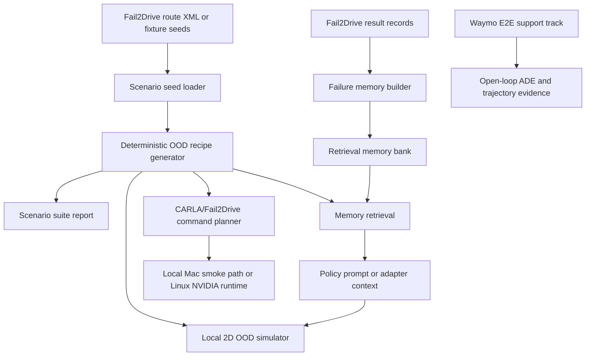

# Architecture

0xDriver is now a CARLA/Fail2Drive-first minimal-shot autonomy harness. The
Waymo E2E pipeline remains a supporting open-loop evidence track.

## Purpose

Build a reproducible environment for testing whether VLA/VLM driving policies
generalize to long-tail closed-loop scenarios with minimal prior examples. The
system generates OOD scenario recipes, stores policy failures as compact safety
memory, and prepares CARLA/Fail2Drive runs without requiring CARLA during local
development.

## System Map

## Canonical Surfaces

- `docs/prd.md`: current scenario-forge PRD.
- `docs/specs/minimal-shot-vla-roadmap.md`: end-to-end roadmap from live CARLA
  probing through generated assets, behavior scripts, policy adapters, and RAG
  comparison.
- `tickets/TASK-064` and `tickets/TASK-070`: current runnable local OOD demo
  and submission-pack evidence. TASK-060/TASK-069 remain live-runtime follow-up
  work for full Town13 route completion and route-aligned Alpamayo capture.
- `src/driverx/scenarios`: scenario seed and OOD recipe generation.
- `src/driverx/memory`: failure-memory creation and retrieval.
- `src/driverx/simulators`: CARLA smoke checks, Fail2Drive command planning,
  overlay injection, sidecar planning, route-video assembly, and the local 2D
  OOD simulator.
- `src/driverx/policies`: policy adapters, runtime readiness matrix, and
  Alpamayo probe reporting.
- `src/driverx/pipeline`: generated OOD suite execution, evidence reports, demo
  pack, and submission dossier builders.
- `src/driverx/datasets`, `planning`, `pipeline`, `submission`: preserved
  Waymo/open-loop support track.

## Runtime Direction

Local Mac:

- fixture scenario generation
- memory/report artifacts
- Fail2Drive command dry-runs
- optional Apple Silicon CARLA TCP smoke checks
- Waymo fixture and Docker bridge commands

Remote or Linux NVIDIA runtime:

- reproducible CARLA/Fail2Drive execution
- SimLingo/CarLLaVA policy runs
- Alpamayo inference
- latency-sensitive serving experiments

## Read Order

1. `AGENTS.md`
2. `docs/prd.md`
3. `ARCHITECTURE.md`
4. active `tickets/TASK-*/ticket.md`
5. relevant module `README.md`
6. archived tickets for prior Waymo evidence when needed

## Current Limits

- TASK-007 does not run SimLingo, Alpamayo, or live Fail2Drive.
- CARLA on Apple Silicon is treated as an optional smoke path until server,
  Python client, Fail2Drive, and policy execution work together.
- Generated scenarios now export stock-compatible Bench2Drive route XML plus
  DriverX sidecar overlays. Town13 is installed and loadable locally, and a
  stock Fail2Drive Town13 route starts through Docker, writes a checkpoint, and
  emits RGB frames, but the Mac/Kegworks/Wine path runs around `0.075x` and did
  not complete route scoring inside the 300s cap.
- TASK-064 provides a dependency-light end-to-end local simulator artifact. It
  is the current primary demo artifact, but it is not a live CARLA route score.
- Regional driving behavior traces and dry-run generated asset manifests are
  shipped as local evidence; real generated mesh import remains a future
  provider/runtime task.
- Alpamayo CARLA control remains open-loop today: live inference and memory
  comparison are proven, while TASK-062 owns the first cached trajectory replay
  bridge toward closed-loop control.
