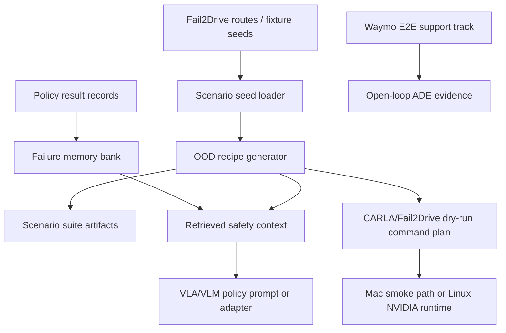

# 0xDriver

0xDriver is a research engineering project for the SoTA Commission I
minimal-shot autonomy challenge. The current thesis is:

> Use CARLA/Fail2Drive to generate closed-loop long-tail scenarios, turn policy
> failures into compact safety memory, and test whether VLA/VLM policies improve
> with minimal retrieved context instead of fine-tuning.

The earlier Waymo E2E work remains in the repo as an open-loop real-data support
track. The main submission direction is now CARLA/Fail2Drive scenario
generation and evaluation.

## Project Goal

Build a minimal-shot scenario forge that can:

- load Fail2Drive route seeds or tiny local fixtures
- generate deterministic weird-but-plausible OOD scenario recipes
- build retrieval memory from closed-loop failures
- prepare CARLA/Fail2Drive dry-run command plans
- smoke-check a local CARLA server when available
- preserve Waymo ADE/batch evidence as supporting real-world context

## Core Architecture Direction



## Shared Inspiration Resources

- SoTA Commission I: Minimal-Shot Autonomy. The challenge asks for a simulation
  environment or autonomy demo, plus repo, analysis, video/deck, and motivation.
- [Fail2Drive](https://github.com/autonomousvision/fail2drive): paired
  CARLA routes for closed-loop generalization, 17 unseen scenario classes, novel
  assets, result parser, and route toolbox.
- [CARLA](https://carla.readthedocs.io/en/latest/start_introduction/): Unreal
  client/server simulator for autonomous-driving research.
- [SimLingo](https://github.com/RenzKa/simlingo): CARLA-native VLA-style policy
  target for the first real closed-loop policy proof.
- [Alpamayo 1.5](https://github.com/NVlabs/alpamayo1.5): later higher-prestige
  reasoning VLA adapter target.
- [Waymo Open Dataset](https://waymo.com/open/): retained as real logged
  open-loop evidence and trajectory baseline support.

## Repository Shape

- `docs/prd.md`: current scenario-forge PRD.
- `ARCHITECTURE.md`: top-level system map.
- `tickets/TASK-039/ticket.md`: currently blocked Alpamayo CARLA adapter ticket.
- `tickets/archive/`: completed Waymo/fixture support-track tickets.
- `src/driverx/scenarios/`: scenario seeds, recipes, and reports.
- `src/driverx/memory/`: failure memory and retrieval.
- `src/driverx/simulators/`: CARLA smoke checks and Fail2Drive command plans.
- `src/driverx/datasets/`, `planning/`, `pipeline/`, `submission/`: Waymo and
  open-loop support-track code.

## Current Status

TASK-001 through TASK-006 established a working Waymo/open-loop measuring stick:
fixture runs, optional real Waymo TFRecords through Docker, streaming batch
reports, deterministic baselines, and a hybrid semantic-intent plus motion-prior
planner.

The current closed-loop pivot has scenario generation, failure memory,
CARLA/Fail2Drive dry-run planning, local CARLA probing, route-pack export,
overlay plans, sidecar orchestration, policy readiness reports, an Alpamayo
offline probe, and a judge-facing demo pack. The only active ticket is the
Alpamayo CARLA adapter, blocked until a live Alpamayo probe produces real
input/output shape evidence.

## Quickstart: Scenario Forge

```bash
# Generate deterministic OOD scenario recipes from fixture seeds
PYTHONPATH=src python3 -m driverx forge-scenarios \
  --config configs/scenario_forge.sample.yaml \
  --count 8 \
  --seed 7

# Build compact safety memory from fixture policy failures
PYTHONPATH=src python3 -m driverx build-memory \
  --results tests/fixtures/fail2drive_like/results.json \
  --run-id memory-bank

# Plan a dry-run Fail2Drive/CARLA command from one generated recipe file
PYTHONPATH=src python3 -m driverx plan-carla-run \
  --config configs/carla_local.sample.yaml \
  --recipe artifacts/runs/scenario-forge/scenario_recipes.json \
  --recipe-id generated-base-animals-0076-visual-noise-000

# Check whether a local CARLA server is reachable
PYTHONPATH=src python3 -m driverx smoke-carla \
  --config configs/carla_local.sample.yaml

# Probe the live CARLA Python API through Docker
bash scripts/build_carla_client_docker.sh
bash scripts/run_carla_client_docker.sh python -m driverx probe-carla \
  --host host.docker.internal \
  --port 2000 \
  --run-id task8-carla-probe

# Spawn one ego vehicle/camera, capture a frame, log tracks, and clean up
bash scripts/run_carla_client_docker.sh python -m driverx spawn-ego-smoke \
  --host host.docker.internal \
  --port 2000 \
  --run-id task9-ego-smoke

# Build the local CARLA 0.9.16 client image and run both live proofs
bash scripts/prove_carla_0916_docker.sh

# If Docker times out on host.docker.internal:2000, the client image is still
# valid; keep CARLA.app open, wait for the town to finish loading, and rerun.
# Use DRIVERX_DOCKER_ENV_FILE=.env only when a container needs local env vars.

# Generate regional/OOD behavior traces and metrics
PYTHONPATH=src python3 -m driverx generate-behaviors \
  --run-id task10-behaviors

# Compile one generated recipe and behavior into a CARLA script plan
PYTHONPATH=src python3 -m driverx compile-carla-script \
  --recipe artifacts/runs/scenario-forge/scenario_recipes.json \
  --recipe-id generated-base-animals-0076-visual-noise-000 \
  --behavior-id motorcycle_filtering \
  --run-id task11-carla-script

# Export generated recipes as stock-compatible Bench2Drive route XML plus
# DriverX sidecar overlays for OOD actors/assets/behavior intent
PYTHONPATH=src python3 -m driverx export-bench2drive-suite \
  --recipe artifacts/runs/scenario-forge/scenario_recipes.json \
  --recipe-id generated-base-animals-0076-visual-noise-000 \
  --route-root ../external/fail2drive \
  --behavior-id motorcycle_filtering \
  --config configs/simlingo.sample.yaml \
  --run-id task18-route-pack
PYTHONPATH=src python3 -m driverx plan-overlay-injection \
  --route-pack artifacts/runs/task18-route-pack/bench2drive_route_pack.json \
  --run-id task21-overlay-injection
bash scripts/run_carla_client_docker.sh python -m driverx run-overlay-injection \
  --config configs/carla_local.sample.yaml \
  --plan artifacts/runs/task21-overlay-injection/overlay_injection_plan.json \
  --route-limit 1 \
  --run-id task22-overlay-injection-run
PYTHONPATH=src python3 -m driverx plan-simlingo-sidecar \
  --simlingo-plan artifacts/runs/task18-route-pack/simlingo_command_plan.json \
  --overlay-plan artifacts/runs/task21-overlay-injection/overlay_injection_plan.json \
  --docker-carla-client \
  --run-id task23-sidecar-plan
PYTHONPATH=src python3 -m driverx run-simlingo-sidecar \
  --plan artifacts/runs/task23-sidecar-plan/simlingo_sidecar_plan.json \
  --timeout-s 900 \
  --run-id task24-sidecar-run

# Combine the generated scenarios, route pack, overlay plan, sidecar run,
# policy comparison, SimLingo result/evidence, and blocker ledger into one report
PYTHONPATH=src python3 -m driverx build-ood-suite-report \
  --scenario-summary artifacts/runs/scenario-forge/scenario_suite_summary.json \
  --route-pack artifacts/runs/task18-route-pack/bench2drive_route_pack.json \
  --overlay-plan artifacts/runs/task21-overlay-injection/overlay_injection_plan.json \
  --sidecar-plan artifacts/runs/task23-sidecar-plan/simlingo_sidecar_plan.json \
  --sidecar-run artifacts/runs/task24-sidecar-run/simlingo_sidecar_run.json \
  --rag-comparison artifacts/runs/task14-rag/rag_comparison.json \
  --simlingo-result artifacts/runs/task19-simlingo-result/simlingo_result_record.json \
  --blockers blockers.md \
  --run-id task25-ood-suite-report
# `--simlingo-result` also accepts remote evidence from
# `summarize-simlingo-evidence`, such as
# tickets/TASK-020/artifacts/task20-evidence-final/remote_simlingo_evidence.json.

# Run a generated OOD mini-suite and build per-recipe evidence bundles
PYTHONPATH=src python3 -m driverx run-generated-ood-suite \
  --config configs/scenario_forge.sample.yaml \
  --carla-config configs/carla_local.sample.yaml \
  --limit 1 \
  --run-id task36-suite

# Report which policy adapters are ready, dry-run-ready, or blocked
PYTHONPATH=src python3 -m driverx build-policy-runtime-matrix \
  --carla-config configs/carla_local.sample.yaml \
  --simlingo-config configs/simlingo.sample.yaml \
  --suite artifacts/runs/task36-suite/route-pack/bench2drive_routes/generated_routes.xml \
  --run-id task37-policy-matrix

# Summarize local or remote Alpamayo probe artifacts without leaking secrets
PYTHONPATH=src python3 -m driverx probe-alpamayo \
  --artifact-root artifacts/remote/alpamayo-probe/latest \
  --run-id task38-alpamayo-probe

# On the current RunPod RTX 6000 Ada lane, Alpamayo load probes should use
# eager attention. The SDPA fallback path is rejected by Alpamayo's custom
# architecture; flash-attn can be tested separately on hosts with nvcc.
DRIVERX_ENV_FILE=.env \
GPU_SSH_OPTS="-p 55050 -i ~/.ssh/id_ed25519_runpod" \
PYTHON_BIN=/workspace/alpamayo1.5/a1_5_venv/bin/python \
ALPAMAYO_LOAD=1 \
ALPAMAYO_ATTN_IMPLEMENTATION=eager \
REMOTE_CACHE_ROOT=/workspace/.cache/driverx \
bash scripts/run_remote_alpamayo_probe.sh root@195.26.233.80 \
  artifacts/remote/alpamayo-probe/latest

# Build the judge-facing demo pack with storyboard, artifact map, declarations,
# write-up draft, and first understood failure case
PYTHONPATH=src python3 -m driverx build-demo-pack \
  --generated-suite artifacts/runs/task36-suite/generated_ood_suite.json \
  --policy-matrix artifacts/runs/task37-policy-matrix/policy_runtime_matrix.json \
  --alpamayo-probe artifacts/runs/task38-alpamayo-probe/alpamayo_probe_report.json \
  --blockers blockers.md \
  --progress docs/progress.md \
  --run-id task40-demo-pack

# Once a live route run has written RGB frames under SAVE_PATH, assemble MP4
# evidence without relying on Fail2Drive's missing tools/generate_video.py
PYTHONPATH=src python3 -m driverx assemble-route-video \
  --rgb-folder artifacts/runs/task36-suite/recipes/000_example/fail2drive_outputs/visualizations/RouteName/rgb \
  --output-video artifacts/runs/task36-suite/RouteName.mp4 \
  --run-id task41-route-video

# Plan generated OOD assets and attach asset ids to scenario recipes
PYTHONPATH=src python3 -m driverx plan-assets \
  --recipe artifacts/runs/scenario-forge/scenario_recipes.json \
  --run-id task12-assets

# Run a fixture through the policy adapter surface
PYTHONPATH=src python3 -m driverx run-policy-fixture \
  --policy mock \
  --with-memory \
  --run-id task13-policy-memory

# Compare a policy with and without retrieved safety memory
PYTHONPATH=src python3 -m driverx run-rag-comparison \
  --policy mock \
  --run-id task14-rag

# Inspect and plan the external SimLingo/CarLLaVA backend
PYTHONPATH=src python3 -m driverx inspect-simlingo \
  --run-id task15-simlingo-readiness
PYTHONPATH=src python3 -m driverx plan-simlingo-run \
  --config configs/simlingo.sample.yaml \
  --run-id task15-simlingo-plan
PYTHONPATH=src python3 -m driverx ingest-simlingo-result \
  --result tickets/TASK-017/artifacts/qa/2026-05-04T194700Z/seed_1_res.json \
  --compatibility tickets/TASK-017/artifacts/qa/2026-05-04T194700Z/torch_cuda_compatibility.json \
  --route-log tickets/TASK-017/artifacts/qa/2026-05-04T194700Z/run_one_route.log \
  --run-id task19-simlingo-result

# On a Linux NVIDIA GPU host, sync this repo and launch the SimLingo bootstrap
# in tmux. `HF_TOKEN` is read from the local environment or ignored `.env`,
# copied through a temporary remote file, then that temporary file is removed
# after the tmux job starts. Existing host Hugging Face login state is preserved.
bash scripts/sync_remote_gpu.sh root@31.22.104.74 /workspace/0xDriver
bash scripts/run_remote_simlingo_bootstrap.sh root@31.22.104.74 /workspace/0xDriver

# For RunPod direct TCP SSH, resolve the current pod port first. RunPod TCP
# mappings change when pods are replaced or restarted, so do not reuse stale
# Connect-tab ports blindly.
PYTHONPATH=src python3 -m driverx resolve-runpod-ssh \
  --env-file .env \
  --ssh-key ~/.ssh/id_ed25519_runpod \
  --run-id runpod-current

# Then export the emitted GPU_SSH_HOST / GPU_SSH_OPTS values before running
# remote helpers.
GPU_SSH_HOST=root@195.26.233.80 \
GPU_SSH_OPTS="-p 55050 -i ~/.ssh/id_ed25519_runpod" \
bash scripts/sync_remote_gpu.sh
GPU_SSH_HOST=root@195.26.233.80 \
GPU_SSH_OPTS="-p 55050 -i ~/.ssh/id_ed25519_runpod" \
SESSION_NAME=task20 \
REMOTE_RUN_ID=task20 \
bash scripts/run_remote_simlingo_bootstrap.sh

# Pull only compact logs, JSON, Markdown, checksums, and generated run scripts
# back from the remote artifact directory. This deliberately excludes model
# weights, simulator archives, videos, images, caches, and CARLA files.
GPU_SSH_HOST=root@195.26.233.80 \
GPU_SSH_OPTS="-p 55050 -i ~/.ssh/id_ed25519_runpod" \
REMOTE_RUN_ID=task20 \
bash scripts/pull_remote_simlingo_artifacts.sh

# After the bootstrap emits run_one_route_with_carla_as_user.sh, launch the
# stock route, keep the remote route log, and pull compact evidence back even
# when the route fails with a runtime blocker.
GPU_SSH_HOST=root@195.26.233.80 \
GPU_SSH_OPTS="-p 55050 -i ~/.ssh/id_ed25519_runpod" \
REMOTE_RUN_ID=task20 \
bash scripts/run_remote_simlingo_route.sh

# Classify whatever compact evidence came back into a small verdict report.
PYTHONPATH=src python3 -m driverx summarize-simlingo-evidence \
  --artifact-root tickets/TASK-020/artifacts/task20-remote \
  --output-root tickets/TASK-020/artifacts \
  --run-id task20-evidence

# On a fresh GPU host, collect the small preflight artifacts used by
# assess-gpu-host before launching an expensive route job.
GPU_SSH_HOST=root@195.26.233.80 \
GPU_SSH_OPTS="-p 55050 -i ~/.ssh/id_ed25519_runpod" \
LOCAL_PROBE_DIR=tickets/TASK-029/artifacts/gpu-host-probe \
bash scripts/run_remote_gpu_probe.sh

# Convert CUDA, CARLA graphics, and remote evidence into a host recommendation.
PYTHONPATH=src python3 -m driverx assess-gpu-host \
  --gpu-snapshot tickets/TASK-020/artifacts/2026-05-05T151900+0800/remote_gpu_snapshot.txt \
  --torch-compatibility tickets/TASK-020/artifacts/task20-remote/torch_cuda_compatibility.json \
  --carla-diagnostics tickets/TASK-020/artifacts/task20-remote/carla_runtime_diagnostics.md \
  --simlingo-evidence tickets/TASK-020/artifacts/task20-evidence-final/remote_simlingo_evidence.json \
  --run-id h100-host-suitability

# Build a submission-facing Markdown/JSON dossier from current evidence.
PYTHONPATH=src python3 -m driverx build-submission-dossier \
  --ood-suite-manifest tickets/TASK-027/artifacts/ood-suite-report-task20-blocker/ood_suite_manifest.json \
  --gpu-host-suitability tickets/TASK-029/artifacts/h100-probe-live-suitability/gpu_host_suitability.json \
  --output-root tickets/TASK-031/artifacts \
  --run-id current-submission-dossier
```

Stock SimLingo currently targets Python 3.8 and `torch==2.2.0+cu121`. That
works best on CUDA architectures already compiled into that wheel, especially
H100/H200-class `sm_90` hosts. RTX PRO 6000 Blackwell requires `sm_120`, so it
needs a separate PyTorch/CARLA rebuild lane before it can run the stock route.
Generated Bench2Drive route packs keep route XML stock-compatible and store OOD
object/behavior intent in DriverX sidecar overlays until a companion CARLA
actor injector is running.
`run-simlingo-sidecar` executes an existing sidecar plan with per-process logs,
exit codes, and timings; use it after the stock SimLingo route path is stable
on the same CARLA host.

Generated run artifacts are written under `artifacts/runs/` and remain ignored
by git.

## External Fail2Drive Checkout

Fail2Drive and SimLingo are used as read-only external references, not vendored
into this repo:

```bash
mkdir -p ../external
git clone https://github.com/autonomousvision/fail2drive.git ../external/fail2drive
git clone https://github.com/RenzKa/simlingo.git ../external/simlingo
```

`configs/carla_local.sample.yaml` defaults to `../external/fail2drive`. The
SimLingo planner defaults to `../external/simlingo`. Local tests use tiny
fixtures, so they do not require CARLA, Conda, model checkpoints, or CUDA.

## Optional CARLA On Apple Silicon

CARLA can reportedly run on Apple Silicon through a community
Wine/Kegworks/D3DMetal wrapper for the Windows CARLA package. Treat that as a
local smoke-test path until CARLA server, Python client, Fail2Drive routes, and
policy execution all work together.

For reproducible Fail2Drive + VLA experiments, use Linux NVIDIA hardware.

## Waymo Support Track

The existing Waymo commands remain available:

```bash
PYTHONPATH=src python3 -m driverx inspect-scene --config configs/mock.yaml
PYTHONPATH=src python3 -m driverx run-scene --config configs/mock.yaml --run-id demo
PYTHONPATH=src python3 -m driverx run-batch --config configs/mock.yaml --run-id demo-batch
PYTHONPATH=src python3 -m driverx run-experiment --config configs/mock.yaml --run-id demo-experiment
bash scripts/pre_push_check.sh
```

Real Waymo TFRecords still use the Docker compatibility bridge documented by
the archived TASK-003 through TASK-006 evidence.
