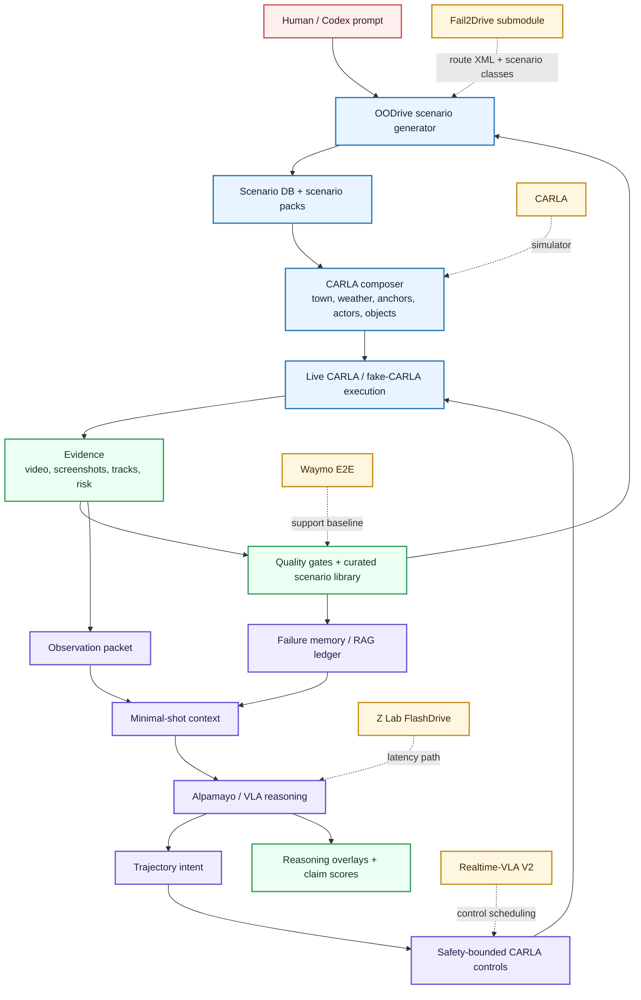
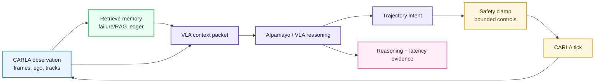

# 0xDriver

0xDriver is a minimal-shot autonomy project for the SoTA Commission I challenge.
The submission thesis is simple:

> Use OODrive to generate long-tail CARLA driving scenarios, run a frozen VLA/VLM
> policy over those scenes, retrieve compact failure memory as context, and keep
> every claim tied to simulator evidence.

The current project focus is CARLA + Fail2Drive + OODrive + Alpamayo evidence.
Older Waymo and SimLingo/CarLLaVA work is preserved as a support track, but it
is no longer the main path a new reader should start from.

## What This Repo Shows

- A prompt-to-scenario CLI that creates out-of-distribution CARLA cases.
- A CARLA placement/capture path for simulator evidence and demo videos.
- A minimal-shot autonomy architecture: observation -> RAG memory -> Alpamayo /
  VLA reasoning -> safety-bounded controls.
- Honest proof boundaries for the current demo: time-warped/offline video and
  sampled open-loop Alpamayo reasoning are labeled as such until live real-time
  VLA steering is proved.

## Architecture



### Scenario Generation System

```mermaid
flowchart LR
    P["Prompt<br/>wet roadwork + scooter"] --> B["Brief extraction"]
    B --> C["Seeded variants"]
    C --> D["Scenario pack<br/>environment, actors, props, behavior"]
    D --> E["CARLA placement plan"]
    E --> F["Run / capture"]
    F --> G["Quality gates<br/>road alignment, visibility, evidence"]
    G --> H["Scenario library"]

    classDef prompt fill:#fff0f0,stroke:#cc4b4b,color:#421313,stroke-width:2px
    classDef gen fill:#e8f4ff,stroke:#2478b8,color:#102535,stroke-width:2px
    classDef sim fill:#eaf7ff,stroke:#0d7792,color:#0b3440,stroke-width:2px
    classDef proof fill:#ecfff3,stroke:#2f9d58,color:#12351f,stroke-width:2px

    class P prompt
    class B,C,D,E gen
    class F sim
    class G,H proof
```



### Minimal-Shot Autonomy System



## Quick Start

Local commands use `PYTHONPATH=src`; editable install is optional.

```bash
python3 -m pip install -e .

git submodule update --init --recursive third_party/fail2drive

PYTHONPATH=src python3 -m oodrive quickstart \
  --prompt "wet Kuala Lumpur roadwork with a scooter filtering past cones" \
  --run-id friend-quickstart

PYTHONPATH=src python3 -m oodrive generate \
  "wet Malaysian roadwork, scooter filtering, blocked lane" \
  --count 4 \
  --run-id malaysia-roadwork-demo
```

To run against a live CARLA host, use the RunPod/Kasm guide:
[`docs/runpod-kasm-quickstart.md`](docs/runpod-kasm-quickstart.md).

## Fail2Drive Extension

OODrive extends Fail2Drive rather than replacing it. The pinned upstream
checkout lives at [`third_party/fail2drive`](third_party/fail2drive), and the
intended agent workflow is:

1. Codex writes or edits Fail2Drive-compatible route XML.
2. OODrive validates the XML, scenario types, parameters, and claim boundaries.
3. Fail2Drive/ScenarioRunner execute the route and scenario behavior.
4. OODrive captures, overlays, scores, and packages the judge-facing evidence.

This keeps the submission honest: Fail2Drive provides the benchmark/runtime
base; OODrive provides the agent-operable CLI, generation workflow, reasoning
evidence, and submission-quality gates.

Agent-facing Fail2Drive path:

```bash
# Inspect upstream scenario types and parameters.
PYTHONPATH=src python3 -m oodrive f2d-catalog --format md

# Validate or compile route XML from an agent-authored spec.
PYTHONPATH=src python3 -m oodrive f2d-write-route \
  --example RoadBlocked \
  --validate

PYTHONPATH=src python3 -m oodrive f2d-validate-route \
  --route artifacts/runs/<run>/route.xml

# Plan/run upstream Fail2Drive, then attach reasoning and video evidence.
PYTHONPATH=src python3 -m oodrive f2d-run-route \
  --route artifacts/runs/<run>/route.xml \
  --dry-run

# Default agent is OODrive's RGB capture agent. Use `--agent pdm-lite` only for
# the upstream display-oriented visualizer path, which does not write RGB proof.

PYTHONPATH=src python3 -m oodrive f2d-reason \
  --evidence artifacts/runs/<run>/run_evidence.json \
  --route artifacts/runs/<run>/route.xml \
  --mode fake

PYTHONPATH=src python3 -m oodrive f2d-demo-video \
  --evidence artifacts/runs/<run>/run_evidence.json \
  --reasoning artifacts/runs/<run>/f2d_reasoning.json \
  --route artifacts/runs/<run>/route.xml \
  --input-video artifacts/runs/<run>/route.mp4

PYTHONPATH=src python3 -m oodrive f2d-evaluate-model \
  --routes third_party/fail2drive/fail2drive_split \
  --limit 5 \
  --dry-run
```

## Main Commands

```bash
# Create prompt-authored OOD scenario candidates.
PYTHONPATH=src python3 -m oodrive generate "night rain, roadwork, pedestrian occlusion"

# Place a generated scenario. Omit --live for a dry-run placement manifest.
PYTHONPATH=src python3 -m oodrive place \
  --db artifacts/runs/malaysia-roadwork-demo/oodrive.sqlite \
  --live

# Run or prepare Alpamayo inference over a captured package.
PYTHONPATH=src python3 -m oodrive infer \
  --package artifacts/runs/<run>/alpamayo_package.json \
  --mode fake

# Attach prediction + retrieved memory into a reasoning record.
PYTHONPATH=src python3 -m oodrive reason \
  --db artifacts/runs/<run>/oodrive.sqlite \
  --prediction-json artifacts/runs/<infer>/prediction.json

# Score the repo-local checks before sharing.
bash scripts/pre_push_check.sh
```

## Current Evidence

The best current submission packet is described in:

- [`docs/submission-thesis.md`](docs/submission-thesis.md)
- [`docs/submission-form-answers.md`](docs/submission-form-answers.md)
- [`tickets/archive/`](tickets/archive/)

Generated videos and heavy artifacts live under ignored `artifacts/` paths. The
repo tracks manifests, reports, tests, and scripts; it does not track model
weights, CARLA installs, Waymo shards, or generated MP4s.

## Repo Map

- `src/oodrive/`: public OODrive CLI wrapper.
- `src/driverx/scenarios/`: scenario database, generation, placement,
  evidence, scoring, and submission packaging.
- `src/driverx/simulators/`: CARLA/Fail2Drive bridges, video helpers, and
  archived SimLingo support modules.
- `src/driverx/memory/`: failure memory and retrieval.
- `src/driverx/policies/`: policy adapter contracts and control traces.
- `configs/`: local, RunPod, CARLA, Fail2Drive, and fixture configs.
- `scripts/`: active setup, sync, validation, and demo video helpers.
- `docs/`: canonical docs. Historical drafts are under `docs/archive/`.
- `tickets/archive/`: completed work records and compact proof summaries.

## Active Docs

- [`ARCHITECTURE.md`](ARCHITECTURE.md): top-level design map.
- [`PROJECT_RULES.md`](PROJECT_RULES.md): technical conventions and QA.
- [`docs/prd.md`](docs/prd.md): current product requirements.
- [`docs/specs/README.md`](docs/specs/README.md): current spec index.
- [`docs/runpod-kasm-quickstart.md`](docs/runpod-kasm-quickstart.md):
  graphics pod setup and remote execution.
- [`docs/MEMORY.md`](docs/MEMORY.md): durable project constraints.
- [`docs/HISTORY.md`](docs/HISTORY.md): shipped milestone ledger.

## External References

- [CARLA](https://carla.readthedocs.io/en/latest/start_introduction/)
- [Fail2Drive](https://github.com/autonomousvision/fail2drive) vendored as a
  pinned submodule under `third_party/fail2drive`
- [NVIDIA Alpamayo](https://developer.nvidia.com/drive/alpamayo)
- [Z Lab FlashDrive](https://z-lab.ai/projects/flashdrive/)
- [Realtime-VLA V2](https://dexmal.github.io/realtime-vla-v2/)
- [Waymo Open Dataset](https://waymo.com/open/)

## Legacy Material

The old exploratory README, early Waymo bootstrap notes, old milestone ladders,
and deprecated SimLingo remote scripts are archived so the repo stays readable:
[`docs/archive/README.md`](docs/archive/README.md).
