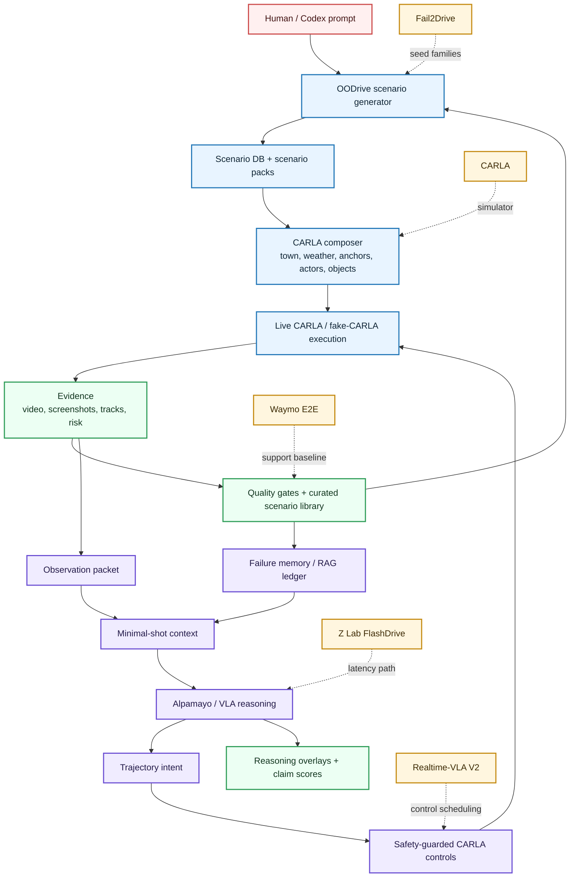
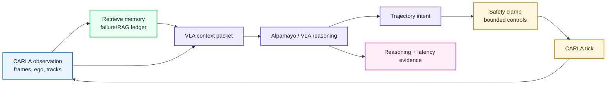

# 0xDriver

0xDriver is a research engineering project for the SoTA Commission I
minimal-shot autonomy challenge. The current thesis is:

> Use CARLA/Fail2Drive to generate closed-loop long-tail scenarios, turn policy
> failures into compact safety memory, and test whether VLA/VLM policies improve
> with minimal retrieved context instead of fine-tuning.

The earlier Waymo E2E work remains in the repo as an open-loop real-data support
track. The main submission direction is now CARLA/Fail2Drive scenario
generation and evaluation.

## Project Goal

Build a minimal-shot scenario forge that can:

- load Fail2Drive route seeds or tiny local fixtures
- generate deterministic weird-but-plausible OOD scenario recipes
- build retrieval memory from closed-loop failures
- prepare CARLA/Fail2Drive dry-run command plans
- smoke-check a local CARLA server when available
- preserve Waymo ADE/batch evidence as supporting real-world context

## Submission Architecture: Two Systems



Legend: blue = scenario generation system, purple = autonomy architecture,
green = evidence/curation, yellow = external research/tooling resources.

### System 1: Scenario Generator

OODrive turns a short prompt into a simulator-ready OOD driving case:

```mermaid
flowchart LR
    P["Prompt<br/>wet roadwork + scooter"] --> B["Brief extraction"]
    B --> C["Concrete variants<br/>seeded randomization"]
    C --> D["Scenario pack<br/>environment, actors, props, behavior"]
    D --> E["CARLA placement plan"]
    E --> F["Run / capture"]
    F --> G["Score gates<br/>road alignment, visibility, evidence"]
    G --> H["Scenario library"]

    classDef prompt fill:#fff0f0,stroke:#cc4b4b,color:#421313,stroke-width:2px
    classDef gen fill:#e8f4ff,stroke:#2478b8,color:#102535,stroke-width:2px
    classDef sim fill:#eaf7ff,stroke:#0d7792,color:#0b3440,stroke-width:2px
    classDef proof fill:#ecfff3,stroke:#2f9d58,color:#12351f,stroke-width:2px

    class P prompt
    class B,C,D,E gen
    class F sim
    class G,H proof
```



Local resources:

- Generator CLI spec: [`docs/specs/scenario-generator-cli-v1.md`](docs/specs/scenario-generator-cli-v1.md)
- Scenario Studio data engine: [`docs/specs/scenario-studio-data-engine.md`](docs/specs/scenario-studio-data-engine.md)
- Product thesis: [`docs/submission-thesis.md`](docs/submission-thesis.md)
- CLI entrypoint: [`src/oodrive/cli.py`](src/oodrive/cli.py)

External resources:

- [CARLA](https://carla.readthedocs.io/en/latest/start_introduction/)
- [Fail2Drive](https://github.com/autonomousvision/fail2drive)

### System 2: Minimal-Shot Autonomy Architecture

The autonomy loop uses a frozen VLA with retrieved failure memory and explicit
latency/claim gates:



Local resources:

- Minimal-shot VLA roadmap: [`docs/specs/minimal-shot-vla-roadmap.md`](docs/specs/minimal-shot-vla-roadmap.md)
- Submission thesis: [`docs/submission-thesis.md`](docs/submission-thesis.md)
- Memory/RAG package: [`src/driverx/memory/`](src/driverx/memory/)
- Policy adapters and closed-loop control: [`src/driverx/policies/`](src/driverx/policies/)

External resources:

- [NVIDIA Alpamayo](https://developer.nvidia.com/drive/alpamayo)
- [Z Lab FlashDrive](https://z-lab.ai/projects/flashdrive/)
- [Realtime-VLA V2](https://dexmal.github.io/realtime-vla-v2/)

## Shared Inspiration Resources

- SoTA Commission I: Minimal-Shot Autonomy. The challenge asks for a simulation
  environment or autonomy demo, plus repo, analysis, video/deck, and motivation.
- [Fail2Drive](https://github.com/autonomousvision/fail2drive): paired
  CARLA routes for closed-loop generalization, 17 unseen scenario classes, novel
  assets, result parser, and route toolbox.
- [CARLA](https://carla.readthedocs.io/en/latest/start_introduction/): Unreal
  client/server simulator for autonomous-driving research.
- [SimLingo](https://github.com/RenzKa/simlingo): CARLA-native VLA-style policy
  target for the first real closed-loop policy proof.
- [Alpamayo 1.5](https://github.com/NVlabs/alpamayo1.5): later higher-prestige
  reasoning VLA adapter target.
- [Waymo Open Dataset](https://waymo.com/open/): retained as real logged
  open-loop evidence and trajectory baseline support.

## Repository Shape

- `docs/prd.md`: current scenario-forge PRD.
- `ARCHITECTURE.md`: top-level system map.
- `tickets/archive/`: completed ticket records and compact evidence artifacts,
  including the live Alpamayo and CARLA route proofs.
- `src/driverx/scenarios/`: scenario seeds, recipes, catalog, quality gates,
  and reports.
- `src/driverx/environments/`: deterministic construction, roadside-market,
  flood, visibility, regional-traffic, and pedestrian-occlusion environment
  packs.
- `src/driverx/behaviors/`: deterministic and parameterized OOD actor behavior
  traces.
- `src/driverx/memory/`: failure memory and retrieval.
- `src/driverx/simulators/`: CARLA smoke checks and Fail2Drive command plans.
- `src/driverx/datasets/`, `planning/`, `pipeline/`, `submission/`: Waymo and
  open-loop support-track code.

## Current Status

The current strongest packet is the TASK-131 score-gated OODrive hero demo:
an OODrive-generated CARLA case rendered as a 42s time-warped judge-visible MP4
with frame/time, simulator-grounded risk telemetry, RAG memory callouts, and
sampled Alpamayo reasoning over captured frames.

Current strongest evidence:

- a score-gated OODrive hero MP4 at
  `artifacts/runs/task128-oodrive-live-product/demo-videos/task131-score-gated-hero-v2/oodrive_hero_demo.mp4`
  with `hero_demo_score=100.0`, status `passed`, and no score blockers
- an 84s RunPod-generated, road-aligned CARLA OOD campaign source clip exported
  locally at `artifacts/exported/task102_high_fidelity_hero_v6_full.mp4`
- TASK-128 live OODrive generate/place/reason artifacts recovered locally under
  `artifacts/runs/task128-oodrive-live-product/`
- a 28s time-warped clip at `artifacts/exported/task112_hero_timewarp_3x.mp4`
- a reasoning-overlay video at
  `artifacts/exported/task111_reasoning_overlay_v1.mp4`
- a 76s paper-style final demo at `artifacts/exported/final_sota_demo_v8.mp4`
- a Scenario Workbench bundle linking Scenario Studio, CARLA evidence,
  Alpamayo/RAG, risk, and curation
- live Alpamayo 1.5 open-loop reasoning and measured latency/VRAM on generated
  CARLA packages

Final sprint direction is now submission packaging and optional product polish,
not new setup work:

- optimize against the SoTA Commission readiness score, not the saturated hero
  video score
- promote the TASK-131 score-gated hero demo in the final write-up/deck as one
  artifact inside a broader judge pack
- optionally productize Alpamayo inference as `oodrive infer` after the hero
  artifact remains stable
- keep claim boundaries explicit: time-warped offline demo, sampled open-loop
  reasoning, no real-time VLA steering claim

Milestone guidance lives in `docs/submission-milestones.md`.

## Current Submission Packet

- Score-gated OODrive hero demo:
  `artifacts/runs/task128-oodrive-live-product/demo-videos/task131-score-gated-hero-v2/oodrive_hero_demo.mp4`
- Hero demo score report:
  `artifacts/runs/task128-oodrive-live-product/demo-scores/task131-score-gated-hero-v2-score/hero_demo_score.md`
- SoTA Commission readiness baseline:
  `./autoresearch.sh` currently emits `submission_readiness_score=96.35`,
  `hero_demo_score=100.0`, `judge_comprehension_pack=16.0`, and
  `code_quality=7.0`, so the remaining optional lift is product-loop hardening
  rather than more raw video polishing.
- Judge-facing submission pack:
  `artifacts/runs/task128-oodrive-live-product/submission-packs/task133-submission-pack-v1/index.html`
- Environment Studio demo pack:
  `artifacts/runs/task135-env-demo-v1/environment-demo-packs/task135-env-demo-v1/index.html`
- Environment demo score report:
  `artifacts/runs/task135-env-demo-v1/environment-demo-packs/task135-env-demo-v1/environment-demo-scores/task135-env-demo-v1-score-report/environment_demo_score.md`
- Environment-to-CARLA visual proof dry-run:
  `artifacts/runs/task136-env-c3-proof-v1/env_carla_proof_manifest.json`
- Environment keyframe analysis blocked proof:
  `artifacts/runs/task137-keyframe-analysis-v1/keyframe_analysis.json`
- Environment-to-reasoned-CARLA story pack:
  `artifacts/runs/task138-env-reasoned-carla-v1/environment_reasoned_carla_demo.json`
- TASK-131 QA:
  `tickets/TASK-131/artifacts/qa/score_gated_hero_demo_qa.md`
- Final V8 pack:
  `tickets/TASK-113/artifacts/final-submission-pack-v8/final_submission_pack_v8.md`
- Scenario browser V8:
  `tickets/TASK-113/artifacts/final-submission-pack-v8/scenario_browser_v8.html`
- Two-page write-up V8:
  `tickets/TASK-113/artifacts/final-submission-pack-v8/writeup_2page_v8.md`
- Video script V8:
  `tickets/TASK-113/artifacts/final-submission-pack-v8/video_script_v8.md`
- Final rendered demo MP4:
  `artifacts/exported/final_sota_demo_v8.mp4`
- Workbench bundle:
  `tickets/TASK-108/artifacts/workbench-bundle-v1-with-risk/scenario_run_bundle.md`
- Agentic OOD queue:
  `tickets/TASK-109/artifacts/agentic-ood-loop-v1/dataset_curation_queue.md`
- Risk timeline:
  `tickets/TASK-110/artifacts/risk-timeline-v1/risk_timeline.md`
- Reasoning overlay evidence:
  `tickets/TASK-111/artifacts/reasoning-overlay-v1/reasoning_overlay_video.md`
- Video timewarp evidence:
  `tickets/TASK-112/artifacts/timewarp-v1/video_timewarp.md`
- Final V7 pack:
  `tickets/TASK-106/artifacts/final-submission-pack-v7-task102/final_submission_pack_v7.md`
- Scenario browser:
  `tickets/TASK-106/artifacts/final-submission-pack-v7-task102/scenario_browser_v7.html`
- Two-page write-up draft:
  `tickets/TASK-106/artifacts/final-submission-pack-v7-task102/writeup_2page_draft.md`
- Video script:
  `tickets/TASK-106/artifacts/final-submission-pack-v7-task102/video_script_v7.md`
- Final demo packet:
  `tickets/TASK-107/artifacts/final_demo_packet.md`
- Draft rendered demo MP4:
  `artifacts/exported/final_sota_demo_draft_v1.mp4`
- Scenario catalog:
  `tickets/archive/TASK-090/artifacts/scenario-catalog-v4/scenario_catalog.md`
- Policy evaluation campaign:
  `tickets/archive/TASK-094/artifacts/policy-evaluation-v6/policy_evaluation_campaign.md`
  (current status counts: passed `0`, planned `9`, blocked `18`; no policy row
  is counted as completed unless its scenario passes strict quality gates)
- Reasoning pack:
  `tickets/archive/TASK-084/artifacts/task84-reasoning-pack/reasoning_video_pack.html`
- Live cached Alpamayo replay:
  `tickets/archive/TASK-083/artifacts/task83-live-cached-replay-video/ood_video_evidence.md`
- Live generated OOD campaign:
  `tickets/archive/TASK-085/artifacts/task85-live-campaign-2b/scripted_ood_campaign_summary.md`

## Quickstart: End-To-End OOD Demo

```bash
PYTHONPATH=src python3 -m driverx run-end-to-end-ood-demo \
  --output-root artifacts/runs \
  --run-id local-ood-demo
```

Key outputs:

- `end_to_end_demo.md`: generated scenario, memory ids, policy reactions, and
  claim boundaries.
- `local-sim/local_ood_sim.html`: top-down local simulator evidence.
- `policy/policy_reaction_matrix.md`: baseline, memory-guided, and hybrid
  policy comparison table.

## Quickstart: OODrive Scenario Studio

OODrive is the product name for the out-of-distribution scenario generator.
The CLI is the database/control layer; Codex or another agent is the creative
operator that proposes briefs and decides what to test next.

```bash
PYTHONPATH=src python3 -m oodrive quickstart \
  --prompt "Malaysian wet roadwork: motorbike filters between cars while a lorry brakes without signal" \
  --output-root artifacts/runs \
  --run-id oodrive-cli-smoke \
  --count 3 \
  --seed 19
```

AI-assisted scenario generation is available as a dependency-light DB command:

```bash
PYTHONPATH=src python3 -m oodrive ai-generate \
  --prompt "Malaysian wet night roadwork chaos with scooter filtering" \
  --output-root artifacts/runs \
  --run-id oodrive-ai-smoke \
  --count 4 \
  --compile \
  --queue
```

The default `codex-template` provider is deterministic and does not call a
network LLM; it records `scenario_generation_ai_provider=codex-template` in the
DB so claim boundaries stay honest. `driverx oodrive`, `driverx oodriver`, and
`driverx studio` remain compatibility aliases for older scripts.

The product-facing path is:

```bash
PYTHONPATH=src python3 -m oodrive generate \
  "Malaysian wet roadwork with a roadside vendor, cones, and a motorcycle filtering beside ego" \
  --output-root artifacts/runs \
  --run-id oodrive-demo \
  --count 3

PYTHONPATH=src python3 -m oodrive place \
  --db artifacts/runs/oodrive-demo/scenario_studio_db.json \
  --placement artifacts/runs/oodrive-demo/placements/oodrive-demo-placement/carla_placement_plan.json \
  --config configs/carla_ood_demo.local.sample.yaml \
  --live

PYTHONPATH=src python3 -m oodrive reason \
  --db artifacts/runs/oodrive-demo/scenario_studio_db.json \
  --run artifacts/runs/oodrive-demo/runs/<run-id>/run_manifest.json \
  --prediction-json <alpamayo_prediction.json>

PYTHONPATH=src python3 -m oodrive demo-video \
  --db artifacts/runs/oodrive-demo/scenario_studio_db.json \
  --run artifacts/runs/oodrive-demo/runs/<run-id>/run_manifest.json \
  --evaluation artifacts/runs/oodrive-demo/reasoning/evaluations/<evaluation-id>/policy_evaluation.json \
  --input-video artifacts/exported/<source-carla-video>.mp4 \
  --speed-factor 4

PYTHONPATH=src python3 -m oodrive score-demo \
  --db artifacts/runs/oodrive-demo/scenario_studio_db.json \
  --run artifacts/runs/oodrive-demo/runs/<run-id>/run_manifest.json \
  --evaluation artifacts/runs/oodrive-demo/reasoning/evaluations/<evaluation-id>/policy_evaluation.json \
  --video artifacts/runs/oodrive-demo/demo-videos/<demo-id>/oodrive_hero_demo.mp4 \
  --overlay-report artifacts/runs/oodrive-demo/demo-videos/<demo-id>/hero_demo_video.json

PYTHONPATH=src python3 -m oodrive score-submission \
  --db artifacts/runs/oodrive-demo/scenario_studio_db.json \
  --run artifacts/runs/oodrive-demo/runs/<run-id>/run_manifest.json \
  --evaluation artifacts/runs/oodrive-demo/reasoning/evaluations/<evaluation-id>/policy_evaluation.json \
  --hero-score artifacts/runs/oodrive-demo/demo-scores/<score-id>/hero_demo_score.json \
  --overlay-report artifacts/runs/oodrive-demo/demo-videos/<demo-id>/hero_demo_video.json
```

`generate` writes a CARLA placement plan with stock blueprint filters and
road-local transforms. `place` dry-runs by default and uses `--live` to connect
to CARLA through the existing scripted OOD demo runner. `reason` attaches cached
or live Alpamayo reasoning evidence to the run and builds the replay bundle.
`demo-video` time-warps the source footage and overlays frame/time, risk, RAG
memory, VLA reasoning, and action intent. `score-demo` is the hero-video gate:
bad videos fail unless they show enough duration, motion, OOD objects, risk
events, reasoning callouts, RAG callouts, frame/time coverage, road alignment,
and explicit claim boundaries. `score-submission` is the harder SoTA Commission
gate: it scores novelty/adherence, randomized minimal-shot simulation,
navigation/risk evidence, reasoning/memory/latency evidence, judge
comprehension, operator reproducibility, and code-quality proof.
Unless a live CARLA run and model prediction are attached, the artifacts label
themselves as placement/reasoning plans rather than closed-loop VLA driving.

```bash
PYTHONPATH=src python3 -m oodrive init --run-id oodrive-demo --force
PYTHONPATH=src python3 -m oodrive ingest-brief \
  --db artifacts/runs/oodrive-demo/scenario_studio_db.json \
  --prompt "Night market scooter shoulder pass with sudden brake and roadside vendor occlusion" \
  --author codex
PYTHONPATH=src python3 -m oodrive compile --db artifacts/runs/oodrive-demo/scenario_studio_db.json --count 6
PYTHONPATH=src python3 -m oodrive queue --db artifacts/runs/oodrive-demo/scenario_studio_db.json --accept top:3
PYTHONPATH=src python3 -m oodrive run --db artifacts/runs/oodrive-demo/scenario_studio_db.json --policy mock
PYTHONPATH=src python3 -m oodrive export --db artifacts/runs/oodrive-demo/scenario_studio_db.json
```

Key outputs are `scenario_studio_db.json`, `scenario_dataset_queue.json`,
`run_manifest.json`, `policy_evaluation.json`, `scenario_run_bundle.html`, and
`scenario_generator_cli_pack.html`. Mock quickstart deliberately labels
`closed_loop_carla_execution=false` and `real_time_vla_control=false`; live CARLA
and Alpamayo evidence must be attached through run/evaluate artifacts.

## Quickstart: Flagship OODrive Scenario

The next submission push focuses on one high-quality case study rather than
more shallow breadth: Malaysian wet night roadwork with unsignaled braking,
motorcycle filtering, lane-narrowing debris, roadside vendor occlusion, and a
wrong-way shoulder scooter.

```bash
PYTHONPATH=src python3 -m driverx build-flagship-oodrive-scenario \
  --config configs/oodrive_flagship_malaysia.yaml \
  --output-root artifacts/runs \
  --run-id flagship-malaysia
```

Key outputs are `flagship_scenario.json` and `flagship_scenario.md`. They
contain the runtime command plan for CARLA capture, Alpamayo checkpoint
inference, time-warped trajectory replay, and final evidence packaging.

## Quickstart: Scenario Forge

```bash
# Generate deterministic OOD scenario recipes from fixture seeds
PYTHONPATH=src python3 -m driverx forge-scenarios \
  --config configs/scenario_forge.sample.yaml \
  --count 8 \
  --seed 7

# Generate deterministic environment packs and stock CARLA proxy assets
PYTHONPATH=src python3 -m driverx forge-environments \
  --config configs/environment_forge.sample.yaml \
  --run-id environment-forge

# Product-facing Environment Studio demo for judge screen recordings
PYTHONPATH=src python3 -m oodrive generate-envs \
  --severity 4 \
  --count 6 \
  --seed 31 \
  --run-id task135-env-demo-v1

PYTHONPATH=src python3 -m oodrive export-env-demo \
  --environment-summary artifacts/runs/task135-env-demo-v1/environment_suite_summary.json \
  --hero-video artifacts/runs/task128-oodrive-live-product/demo-videos/task131-score-gated-hero-v2/oodrive_hero_demo.mp4 \
  --run-id task135-env-demo-v1

PYTHONPATH=src python3 -m oodrive score-env-demo \
  --environment-summary artifacts/runs/task135-env-demo-v1/environment_suite_summary.json \
  --demo-manifest artifacts/runs/task135-env-demo-v1/environment-demo-packs/task135-env-demo-v1/environment_demo_manifest.json \
  --metric-only

# Same-lineage environment -> CARLA visual proof. Use --live on Kasm/CARLA for
# the preview image; local runs write a dry-run or blocked manifest.
PYTHONPATH=src python3 -m oodrive render-env \
  --environment-summary artifacts/runs/task135-env-demo-v1/environment_suite_summary.json \
  --template-id roadside_market_occlusion \
  --prompt "wet Malaysian roadside market occlusion with scooter filtering" \
  --run-id task136-env-c3-proof-v1

PYTHONPATH=src python3 -m oodrive analyze-keyframes \
  --visual-proof artifacts/runs/task136-env-c3-proof-v1/env_carla_proof_manifest.json \
  --db artifacts/runs/task136-env-c3-proof-v1/scenario_studio_db.json \
  --run artifacts/runs/task136-env-c3-proof-v1/runs/task136-env-c3-proof-v1/run_manifest.json \
  --backend fake \
  --keyframes 8 \
  --run-id task137-keyframe-analysis-v1

# Renders an MP4 when the visual proof and keyframe analysis contain real image
# paths; otherwise writes a blocked story/overlay pack with next commands.
PYTHONPATH=src python3 -m oodrive env-demo-video \
  --environment-summary artifacts/runs/task135-env-demo-v1/environment_suite_summary.json \
  --visual-proof artifacts/runs/task136-env-c3-proof-v1/env_carla_proof_manifest.json \
  --keyframe-analysis artifacts/runs/task137-keyframe-analysis-v1/keyframe_analysis.json \
  --run-id task138-env-reasoned-carla-v1

PYTHONPATH=src python3 -m oodrive score-env-proof \
  --environment-summary artifacts/runs/task135-env-demo-v1/environment_suite_summary.json \
  --visual-proof artifacts/runs/task136-env-c3-proof-v1/env_carla_proof_manifest.json \
  --keyframe-analysis artifacts/runs/task137-keyframe-analysis-v1/keyframe_analysis.json \
  --overlay-report artifacts/runs/task138-env-reasoned-carla-v1/environment_reasoned_carla_demo.json \
  --metric-only

# Bad-path stress reel: local scripted proof, not CARLA visual evidence. Every
# default case shows a bad baseline collision proxy and a guarded
# stop/swerve/yield/recover response that must stay inside the drivable corridor.
PYTHONPATH=src python3 -m oodrive stress-demo \
  --run-id task140-bad-path-stress-v3-lane-safe \
  --target-duration-s 72 \
  --fps 8

# Usable generator runtime: selectable vehicle behaviors plus generated object
# spawn specs, with fake-CARLA proof locally and live-CARLA proof on Kasm.
PYTHONPATH=src python3 -m oodrive generate-run \
  "wet Malaysian roadwork, scooter cut-in, lane debris" \
  --template-id construction_lane_closure \
  --behavior-id motorcycle_filtering \
  --behavior-id no_signal_cut_in \
  --behavior-id unsignaled_u_turn \
  --object-kind construction_debris \
  --object-kind roadside_vendor \
  --backend fake-carla \
  --run-id task141-fake-carla-smoke

PYTHONPATH=src python3 -m oodrive score-generator-runtime \
  --runtime-manifest artifacts/runs/task141-fake-carla-smoke/generated_scenario_runtime.json \
  --metric-only

# Agent-facing CARLA capability matrix and ten-case suite. This composes inside
# installed CARLA towns; it does not claim arbitrary Unreal world generation.
PYTHONPATH=src python3 -m oodrive carla-matrix \
  --run-id task166-capability-matrix

PYTHONPATH=src python3 -m oodrive carla-suite \
  --probe-capabilities \
  --run-id task166-capability-suite-v2

PYTHONPATH=src python3 -m oodrive score-carla-suite \
  --suite-manifest artifacts/runs/task166-capability-suite-v2/carla_suite_manifest.json \
  --metric-only

# The suite is intentionally blocked from generator-gallery promotion until
# TASK-167 captures live CARLA screenshots and passes image-diversity /
# prompt-visual-match scoring.

# Timed bad-path choreography: vehicles, motorcycles, pedestrian proxy,
# static/moving objects, triggers, and expected stop/slow/yield/replan labels.
PYTHONPATH=src python3 -m oodrive choreograph \
  "wet urban OOD bad paths: static blocker, cut-in vehicle, rolling object, compound detour" \
  --run-id task171-choreography-v2

PYTHONPATH=src python3 -m oodrive score-choreography \
  --choreography-manifest artifacts/runs/task171-choreography-v2/choreography_manifest.json \
  --metric-only

# On the Kasm CARLA host, the same runtime can spawn generated assets and a
# generated behavior actor in live CARLA, then render a 90s evidence MP4.
PY=/workspace/driverx_py312/bin/python
PYTHONPATH=src "$PY" -m oodrive generate-run \
  "wet Malaysian roadwork, scooter cut-in, lane debris" \
  --template-id construction_lane_closure \
  --behavior-id motorcycle_filtering \
  --object-kind construction_debris \
  --object-kind roadside_vendor \
  --object-kind lane_cone \
  --backend carla-live \
  --config configs/carla_ood_demo.runpod.high_fidelity.yaml \
  --run-id task141-runpod-carla-live

PYTHONPATH=src "$PY" -m driverx assemble-ood-video \
  --rgb-folder artifacts/runs/task141-runpod-carla-live/live_cases/behavior-00-motorcycle-filtering/rgb \
  --tracks artifacts/runs/task141-runpod-carla-live/live_cases/behavior-00-motorcycle-filtering/entity_tracks.json \
  --scenario-id wet-malaysian-roadwork-scooter-cut-in-lane-debris-0041 \
  --behavior-id motorcycle_filtering \
  --ood-tags generated_runtime,construction_debris,roadside_vendor,lane_cone,motorcycle_filtering \
  --source-kind live_carla \
  --claim-label generated_runtime_live_carla \
  --fps 5 \
  --min-frames 120 \
  --run-id task141-runpod-carla-live-video

# Generate parameterized behavior variants with validation
PYTHONPATH=src python3 -m driverx generate-behaviors \
  --template-id motorcycle_filtering \
  --count 6 \
  --severity 4 \
  --validate \
  --run-id behavior-dsl

# Index generated evidence into a Scenario Studio catalog
PYTHONPATH=src python3 -m driverx index-scenarios \
  --artifact-root tickets/archive/TASK-085/artifacts \
  --artifact-root tickets/archive/TASK-086/artifacts \
  --run-id scenario-catalog

# Build a policy matrix over cataloged scenarios
PYTHONPATH=src python3 -m driverx run-policy-evaluation-campaign \
  --catalog artifacts/runs/scenario-catalog/scenario_catalog.json \
  --run-id policy-evaluation

# Build the judge-facing static browser and dossier/script
PYTHONPATH=src python3 -m driverx build-submission-scenario-browser \
  --catalog artifacts/runs/scenario-catalog/scenario_catalog.json \
  --policy-evaluation artifacts/runs/policy-evaluation/policy_evaluation_campaign.json \
  --run-id submission-browser

# Build compact safety memory from fixture policy failures
PYTHONPATH=src python3 -m driverx build-memory \
  --results tests/fixtures/fail2drive_like/results.json \
  --run-id memory-bank

# Plan a dry-run Fail2Drive/CARLA command from one generated recipe file
PYTHONPATH=src python3 -m driverx plan-carla-run \
  --config configs/carla_local.sample.yaml \
  --recipe artifacts/runs/scenario-forge/scenario_recipes.json \
  --recipe-id generated-base-animals-0076-visual-noise-000

# Check whether a local CARLA server is reachable
PYTHONPATH=src python3 -m driverx smoke-carla \
  --config configs/carla_local.sample.yaml

# Probe the live CARLA Python API through Docker
bash scripts/build_carla_client_docker.sh
bash scripts/run_carla_client_docker.sh python -m driverx probe-carla \
  --host host.docker.internal \
  --port 2000 \
  --run-id task8-carla-probe

# Install/probe CARLA 0.9.16 AdditionalMaps for stock Fail2Drive Town13 routes
PYTHONPATH=src python3 -m driverx install-carla-additional-maps \
  --config configs/carla_maps.local.sample.yaml \
  --dry-run \
  --run-id task58-town13-dry-run
PYTHONPATH=src python3 -m driverx install-carla-additional-maps \
  --config configs/carla_maps.local.sample.yaml \
  --run-id task58-town13-install
bash scripts/run_carla_client_docker.sh python -m driverx probe-carla-maps \
  --config configs/carla_maps.local.sample.yaml \
  --host host.docker.internal \
  --port 2000 \
  --map Town13 \
  --run-id task58-town13-probe

# Spawn one ego vehicle/camera, capture a frame, log tracks, and clean up
bash scripts/run_carla_client_docker.sh python -m driverx spawn-ego-smoke \
  --host host.docker.internal \
  --port 2000 \
  --run-id task9-ego-smoke

# Build the local CARLA 0.9.16 client image and run both live proofs
bash scripts/prove_carla_0916_docker.sh

# If Docker times out on host.docker.internal:2000, the client image is still
# valid; keep CARLA.app open, wait for the town to finish loading, and rerun.
# Use DRIVERX_DOCKER_ENV_FILE=.env only when a container needs local env vars.

# Generate regional/OOD behavior traces and metrics
PYTHONPATH=src python3 -m driverx generate-behaviors \
  --run-id task10-behaviors

# Compile one generated recipe and behavior into a CARLA script plan
PYTHONPATH=src python3 -m driverx compile-carla-script \
  --recipe artifacts/runs/scenario-forge/scenario_recipes.json \
  --recipe-id generated-base-animals-0076-visual-noise-000 \
  --behavior-id motorcycle_filtering \
  --run-id task11-carla-script

# Export generated recipes as stock-compatible Bench2Drive route XML plus
# DriverX sidecar overlays for OOD actors/assets/behavior intent
PYTHONPATH=src python3 -m driverx export-bench2drive-suite \
  --recipe artifacts/runs/scenario-forge/scenario_recipes.json \
  --recipe-id generated-base-animals-0076-visual-noise-000 \
  --route-root ../external/fail2drive \
  --behavior-id motorcycle_filtering \
  --config configs/simlingo.sample.yaml \
  --run-id task18-route-pack
PYTHONPATH=src python3 -m driverx plan-overlay-injection \
  --route-pack artifacts/runs/task18-route-pack/bench2drive_route_pack.json \
  --run-id task21-overlay-injection
bash scripts/run_carla_client_docker.sh python -m driverx run-overlay-injection \
  --config configs/carla_local.sample.yaml \
  --plan artifacts/runs/task21-overlay-injection/overlay_injection_plan.json \
  --route-limit 1 \
  --run-id task22-overlay-injection-run
PYTHONPATH=src python3 -m driverx plan-simlingo-sidecar \
  --simlingo-plan artifacts/runs/task18-route-pack/simlingo_command_plan.json \
  --overlay-plan artifacts/runs/task21-overlay-injection/overlay_injection_plan.json \
  --docker-carla-client \
  --run-id task23-sidecar-plan
PYTHONPATH=src python3 -m driverx run-simlingo-sidecar \
  --plan artifacts/runs/task23-sidecar-plan/simlingo_sidecar_plan.json \
  --timeout-s 900 \
  --run-id task24-sidecar-run

# Combine the generated scenarios, route pack, overlay plan, sidecar run,
# policy comparison, SimLingo result/evidence, and blocker ledger into one report
PYTHONPATH=src python3 -m driverx build-ood-suite-report \
  --scenario-summary artifacts/runs/scenario-forge/scenario_suite_summary.json \
  --route-pack artifacts/runs/task18-route-pack/bench2drive_route_pack.json \
  --overlay-plan artifacts/runs/task21-overlay-injection/overlay_injection_plan.json \
  --sidecar-plan artifacts/runs/task23-sidecar-plan/simlingo_sidecar_plan.json \
  --sidecar-run artifacts/runs/task24-sidecar-run/simlingo_sidecar_run.json \
  --rag-comparison artifacts/runs/task14-rag/rag_comparison.json \
  --simlingo-result artifacts/runs/task19-simlingo-result/simlingo_result_record.json \
  --blockers blockers.md \
  --run-id task25-ood-suite-report
# `--simlingo-result` also accepts remote evidence from
# `summarize-simlingo-evidence`, such as
# tickets/archive/TASK-020/artifacts/task20-evidence-final/remote_simlingo_evidence.json.

# Run a generated OOD mini-suite and build per-recipe evidence bundles
PYTHONPATH=src python3 -m driverx run-generated-ood-suite \
  --config configs/scenario_forge.sample.yaml \
  --carla-config configs/carla_local.sample.yaml \
  --limit 1 \
  --run-id task36-suite

# Report which policy adapters are ready, dry-run-ready, or blocked
PYTHONPATH=src python3 -m driverx build-policy-runtime-matrix \
  --carla-config configs/carla_local.sample.yaml \
  --simlingo-config configs/simlingo.sample.yaml \
  --suite artifacts/runs/task36-suite/route-pack/bench2drive_routes/generated_routes.xml \
  --run-id task37-policy-matrix

# Summarize local or remote Alpamayo probe artifacts without leaking secrets
PYTHONPATH=src python3 -m driverx probe-alpamayo \
  --artifact-root artifacts/remote/alpamayo-probe/latest \
  --run-id task38-alpamayo-probe

# On the current RunPod RTX 6000 Ada lane, Alpamayo load probes should use
# eager attention. The SDPA fallback path is rejected by Alpamayo's custom
# architecture; flash-attn can be tested separately on hosts with nvcc.
DRIVERX_ENV_FILE=.env \
GPU_SSH_OPTS="-p 55050 -i ~/.ssh/id_ed25519_runpod" \
PYTHON_BIN=/workspace/alpamayo1.5/a1_5_venv/bin/python \
ALPAMAYO_LOAD=1 \
ALPAMAYO_ATTN_IMPLEMENTATION=eager \
REMOTE_CACHE_ROOT=/workspace/.cache/driverx \
bash scripts/run_remote_alpamayo_probe.sh root@195.26.233.80 \
  artifacts/remote/alpamayo-probe/latest

# Capture Alpamayo-shaped camera windows from an existing CARLA route actor.
# Use this during a Fail2Drive route run once Town13 is loadable.
bash scripts/run_carla_client_docker.sh python -m driverx capture-alpamayo-carla-input \
  --config configs/carla_local.sample.yaml \
  --host host.docker.internal \
  --attach-role-name hero \
  --no-fallback-spawn \
  --route-name Generalization_PedestriansOnRoad_1088 \
  --route-evidence tickets/archive/TASK-060/artifacts/town13-route-evidence/run_evidence.json \
  --run-id task61-route-aligned-capture

# Compare live Alpamayo open-loop policy decisions with and without retrieved
# DriverX safety memory. The comparison is intentionally not a closed-loop
# CARLA-control claim.
PYTHONPATH=src python3 -m driverx build-alpamayo-ood-comparison \
  --baseline-decision tickets/archive/TASK-039/artifacts/live-capture-summary/alpamayo_policy_decision.json \
  --memory-decision tickets/archive/TASK-056/artifacts/live-memory-run-summary/alpamayo_policy_decision.json \
  --source-package artifacts/runs/task51-live-alpamayo-capture/alpamayo_carla_input_package.json \
  --route-evidence tickets/archive/TASK-055/artifacts/town10-route-evidence/run_evidence.json \
  --run-id task56-alpamayo-ood-comparison

# Convert a cached Alpamayo/DriverX policy decision into bounded CARLA-style
# controls. This is a dry-run bridge for trajectory intent, not real-time VLA
# closed-loop driving.
PYTHONPATH=src python3 -m driverx replay-policy-decision \
  --decision tickets/archive/TASK-039/artifacts/live-capture-summary/alpamayo_policy_decision.json \
  --trajectory-frame ego \
  --run-id task62-cached-replay

# Build the judge-facing demo pack with storyboard, artifact map, declarations,
# write-up draft, and first understood failure case
PYTHONPATH=src python3 -m driverx build-demo-pack \
  --local-demo tickets/archive/TASK-064/artifacts/local-ood-demo/end_to_end_demo.json \
  --generated-suite tickets/archive/TASK-064/artifacts/local-ood-demo/scenario/scenario_suite_summary.json \
  --policy-matrix tickets/archive/TASK-064/artifacts/local-ood-demo/policy/policy_reaction_matrix.json \
  --alpamayo-probe tickets/archive/TASK-059/artifacts/physicalai-shape-probe-summary/alpamayo_shape_probe_report.json \
  --route-evidence tickets/archive/TASK-071/artifacts/town13-early-route-evidence/run_evidence.json \
  --alpamayo-comparison tickets/archive/TASK-056/artifacts/town10-memory-comparison/alpamayo_ood_comparison.json \
  --cached-replay tickets/archive/TASK-062/artifacts/cached-alpamayo-replay/carla_policy_replay.json \
  --blockers blockers.md \
  --progress docs/progress.md \
  --run-id submission-pack-v2-final

# Run the DriverX-owned scripted CARLA OOD demo. Launch this through the CARLA
# 0.9.16 client container while CARLA.app is fully loaded.
bash scripts/run_carla_client_docker.sh python -m driverx run-carla-ood-demo \
  --config configs/carla_ood_demo.local.sample.yaml \
  --tick-count 120 \
  --run-id task78-live-retry

# Assemble OOD video evidence from RGB frames and entity tracks. Use
# source-kind=fixture only for synthetic/local proof frames; omit it for live
# scripted CARLA frames.
PYTHONPATH=src python3 -m driverx assemble-ood-video \
  --rgb-folder tickets/archive/TASK-078/artifacts/task78-live-ood-capture-v3/rgb \
  --tracks tickets/archive/TASK-078/artifacts/task78-live-ood-capture-v3/entity_tracks.json \
  --scenario-id generated-base-animals-0076-regional-driving-behavior-000 \
  --behavior-id motorcycle_filtering \
  --ood-tags motorcycle,filtering,roadside_vendor,regional_context,generated_assets \
  --source-kind live_carla \
  --claim-label live_scripted_carla_ood_demo \
  --fps 5 \
  --min-frames 120 \
  --run-id live-ood-video

# Build an Alpamayo package from the same live generated scene. This duplicates
# the single CARLA ego RGB camera across Alpamayo's three camera slots and keeps
# the claim explicitly open-loop.
PYTHONPATH=src python3 -m driverx build-alpamayo-ood-package \
  --rgb-folder tickets/archive/TASK-078/artifacts/task78-live-ood-capture-v3/rgb \
  --tracks tickets/archive/TASK-078/artifacts/task78-live-ood-capture-v3/entity_tracks.json \
  --scenario-report tickets/archive/TASK-078/artifacts/task78-live-ood-capture-v3/carla_ood_demo.json \
  --video-evidence tickets/archive/TASK-079/artifacts/task79-live-ood-video/ood_video_evidence.json \
  --run-id live-same-scene-package
PYTHONPATH=src python3 -m driverx materialize-alpamayo-input \
  --package artifacts/runs/live-same-scene-package/alpamayo_carla_input_package.json \
  --run-id live-same-scene-materialized

# Build the V4 demo pack with live CARLA OOD video, same-scene Alpamayo memory
# comparison, and stock proxy asset evidence.
PYTHONPATH=src python3 -m driverx build-demo-pack \
  --local-demo tickets/archive/TASK-064/artifacts/local-ood-demo/end_to_end_demo.json \
  --generated-suite tickets/archive/TASK-064/artifacts/local-ood-demo/scenario/scenario_suite_summary.json \
  --policy-matrix tickets/archive/TASK-064/artifacts/local-ood-demo/policy/policy_reaction_matrix.json \
  --alpamayo-probe tickets/archive/TASK-059/artifacts/physicalai-shape-probe-summary/alpamayo_shape_probe_report.json \
  --route-evidence tickets/archive/TASK-071/artifacts/town13-early-route-evidence/run_evidence.json \
  --alpamayo-comparison tickets/archive/TASK-081/artifacts/task81-live-same-scene-comparison/alpamayo_ood_comparison.json \
  --ood-video-evidence tickets/archive/TASK-079/artifacts/task79-live-ood-video/ood_video_evidence.json \
  --alpamayo-scene tickets/archive/TASK-080/artifacts/task80-live-same-scene-alpamayo-scene-v2/alpamayo_ood_scene.json \
  --generated-asset-evidence tickets/archive/TASK-076/artifacts/stock-proxy-assets-v2/asset_summary.json \
  --cached-replay tickets/archive/TASK-062/artifacts/cached-alpamayo-replay/carla_policy_replay.json \
  --blockers blockers.md \
  --progress docs/progress.md \
  --run-id submission-pack-v4

# Once a live route run has written RGB frames under SAVE_PATH, assemble MP4
# evidence without relying on Fail2Drive's missing tools/generate_video.py
PYTHONPATH=src python3 -m driverx assemble-route-video \
  --rgb-folder artifacts/runs/task36-suite/recipes/000_example/fail2drive_outputs/visualizations/RouteName/rgb \
  --output-video artifacts/runs/task36-suite/RouteName.mp4 \
  --run-id task41-route-video

# For slow local CARLA runs, capture judge-visible video as soon as frames exist
# and label the route evidence as partial unless the route finishes scoring.
bash scripts/run_fail2drive_client_docker.sh python -m driverx run-fail2drive-route \
  --plan tickets/archive/TASK-060/artifacts/town13-video-plan-after-restart/fail2drive_video_smoke_plan.json \
  --timeout-s 600 \
  --min-video-frames 5 \
  --video-timeout-s 420 \
  --video-fps 10 \
  --stop-after-video \
  --run-id town13-early-video

# Plan generated OOD assets and attach asset ids to scenario recipes
PYTHONPATH=src python3 -m driverx plan-assets \
  --recipe artifacts/runs/scenario-forge/scenario_recipes.json \
  --run-id task12-assets

# Run a fixture through the policy adapter surface
PYTHONPATH=src python3 -m driverx run-policy-fixture \
  --policy mock \
  --with-memory \
  --run-id task13-policy-memory

# Compare a policy with and without retrieved safety memory
PYTHONPATH=src python3 -m driverx run-rag-comparison \
  --policy mock \
  --run-id task14-rag

# Inspect and plan the external SimLingo/CarLLaVA backend
PYTHONPATH=src python3 -m driverx inspect-simlingo \
  --run-id task15-simlingo-readiness
PYTHONPATH=src python3 -m driverx plan-simlingo-run \
  --config configs/simlingo.sample.yaml \
  --run-id task15-simlingo-plan
PYTHONPATH=src python3 -m driverx ingest-simlingo-result \
  --result tickets/archive/TASK-017/artifacts/qa/2026-05-04T194700Z/seed_1_res.json \
  --compatibility tickets/archive/TASK-017/artifacts/qa/2026-05-04T194700Z/torch_cuda_compatibility.json \
  --route-log tickets/archive/TASK-017/artifacts/qa/2026-05-04T194700Z/run_one_route.log \
  --run-id task19-simlingo-result

# On a Linux NVIDIA GPU host, sync this repo and launch the SimLingo bootstrap
# in tmux. `HF_TOKEN` is read from the local environment or ignored `.env`,
# copied through a temporary remote file, then that temporary file is removed
# after the tmux job starts. Existing host Hugging Face login state is preserved.
bash scripts/sync_remote_gpu.sh root@31.22.104.74 /workspace/0xDriver
bash scripts/run_remote_simlingo_bootstrap.sh root@31.22.104.74 /workspace/0xDriver

# For RunPod direct TCP SSH, resolve the current pod port first. RunPod TCP
# mappings change when pods are replaced or restarted, so do not reuse stale
# Connect-tab ports blindly.
PYTHONPATH=src python3 -m driverx resolve-runpod-ssh \
  --env-file .env \
  --ssh-key ~/.ssh/id_ed25519_runpod \
  --run-id runpod-current

# Then export the emitted GPU_SSH_HOST / GPU_SSH_OPTS values before running
# remote helpers.
GPU_SSH_HOST=root@195.26.233.80 \
GPU_SSH_OPTS="-p 55050 -i ~/.ssh/id_ed25519_runpod" \
bash scripts/sync_remote_gpu.sh
GPU_SSH_HOST=root@195.26.233.80 \
GPU_SSH_OPTS="-p 55050 -i ~/.ssh/id_ed25519_runpod" \
SESSION_NAME=task20 \
REMOTE_RUN_ID=task20 \
bash scripts/run_remote_simlingo_bootstrap.sh

# Pull only compact logs, JSON, Markdown, checksums, and generated run scripts
# back from the remote artifact directory. This deliberately excludes model
# weights, simulator archives, videos, images, caches, and CARLA files.
GPU_SSH_HOST=root@195.26.233.80 \
GPU_SSH_OPTS="-p 55050 -i ~/.ssh/id_ed25519_runpod" \
REMOTE_RUN_ID=task20 \
bash scripts/pull_remote_simlingo_artifacts.sh

# After the bootstrap emits run_one_route_with_carla_as_user.sh, launch the
# stock route, keep the remote route log, and pull compact evidence back even
# when the route fails with a runtime blocker.
GPU_SSH_HOST=root@195.26.233.80 \
GPU_SSH_OPTS="-p 55050 -i ~/.ssh/id_ed25519_runpod" \
REMOTE_RUN_ID=task20 \
bash scripts/run_remote_simlingo_route.sh

# Classify whatever compact evidence came back into a small verdict report.
PYTHONPATH=src python3 -m driverx summarize-simlingo-evidence \
  --artifact-root tickets/archive/TASK-020/artifacts/task20-remote \
  --output-root tickets/archive/TASK-020/artifacts \
  --run-id task20-evidence

# On a fresh GPU host, collect the small preflight artifacts used by
# assess-gpu-host before launching an expensive route job.
GPU_SSH_HOST=root@195.26.233.80 \
GPU_SSH_OPTS="-p 55050 -i ~/.ssh/id_ed25519_runpod" \
LOCAL_PROBE_DIR=tickets/archive/TASK-029/artifacts/gpu-host-probe \
bash scripts/run_remote_gpu_probe.sh

# Convert CUDA, CARLA graphics, and remote evidence into a host recommendation.
PYTHONPATH=src python3 -m driverx assess-gpu-host \
  --gpu-snapshot tickets/archive/TASK-020/artifacts/2026-05-05T151900+0800/remote_gpu_snapshot.txt \
  --torch-compatibility tickets/archive/TASK-020/artifacts/task20-remote/torch_cuda_compatibility.json \
  --carla-diagnostics tickets/archive/TASK-020/artifacts/task20-remote/carla_runtime_diagnostics.md \
  --simlingo-evidence tickets/archive/TASK-020/artifacts/task20-evidence-final/remote_simlingo_evidence.json \
  --run-id h100-host-suitability

# Build a submission-facing Markdown/JSON dossier from current evidence.
PYTHONPATH=src python3 -m driverx build-submission-dossier \
  --ood-suite-manifest tickets/archive/TASK-027/artifacts/ood-suite-report-task20-blocker/ood_suite_manifest.json \
  --gpu-host-suitability tickets/archive/TASK-029/artifacts/h100-probe-live-suitability/gpu_host_suitability.json \
  --output-root tickets/archive/TASK-031/artifacts \
  --run-id current-submission-dossier
```

Stock SimLingo currently targets Python 3.8 and `torch==2.2.0+cu121`. That
works best on CUDA architectures already compiled into that wheel, especially
H100/H200-class `sm_90` hosts. RTX PRO 6000 Blackwell requires `sm_120`, so it
needs a separate PyTorch/CARLA rebuild lane before it can run the stock route.
Generated Bench2Drive route packs keep route XML stock-compatible and store OOD
object/behavior intent in DriverX sidecar overlays until a companion CARLA
actor injector is running.
`run-simlingo-sidecar` executes an existing sidecar plan with per-process logs,
exit codes, and timings; use it after the stock SimLingo route path is stable
on the same CARLA host.

Generated run artifacts are written under `artifacts/runs/` and remain ignored
by git.

## External Fail2Drive Checkout

Fail2Drive and SimLingo are used as read-only external references, not vendored
into this repo:

```bash
mkdir -p ../external
git clone https://github.com/autonomousvision/fail2drive.git ../external/fail2drive
git clone https://github.com/RenzKa/simlingo.git ../external/simlingo
```

`configs/carla_local.sample.yaml` defaults to `../external/fail2drive`. The
SimLingo planner defaults to `../external/simlingo`. Local tests use tiny
fixtures, so they do not require CARLA, Conda, model checkpoints, or CUDA.

## Optional CARLA On Apple Silicon

CARLA can reportedly run on Apple Silicon through a community
Wine/Kegworks/D3DMetal wrapper for the Windows CARLA package. Treat that as a
local smoke-test path until CARLA server, Python client, Fail2Drive routes, and
policy execution all work together.

For reproducible Fail2Drive + VLA experiments, use Linux NVIDIA hardware.

## Waymo Support Track

The existing Waymo commands remain available:

```bash
PYTHONPATH=src python3 -m driverx inspect-scene --config configs/mock.yaml
PYTHONPATH=src python3 -m driverx run-scene --config configs/mock.yaml --run-id demo
PYTHONPATH=src python3 -m driverx run-batch --config configs/mock.yaml --run-id demo-batch
PYTHONPATH=src python3 -m driverx run-experiment --config configs/mock.yaml --run-id demo-experiment
bash scripts/pre_push_check.sh
```

Real Waymo TFRecords still use the Docker compatibility bridge documented by
the archived TASK-003 through TASK-006 evidence.
