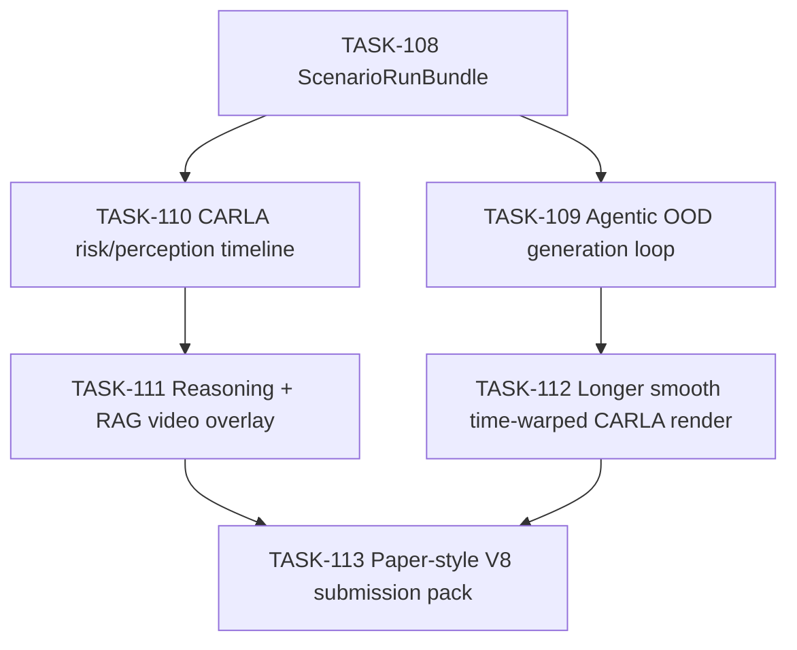

# Scenario Workbench V2 Plan

Last updated: 2026-05-07 12:32 +0800

## Decision

The next sprint should not chase real-time VLA control. It should build a
time-warped, paper-style CARLA demo that makes the contribution legible:

> Generate OOD scenarios, run them in CARLA, extract risk/perception events from
> simulator state, retrieve compact failure memory, show frozen VLA reasoning at
> sampled checkpoints, and curate the result into a growing minimal-shot dataset.

Real-time VLA serving remains future work. Offline/time-warped rendering is
acceptable as long as every artifact labels it honestly.

## Why This Direction Wins

The current TASK-107 draft video is technically valid but not self-explanatory.
It shows a car moving, not the product loop. The strongest submission now is not
"Alpamayo drives CARLA in real time"; it is:

- Scenario Studio as a generation/data-engine layer.
- CARLA as a controlled OOD environment.
- Simulator state as a reliable perception/risk oracle for evaluation.
- RAG as minimal-shot memory, not fine-tuning.
- Alpamayo as frozen sampled reasoning over generated OOD evidence.
- Future work as FlashDrive-style real-time serving.

## Ticket Train

## Main Data Flow

```mermaid
flowchart LR
    A["Seed themes / human brief"] --> B["Agentic OOD loop"]
    B --> C["Scenario Studio candidate"]
    C --> D["CARLA campaign"]
    D --> E["RGB + entity tracks"]
    E --> F["Risk timeline"]
    F --> G["Memory retrieval"]
    G --> H["Alpamayo reasoning snapshot"]
    H --> I["Reasoning overlay video"]
    I --> J["Curated dataset record"]
```

## Claims To Make

- We generate weird but plausible long-tail driving cases.
- We can run and quality-gate those cases in CARLA.
- We can detect risk from simulator state and use it to retrieve prior failure
  memory.
- We can compare frozen VLA reasoning with and without retrieved memory.
- We can curate the result as a reusable minimal-shot evaluation dataset.

## Claims To Avoid

- No real-time Alpamayo control.
- No official Fail2Drive leaderboard score unless a real full route score exists.
- No image-detector claim when risk is from simulator tracks.
- No live LLM/Meshy claim unless provider-backed artifacts exist.

## Next Build Order

1. TASK-108 creates the bundle surface.
2. TASK-110 creates risk timeline from existing tracks.
3. TASK-111 makes the existing video legible with risk/RAG/reasoning overlay.
4. TASK-109 adds the autonomous scenario-generation loop in parallel or after
   the first overlay proof.
5. TASK-112 improves footage and time-warps it.
6. TASK-113 rebuilds the final submission around the V2 story.
