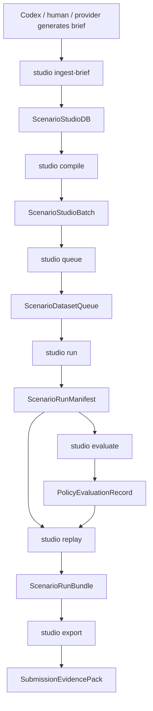

# Scenario Generator CLI V1 Spec

Last updated: 2026-05-07 17:21 +0800

## Decision

Build the Scenario Generator Studio as a **CLI-backed scenario database and
control plane**, then put the AI generation/orchestration layer in Codex.

Recommendation: make `python -m driverx studio ...` the canonical durable data
surface. Existing flat commands remain low-level primitives. The new `studio`
command group should create, ingest, validate, compile, queue, run, evaluate,
replay, and export scenario records. It should not pretend to be the AI brain.

Codex becomes the generator/operator: it proposes weird OOD briefs, uses
external tools when useful, calls the CLI to persist records, chooses the next
experiment, and writes everything back into the artifact database. A future
Codex skill should wrap this workflow after the CLI schema is stable.

## CLI UX

The operator, human or Codex, should be able to run the product loop with a
small number of commands:

```bash
PYTHONPATH=src python3 -m driverx studio init \
  --run-id wet-roadwork-v1

PYTHONPATH=src python3 -m driverx studio ingest-brief \
  --db artifacts/runs/wet-roadwork-v1/scenario_studio_db.json \
  --prompt "Malaysian wet roadwork: motorbike filters while a lorry brakes without signal" \
  --author codex

PYTHONPATH=src python3 -m driverx studio compile \
  --db artifacts/runs/wet-roadwork-v1/scenario_studio_db.json \
  --count 12 \
  --severity 4 \
  --seed 42

PYTHONPATH=src python3 -m driverx studio queue \
  --db artifacts/runs/wet-roadwork-v1/scenario_studio_db.json \
  --accept top:3

PYTHONPATH=src python3 -m driverx studio run \
  --db artifacts/runs/wet-roadwork-v1/scenario_studio_db.json \
  --scenario-id studio-0042-malaysian-wet-roadwork-v00 \
  --policy carla-autopilot \
  --config configs/carla_ood_demo.runpod.high_fidelity.yaml \
  --run-id wet-roadwork-autopilot-run

PYTHONPATH=src python3 -m driverx studio evaluate \
  --db artifacts/runs/wet-roadwork-v1/scenario_studio_db.json \
  --run artifacts/runs/wet-roadwork-autopilot-run/run_manifest.json \
  --policy alpamayo-trajectory \
  --memory auto

PYTHONPATH=src python3 -m driverx studio replay \
  --db artifacts/runs/wet-roadwork-v1/scenario_studio_db.json \
  --run artifacts/runs/wet-roadwork-autopilot-run/run_manifest.json \
  --run-id wet-roadwork-replay

PYTHONPATH=src python3 -m driverx studio export \
  --db artifacts/runs/wet-roadwork-v1/scenario_studio_db.json \
  --run-id scenario-generator-cli-demo
```

For submission speed, the first implementation may also provide an all-in-one
dry run:

```bash
PYTHONPATH=src python3 -m driverx studio quickstart \
  --prompt "Night market double parking with a scooter passing on the shoulder" \
  --policy mock \
  --run-id studio-cli-smoke
```

## Command Contract

### `studio init`

Creates a durable artifact database for one Scenario Studio run.

Output:

- `scenario_studio_db.json`
- `scenario_studio_db.md`
- schema version, run id, empty collections, and claim boundaries

### `studio ingest-brief`

Adds human, Codex, fixture, or provider-generated scenario briefs to the DB.

Output:

- updated `scenario_studio_db.json`
- appended brief record
- validation warnings
- compact stdout summary with the next compile command

### `studio compile`

Deterministically compiles stored briefs into candidate scenarios. This is a
compiler/database operation, not an AI generation operation.

Output:

- updated `scenario_studio_db.json`
- `scenario_studio_batch.json`
- `scenario_studio_recipes.json`
- `scenario_studio_gallery.md`
- compact stdout summary with candidate count, curation counts, and next command

### `studio queue`

Turns compiled candidates into an explicit dataset/run queue.

Output:

- updated `scenario_studio_db.json`
- `scenario_dataset_queue.json`
- `scenario_dataset_queue.md`
- queue rows with `accepted`, `rejected`, `needs_runtime`, and
  `ready_for_submission`

### `studio run`

Runs or plans one queued candidate against a selected policy/runtime.

Policy modes:

- `mock`: dependency-light proof path
- `carla-autopilot`: first real closed-loop CARLA baseline
- `alpamayo-trajectory`: attempts trajectory-to-control loop when available

Output:

- updated `scenario_studio_db.json`
- `run_manifest.json`
- `run_manifest.md`
- video path or precise blocker
- entity tracks or precise blocker
- policy action trace or precise blocker
- timing and claim boundaries

### `studio evaluate`

Links risk, RAG, and model reasoning against a run.

Output:

- updated `scenario_studio_db.json`
- `policy_evaluation.json`
- `policy_evaluation.md`
- Alpamayo baseline vs memory rows when available
- fallback labels when only open-loop reasoning exists

### `studio replay`

Builds one local replay evidence packet from recorded artifacts.

Output:

- updated `scenario_studio_db.json`
- `scenario_run_bundle.json`
- `scenario_run_bundle.html`
- `scenario_run_bundle.md`
- optional overlay video when source frames/video exist

### `studio export`

Builds the judge-facing packet.

Output:

- final DB snapshot
- `scenario_generator_cli_pack.json`
- `scenario_generator_cli_pack.md`
- `scenario_generator_cli_browser.html`
- demo script with exact command provenance

### `studio quickstart`

Runs the smallest dependency-light product proof: init -> ingest brief ->
compile -> queue -> mock run manifest -> replay -> export.

Output:

- all artifacts under one `run_id`
- no CARLA/GPU dependency
- explicit `closed_loop_carla_execution=false`

## Data Flow



## Type Sketch

```python
ScenarioStudioDB = {
  "schema_version": str,
  "run_id": str,
  "briefs": list[ScenarioBrief],
  "plans": list[ScenarioStudioPlan],
  "candidates": list[ScenarioStudioCandidate],
  "queue": list[ScenarioQueueRecord],
  "runs": list[ScenarioRunManifest],
  "evaluations": list[PolicyEvaluationRecord],
  "bundles": list[dict],
  "claim_boundaries": list[str],
}

ScenarioDatasetQueue = {
  "queue_id": str,
  "source_batch_path": str,
  "records": list[ScenarioQueueRecord],
  "claim_boundaries": list[str],
}

ScenarioQueueRecord = {
  "scenario_id": str,
  "candidate_id": str,
  "curation_status": str,
  "run_status": "needs_runtime" | "ready" | "running" | "complete" | "blocked",
  "priority": int,
  "policy_targets": list[str],
  "next_command": str,
}

ScenarioRunManifest = {
  "run_id": str,
  "scenario_id": str,
  "policy": "mock" | "carla-autopilot" | "alpamayo-trajectory",
  "runtime": "local" | "runpod" | "dry_run",
  "artifacts": dict[str, str | None],
  "timings_ms": dict[str, float],
  "claim_boundaries": list[str],
  "blockers": list[str],
}
```

## UX Principles

- The CLI owns durable scenario records and artifact linkage; Codex owns
  creative generation and experiment selection.
- Every command prints compact JSON to stdout and writes Markdown for humans.
- Every command says the next likely command.
- Existing flat commands remain available for debugging.
- The high-level `studio` commands link artifacts instead of copying heavy
  videos or model outputs.
- Remote/CARLA commands must degrade to precise blockers rather than crashing
  without evidence.
- The CLI should be easy for Codex to call; the future skill is an AI operator
  that uses the CLI database, not a second data store.

## Tickets

- TASK-114: CLI database surface and quickstart.
- TASK-115: dataset queue and curation commands.
- TASK-116: closed-loop run manifest and CARLA policy runner command.
- TASK-117: Alpamayo trajectory evaluation adapter in the CLI loop.
- TASK-118: replay/export packet for the CLI product demo.
- TASK-119: Codex Scenario Operator skill wrapper around the CLI database.
