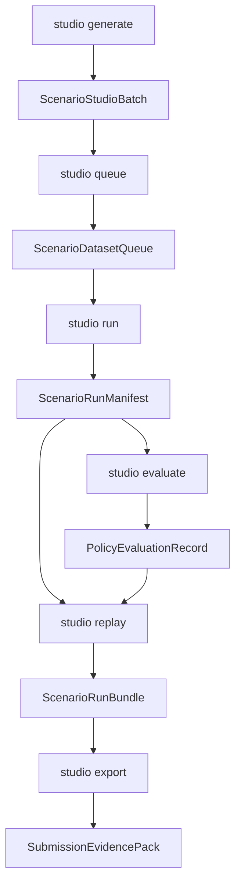

# Scenario Generator CLI V1 Spec

Last updated: 2026-05-07 17:12 +0800

## Decision

Build the Scenario Generator Studio as a CLI-first product before building a
browser app or Codex skill.

Recommendation: make `python -m driverx studio ...` the canonical operator
surface. Existing flat commands remain as low-level primitives, while the
`studio` command group becomes the judge/demo workflow.

Codex can still be the harness, but only by calling the same CLI commands. A
Codex skill can wrap the workflow after the CLI is stable; the skill should not
be the first implementation surface because it would hide state, make remote
debugging harder, and make evidence harder to reproduce.

## CLI UX

The operator should be able to run the product loop with a small number of
commands:

```bash
PYTHONPATH=src python3 -m driverx studio generate \
  --prompt "Malaysian wet roadwork: motorbike filters while a lorry brakes without signal" \
  --count 12 \
  --severity 4 \
  --seed 42 \
  --run-id wet-roadwork-v1

PYTHONPATH=src python3 -m driverx studio queue \
  --studio-batch artifacts/runs/wet-roadwork-v1/scenario_studio_batch.json \
  --accept top:3

PYTHONPATH=src python3 -m driverx studio run \
  --queue artifacts/runs/wet-roadwork-v1/scenario_dataset_queue.json \
  --scenario-id studio-0042-malaysian-wet-roadwork-v00 \
  --policy carla-autopilot \
  --config configs/carla_ood_demo.runpod.high_fidelity.yaml \
  --run-id wet-roadwork-autopilot-run

PYTHONPATH=src python3 -m driverx studio evaluate \
  --run artifacts/runs/wet-roadwork-autopilot-run/run_manifest.json \
  --policy alpamayo-trajectory \
  --memory auto

PYTHONPATH=src python3 -m driverx studio replay \
  --run artifacts/runs/wet-roadwork-autopilot-run/run_manifest.json \
  --run-id wet-roadwork-replay

PYTHONPATH=src python3 -m driverx studio export \
  --runs artifacts/runs/wet-roadwork-replay/scenario_run_bundle.json \
  --run-id scenario-generator-cli-demo
```

For submission speed, the first implementation may also provide an all-in-one
dry run:

```bash
PYTHONPATH=src python3 -m driverx studio quickstart \
  --prompt "Night market double parking with a scooter passing on the shoulder" \
  --policy mock \
  --run-id studio-cli-smoke
```

## Command Contract

### `studio generate`

Compiles natural-language OOD briefs into candidate scenarios.

Output:

- `scenario_studio_batch.json`
- `scenario_studio_recipes.json`
- `scenario_studio_gallery.md`
- compact stdout summary with candidate count, curation counts, and next command

### `studio queue`

Turns generated candidates into an explicit dataset/run queue.

Output:

- `scenario_dataset_queue.json`
- `scenario_dataset_queue.md`
- queue rows with `accepted`, `rejected`, `needs_runtime`, and
  `ready_for_submission`

### `studio run`

Runs or plans one queued candidate against a selected policy/runtime.

Policy modes:

- `mock`: dependency-light proof path
- `carla-autopilot`: first real closed-loop CARLA baseline
- `alpamayo-trajectory`: attempts trajectory-to-control loop when available

Output:

- `run_manifest.json`
- `run_manifest.md`
- video path or precise blocker
- entity tracks or precise blocker
- policy action trace or precise blocker
- timing and claim boundaries

### `studio evaluate`

Links risk, RAG, and model reasoning against a run.

Output:

- `policy_evaluation.json`
- `policy_evaluation.md`
- Alpamayo baseline vs memory rows when available
- fallback labels when only open-loop reasoning exists

### `studio replay`

Builds one local replay evidence packet from recorded artifacts.

Output:

- `scenario_run_bundle.json`
- `scenario_run_bundle.html`
- `scenario_run_bundle.md`
- optional overlay video when source frames/video exist

### `studio export`

Builds the judge-facing packet.

Output:

- `scenario_generator_cli_pack.json`
- `scenario_generator_cli_pack.md`
- `scenario_generator_cli_browser.html`
- demo script with exact command provenance

### `studio quickstart`

Runs the smallest dependency-light product proof: generate -> queue -> mock run
manifest -> replay -> export.

Output:

- all artifacts under one `run_id`
- no CARLA/GPU dependency
- explicit `closed_loop_carla_execution=false`

## Data Flow



## Type Sketch

```python
ScenarioDatasetQueue = {
  "queue_id": str,
  "source_batch_path": str,
  "records": list[ScenarioQueueRecord],
  "claim_boundaries": list[str],
}

ScenarioQueueRecord = {
  "scenario_id": str,
  "candidate_id": str,
  "curation_status": str,
  "run_status": "needs_runtime" | "ready" | "running" | "complete" | "blocked",
  "priority": int,
  "policy_targets": list[str],
  "next_command": str,
}

ScenarioRunManifest = {
  "run_id": str,
  "scenario_id": str,
  "policy": "mock" | "carla-autopilot" | "alpamayo-trajectory",
  "runtime": "local" | "runpod" | "dry_run",
  "artifacts": dict[str, str | None],
  "timings_ms": dict[str, float],
  "claim_boundaries": list[str],
  "blockers": list[str],
}
```

## UX Principles

- Every command prints compact JSON to stdout and writes Markdown for humans.
- Every command says the next likely command.
- Existing flat commands remain available for debugging.
- The high-level `studio` commands link artifacts instead of copying heavy
  videos or model outputs.
- Remote/CARLA commands must degrade to precise blockers rather than crashing
  without evidence.
- The CLI should be easy for Codex to call; a future skill should be a wrapper
  around these commands, not a second implementation.

## Tickets

- TASK-114: CLI product surface and quickstart.
- TASK-115: dataset queue and curation commands.
- TASK-116: closed-loop run manifest and CARLA policy runner command.
- TASK-117: Alpamayo trajectory evaluation adapter in the CLI loop.
- TASK-118: replay/export packet for the CLI product demo.
