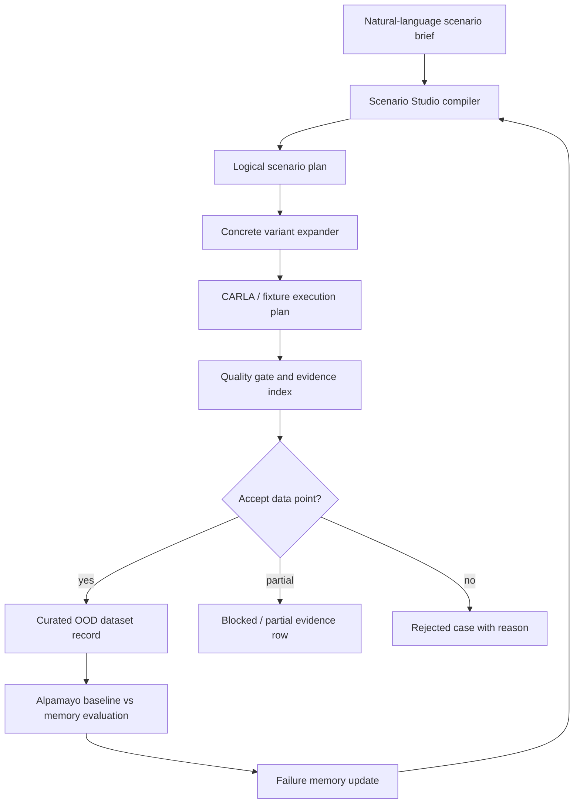

# Scenario Studio Data Engine Spec

Last updated: 2026-05-07 03:05 +0800

## Decision

`TASK-103` should be treated as the core product contribution for the final
SoTA sprint. It is not just prompt-to-YAML. It is a small autonomy data engine:
generate edge-case scenario briefs, compile them into CARLA-ready concrete
cases, quality-gate the results, score model reactions, and curate the best
cases into the final minimal-shot evaluation dataset.

Recommended scope for this sprint:

- build the deterministic Scenario Studio compiler and batch loop
- make it look like an AI/data-engine workflow through clear artifacts
- keep live LLM generation, Meshy GLB import, and full UI as optional stretch

## Parity Brief

### Capability And Lens

Capability: scenario authoring and dataset growth for minimal-shot autonomy.

Parity lens: if this were a small Scale AI / Applied Intuition style product
for self-driving evaluation, what surfaces would make it credible to an
autonomy reviewer?

### Local Baseline

0xDriver already has:

- deterministic Fail2Drive-like scenario seed loading
- generated `ScenarioRecipe` records
- six environment families including construction, roadside market, flooding,
  night rain/fog, dense regional traffic, and school-zone occlusion
- behavior DSL variants for no-signal cut-ins, sudden braking, motorcycle
  filtering, wrong-way shoulder creep, informal right-of-way push, stunt
  motorcycle proxy, double-parked swerve, and unsignaled U-turn
- CARLA evidence, entity tracks, quality gates, catalog promotion, memory, and
  Alpamayo open-loop reasoning

Current gap: these are powerful components, but the authoring loop is still
developer-facing. A judge cannot yet type or read a scenario brief and see how
that brief becomes a dataset candidate, simulator run, memory query, and model
evaluation case.

### Comparable Implementations

- [ASAM OpenSCENARIO DSL](https://www.asam.net/standards/detail/openscenario-dsl/)
  separates abstract scenario intent from concrete scenario descriptions and is
  used for large-scale AV/ADAS verification and validation.
- [CARLA ScenarioRunner OpenSCENARIO support](https://scenario-runner.readthedocs.io/en/latest/openscenario_support/)
  shows the practical runtime layer: initial actions, story actions,
  controller activation, speed actions, route assignment, conditions, and stop
  triggers.
- [Applied Intuition Physical AI](https://www.appliedintuition.com/physical-ai)
  frames the production product as data ingestion, curation, simulation,
  evaluation, metrics, lineage, and agent-driven workflows around physical AI.
- [NVIDIA Omniverse Replicator](https://docs.omniverse.nvidia.com/extensions/latest/ext_replicator.html)
  converges on randomizers, semantic annotations, annotators, visualizers, and
  writers for synthetic data generation.
- [Scale Data Engine for Physical AI](https://scale.com/blog/physical-ai)
  emphasizes high-quality data collection and annotation for robotics and
  physical AI, not raw volume alone.
- [NVIDIA Cosmos-Drive-Dreams](https://research.nvidia.com/labs/toronto-ai/cosmos_drive_dreams/)
  is useful as a north star: controllable, high-fidelity, challenging synthetic
  driving scenarios that improve downstream autonomy tasks.

### Common Surfaces

The credible systems converge on these surfaces:

1. Scenario intent at multiple abstraction levels: abstract brief, logical
   parameter ranges, concrete scenario instance.
2. Parameterized variation instead of one-off scenes.
3. Quality gates that decide whether a generated case enters the dataset.
4. Semantic labels and metadata for every actor, asset, environment, and risk.
5. Evaluation outputs tied to model behavior, failures, and metrics.
6. Curation lineage: why this case exists, what it extends, what evidence was
   captured, and why it was accepted or rejected.
7. A flywheel loop: generate, run, score, curate, remember, generate more.

### Repo Delta

0xDriver does not need an enterprise UI to hit parity for the commission. It
does need the data-engine loop to be explicit and inspectable:

- prompt/brief layer
- compiler layer
- candidate expansion layer
- quality and novelty gate
- model/RAG evaluation handoff
- curated dataset report
- gallery/browser output for judges

## Product Shape

Scenario Studio is a headless product for this sprint. It should ship as a CLI
plus JSON/Markdown/HTML artifacts, not a large web app.

The judge-facing story:

1. Author a scenario brief.
2. Studio compiles it into behavior, environment, assets, memory query, and
   quality targets.
3. Studio expands it into deterministic concrete variants.
4. CARLA or fixture paths run the chosen variants.
5. Quality gates accept, reject, or mark cases partial.
6. Alpamayo is queried with and without retrieved memory.
7. Useful failures become new memory and dataset candidates.
8. Final browser shows the scenario, video, model reasoning, memory delta, and
   claim boundary.



## User Jobs

- Researcher: write weird but plausible road situations quickly.
- Simulator operator: know which cases are ready to run in CARLA.
- Model evaluator: pick cases that stress a frozen VLA in a minimal-shot way.
- Dataset curator: decide whether a generated case is good enough to keep.
- Judge: understand what was generated, what was measured, what failed, and
  what the model reasoned.

## Scenario Studio V1 Workflow

### 1. Brief Authoring

Input examples:

- `Malaysian wet roadwork: motorbike filters between cars while a lorry brakes without signal`
- `School-zone occlusion: parked van hides a child crossing while a dropped bag sits near the lane edge`
- `Flooded urban road: low obstacle blends into water while traffic creeps around cones`
- `Night rain glare: reflective sign distracts the policy near a lane closure`
- `Double-parked market street: door-swerve vehicle intrudes while a scooter passes on the shoulder`

### 2. Intent Extraction

The compiler extracts:

- region: Malaysian / dense Asian urban / generic
- environment families: wet roadwork, roadside market, flood, night rain, school zone
- dynamic behavior: motorbike filtering, no-signal cut-in, sudden brake, wrong-way shoulder, U-turn
- risk mechanism: occlusion, lateral uncertainty, low-profile object, visual noise, route blockage
- assets: cones, barrier, lorry proxy, scooter, food cart, crates, school bag
- expected safe principle: slow, creep, yield, maintain clearance, ignore irrelevant novelty

### 3. Logical Scenario Plan

The output is not immediately a CARLA script. It is a logical scenario:

- selected map/town and route seed
- environment family and severity range
- behavior template and parameter ranges
- actor/asset tags and placements
- memory query terms
- expected failure mode
- quality targets
- downstream evaluation requirements

### 4. Concrete Variant Expansion

Each logical plan expands into `N` concrete variants:

- fixed random seed
- exact environment recipe
- exact behavior plan
- exact actor placements
- exact asset proxy list
- exact quality thresholds

### 5. Quality Gate

A generated case qualifies as a dataset candidate only if it passes or
explicitly explains partial evidence.

Recommended V1 gates:

- `compiles`: all selected environment/behavior/assets are known
- `solvable`: expected safe behavior is feasible by slowing, yielding, or local bypass
- `novel`: tag combination is not duplicate of existing selected cases
- `ood_pressure`: at least two stressors exist, such as weather plus behavior
- `road_aligned`: ego and actors are on or near the road frame when live evidence exists
- `conflict_present`: tracks show a non-trivial interaction or risk proximity
- `evidence_complete`: report/video/tracks/package exist when claimed
- `model_value`: baseline failure, memory change, or instructive no-change is present

### 6. Dataset Curation

Every case receives one curation label:

- `accept`: strong scenario and usable evidence
- `accept_partial`: useful but missing one runtime artifact
- `needs_rerun`: scenario is good but evidence failed
- `reject_duplicate`: too similar to existing selected cases
- `reject_invalid`: impossible, unsupported, or not meaningful
- `blocked_runtime`: useful but waiting on CARLA/GPU/HF

## Data Contracts

### ScenarioBrief

```python
ScenarioBrief = {
  "brief_id": str,
  "prompt": str,
  "author": "human" | "agent" | "fixture",
  "region": str | None,
  "requested_tags": list[str],
  "target_policy_pressure": str | None,
}
```

### ScenarioStudioPlan

```python
ScenarioStudioPlan = {
  "plan_id": str,
  "brief_id": str,
  "environment_template_id": str,
  "environment_family": str,
  "behavior_template_id": str,
  "asset_tags": list[str],
  "ood_tags": list[str],
  "memory_query": list[str],
  "expected_failure_mode": str,
  "safe_behavior_principle": str,
  "quality_targets": dict[str, float | bool | str],
  "provider": "deterministic" | "llm",
  "validation": StudioValidationReport,
}
```

### ScenarioStudioCandidate

```python
ScenarioStudioCandidate = {
  "candidate_id": str,
  "plan_id": str,
  "variant_index": int,
  "random_seed": int,
  "compiled_recipe": ScenarioRecipe,
  "environment_recipe": EnvironmentRecipe,
  "behavior_plan": BehaviorPlan,
  "asset_requests": list[dict],
  "carla_run_ready": bool,
  "alpamayo_package_ready": bool,
}
```

### DatasetCurationRecord

```python
DatasetCurationRecord = {
  "candidate_id": str,
  "curation_status": str,
  "score": float,
  "gate_results": dict[str, bool | str | float | None],
  "novelty_tags": list[str],
  "evidence_paths": dict[str, str | None],
  "model_eval_status": "not_run" | "planned" | "passed" | "blocked",
  "why_keep": str,
  "next_action": str,
}
```

## Scoring Model

Use a transparent score rather than magic. V1 can be deterministic:

```text
studio_score =
  0.20 * compile_validity
+ 0.20 * ood_pressure
+ 0.15 * novelty
+ 0.15 * solvability
+ 0.15 * evidence_readiness
+ 0.15 * model_eval_value
```

The score is not a benchmark metric. It is a curation heuristic that explains
why a scenario is worth spending CARLA/GPU time on.

## Implementation Plan For TASK-103

### Change

Build `driverx.scenarios.studio` as a Scenario Studio data-engine layer over
existing scenario, environment, behavior, asset, memory, and policy-evaluation
modules.

### Before To After

Before:

- scenario generation is config/code driven
- no first-class prompt brief
- no dataset curation record
- no scenario authoring gallery

After:

- natural-language briefs compile into validated studio plans
- plans expand into concrete candidates
- candidates carry quality targets and curation status
- batch output gives judges a readable gallery and gives later tickets concrete
  cases for CARLA and Alpamayo

### Touch

- `src/driverx/scenarios/studio.py`: core compiler, expander, curation scorer
- `src/driverx/scenarios/studio_cli.py`: CLI registration
- `src/driverx/scenarios/__init__.py`: public exports
- `src/driverx/cli.py`: command registration
- `configs/scenario_studio.sample.yaml`: prompt batch
- `tests/test_scenario_studio.py`: compiler, validation, scoring, CLI
- `tickets/TASK-103/artifacts`: generated batch and gallery

### Signature Delta

```python
compile_scenario_prompt(prompt: str, *, seed: int, catalog: StudioCatalog | None = None) -> ScenarioStudioPlan

expand_studio_plan(plan: ScenarioStudioPlan, *, count: int, random_seed: int) -> list[ScenarioStudioCandidate]

score_studio_candidate(candidate: ScenarioStudioCandidate, existing_records: list[ScenarioCatalogRecord]) -> DatasetCurationRecord

generate_studio_batch(config: ScenarioStudioConfig) -> dict[str, Any]
```

CLI:

```bash
PYTHONPATH=src python3 -m driverx generate-scenario-studio \
  --config configs/scenario_studio.sample.yaml \
  --run-id scenario-studio-v1
```

### Typed Flow Example

Prompt:

`Malaysian wet roadwork: motorbike filters between cars while a lorry brakes without signal`

Flow:

1. `ScenarioBrief(region="malaysian", tags=["wet_roadwork", "motorcycle_filtering", "sudden_brake"])`
2. `ScenarioStudioPlan(environment_template_id="construction_lane_closure", behavior_template_id="motorcycle_filtering")`
3. `ScenarioStudioCandidate(compiled_recipe=..., environment_recipe=..., behavior_plan=...)`
4. `DatasetCurationRecord(curation_status="accept_partial", next_action="run TASK-102 high-fidelity CARLA evidence")`
5. TASK-104 consumes the same candidate for baseline vs memory Alpamayo comparison.

### Execution Steps

1. Define dataclasses and JSON serialization.
2. Implement deterministic keyword/rule compiler using existing environment and
   behavior libraries.
3. Add validation for unknown prompts, unsupported combinations, and empty
   memory queries.
4. Implement candidate expansion and curation scoring.
5. Add batch config and sample prompts.
6. Write JSON and Markdown gallery with accepted, partial, rejected, and blocked
   cases.
7. Add CLI and focused tests.
8. Run pre-push gate and attach review.

## Now Versus Later

### Must Land Now

- deterministic prompt compiler
- 10+ scenario briefs
- concrete candidate expansion
- curation score/status
- Markdown gallery
- handoff fields for TASK-102, TASK-104, and TASK-105

### Later

- live LLM scenario generation provider
- Meshy/custom GLB object generation
- OpenSCENARIO XML export
- full web UI
- active learning loop that automatically launches CARLA/GPU jobs
- model-based novelty scoring

## Claim Boundaries

- `ai_scenario_authoring=false` unless a live LLM provider is used
- `prompt_to_ood_compiler=true`
- `deterministic_reproducible_generation=true`
- `closed_loop_carla_execution=false` for studio-only outputs
- `dataset_curation_heuristic=true`
- `official_benchmark_score=false`
