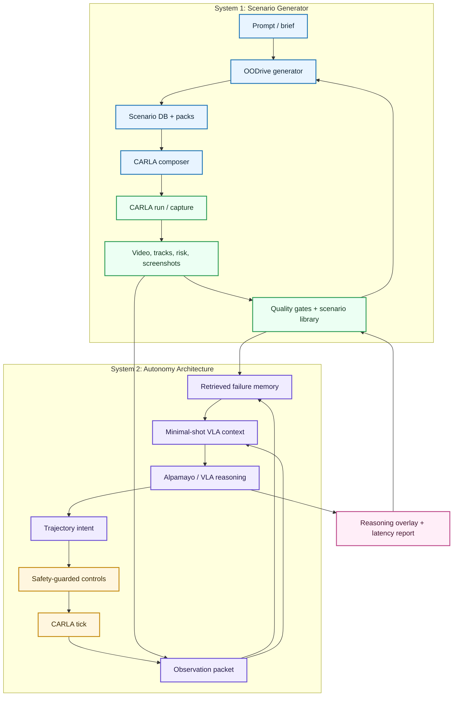
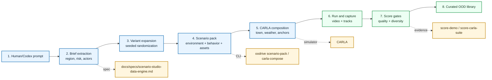
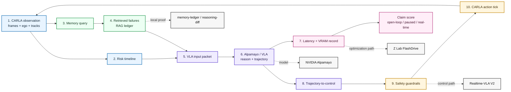
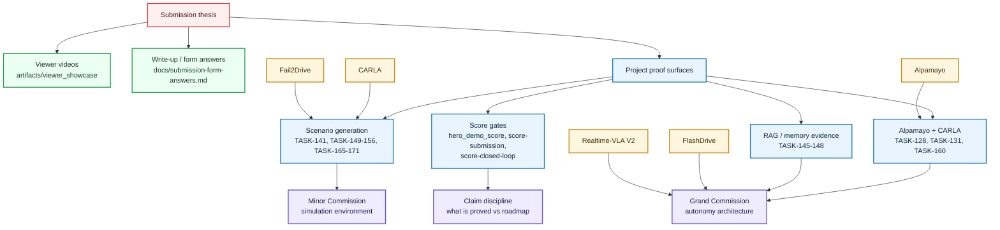

# Submission Thesis: OODrive Minimal-Shot Autonomy

Last updated: 2026-05-09 05:42 +0800

## One-Sentence Thesis

OODrive is an agent-operable CARLA scenario factory plus a minimal-shot VLA
architecture: generate rare driving environments from small prompts, run them
in CARLA, retrieve prior failure memory, and use a reasoning VLA such as
Alpamayo to decide what the vehicle should do under realistic latency and
compute constraints.

## Recommended Submission Framing

Lead with one integrated thesis, then split it into two judge-facing parts:

1. **Best simulation environment:** OODrive makes CARLA programmable by agents.
   A human or coding agent can generate scenario briefs, compose maps/weather/
   actors/objects, place them in CARLA, capture evidence, score quality, and
   curate the result into a reusable OOD dataset.
2. **Best autonomy architecture:** the vehicle uses a minimal-shot reasoning
   loop: observation -> retrieved failure memory -> VLA/VLM reasoning ->
   trajectory/control intent -> safety-guarded CARLA action -> new evidence.

This is stronger than presenting "scenario generation" and "model architecture"
as two unrelated projects. The novelty is the flywheel between them: generated
long-tail worlds create failures, failures become memory, and memory gives a
frozen VLA a small amount of task-relevant context without fine-tuning.

## Why This Fits The Challenge

The challenge asks for a simulation environment for minimal-shot models to
navigate, with extra credit for realistic compute/latency constraints and
randomized scenario generation.

OODrive maps directly:

- **Simulation environment:** CARLA, controlled through OODrive commands and
  generated scenario packs.
- **Navigation demonstration:** live CARLA evidence, risk timeline, and the
  paused Alpamayo/CARLA closed-loop trace when promoted by scores.
- **Minimal-shot model:** frozen Alpamayo / VLA-style reasoning with retrieved
  failure memory instead of model fine-tuning.
- **Randomized scenario generation:** prompt -> deterministic concrete variants
  -> CARLA-ready placement plans -> quality-gated scenario library.
- **Compute and latency honesty:** measured Alpamayo latency/VRAM, explicit
  open-loop versus closed-loop labels, and a clear route to FlashDrive-style
  latency optimization.

## Motivation Story

The human motivation is unusually important and should stay in the submission.
This project began as a one-week experiment:

> I knew almost nothing about self-driving cars at the start. I wanted to see
> how far a motivated outsider could get using Codex, open-source autonomy
> tools, and current VLA research. The surprising result is that a single
> builder could go from zero domain knowledge to a working CARLA scenario
> generator, Alpamayo evidence bridge, RAG/memory layer, and paused closed-loop
> proof path.

The story is not "we are an AV lab pretending this was easy." The story is:

- frontier autonomy tooling is now accessible enough that one person can build
  a credible research harness quickly;
- the hard parts are still real: GPU cost, simulator setup, model latency,
  evidence quality, and claim discipline;
- Codex was not just a code autocomplete tool, but the operator that explored
  ideas, implemented CLI surfaces, ran CARLA, stitched evidence, and helped
  decide what to cut.

This should be framed as **agent-amplified research engineering**: a non-expert
used Codex to climb the autonomy stack, found the real bottlenecks, and built a
submission-grade prototype around the parts that could be proved.

## What We Tried And Learned

The submission can be more credible if it admits the path was messy:

- **Waymo E2E first:** useful as real driving data and ADE baseline support, but
  not the best main path for a simulation-environment challenge. Generating
  meaningful new TFRecord-style driving trajectories is not realistic in a
  one-week prototype.
- **Image generation as input:** attractive for fast visual variety, but not
  consistent enough for simulator-grounded navigation proof. We needed live
  CARLA geometry, actors, tracks, and routes, not disconnected images.
- **Direct VLA real-time serving:** we wanted to reproduce Z Lab / FlashDrive-
  style real-time VLA optimization, but that is a serious systems project. We
  kept it as the production path and focused the submission on measured latency,
  paused closed-loop proof, and honest labels.
- **Environment generation:** this became the strongest surface. Instead of
  pretending we had solved full self-driving, we built the machinery to produce
  many rare CARLA scenarios, run them, inspect them, and feed the results into
  VLA/RAG evaluation.
- **Alpamayo + CARLA bridge:** this became the prestige architecture proof:
  connect a frontier reasoning VLA to generated CARLA evidence, then make its
  reasoning, latency, and action intent inspectable.

## Two-System Architecture

Legend: blue = scenario generator, purple = VLA autonomy loop, green = CARLA
evidence and curation, yellow = safety/control, pink = judge-facing report.

## System 1 Diagram: Scenario Generator

Resource anchors:

- Local: `docs/specs/scenario-generator-cli-v1.md`,
  `docs/specs/scenario-studio-data-engine.md`, `src/oodrive/cli.py`,
  `src/driverx/scenarios/`, `src/driverx/simulators/`
- External: [CARLA](https://carla.readthedocs.io/en/latest/start_introduction/),
  [Fail2Drive](https://github.com/autonomousvision/fail2drive)

## Minimal-Shot Autonomy Architecture

The autonomy architecture should be described as a **reasoning controller
around a frozen VLA**, not as a fine-tuned AV stack.

Core loop:

1. Capture the current CARLA observation, ego state, navigation target, and
   nearby actor tracks.
2. Retrieve a small set of relevant prior failure memories from the OODrive
   memory bank.
3. Package the observation and memory into a VLA prompt/input contract.
4. Run Alpamayo or a compatible VLA/VLM policy to produce causal reasoning and
   trajectory intent.
5. Convert the trajectory into bounded CARLA controls with safety clamps.
6. Tick the simulator and write synchronized evidence.
7. Score whether the run proves open-loop reasoning, paused closed-loop control,
   or real-time closed-loop control.

The submission should say:

> We use the reasoning model as the decision layer, then wrap it with simulator
> synchronization, memory retrieval, trajectory conversion, and safety gates so
> it can be evaluated honestly in CARLA.

## System 2 Diagram: Autonomy Architecture

Resource anchors:

- Local: `src/driverx/memory/`, `src/driverx/policies/`,
  `src/driverx/simulators/`, `oodrive closed-loop-run`, `oodrive infer`,
  `oodrive score-closed-loop`
- External: [NVIDIA Alpamayo](https://developer.nvidia.com/drive/alpamayo),
  [Z Lab FlashDrive](https://z-lab.ai/projects/flashdrive/),
  [Realtime-VLA V2](https://dexmal.github.io/realtime-vla-v2/)

## Real-Time Path

Our current evidence should stay honest, but the architecture can credibly point
to a real-time path.

- NVIDIA positions Alpamayo as an open reasoning VLA for autonomous driving that
  processes video, ego motion, navigation, and text, then generates trajectories
  with language-based causal reasoning.
- Z Lab's FlashDrive shows the right optimization recipe for Alpamayo-style
  driving VLAs: streaming vision cache reuse, speculative reasoning, adaptive
  action generation, quantization, CUDA graphs, and kernel fusion.
- Realtime-VLA V2 supports the broader thesis that VLA deployment is not only
  model inference; calibration, planning, control, and execution-speed
  selection matter too.

Submission phrasing:

> Today we demonstrate the architecture in CARLA with measured latency and
> explicit claim labels. The production path is to apply FlashDrive-style
> inference optimization and Realtime-VLA-style control scheduling so the same
> observe-retrieve-reason-act loop can move toward real-time operation.

## Scenario Generation Architecture

OODrive should be pitched as an **agent-operable simulation environment**, not a
static hand-authored demo.

The loop:

1. A human or coding agent writes a short prompt: "wet Malaysian roadwork with a
   scooter filtering beside ego."
2. OODrive expands it into logical scenario candidates with environment,
   actors, props, behaviors, memory queries, and expected failure modes.
3. The generator composes CARLA towns, weather, road anchors, background
   traffic, pedestrians, stock proxy assets, and dynamic actors.
4. CARLA execution produces frames, tracks, screenshots, and video.
5. Quality gates decide whether the result is gallery-ready, partial, blocked,
   or rejected.
6. The evidence becomes a reusable scenario library for minimal-shot evaluation.

This is a strong Minor Commission story because it turns CARLA from a manual
simulator into a prompt-driven and agent-operable OOD environment generator.

## Novel Contributions To Name

- **Agent-operable CARLA:** OODrive exposes CARLA controls through CLI artifacts
  that a coding agent can use to compose, run, inspect, and score scenarios.
- **Prompt-to-OOD simulation flywheel:** short prompts become scenario packs,
  CARLA placements, live evidence, score gates, and curated dataset records.
- **Alpamayo-to-CARLA bridge:** Alpamayo reasoning and trajectory intent are
  attached to CARLA evidence, with a paused closed-loop path for observe-infer-
  act recurrence.
- **Minimal-shot memory/RAG layer:** prior failures become compact retrieval
  memories that condition the frozen VLA without fine-tuning.
- **Honest latency and claim gating:** videos and reports distinguish open-loop
  reasoning, paused closed-loop proof, fake/cached traces, and real-time VLA
  control.

## Prize Positioning

### Grand Commission: Best Autonomy Architecture

Pitch OODrive as a practical architecture for reasoning autonomy under sparse
data:

- frozen VLA, not a trained-from-scratch policy
- memory retrieval from prior failures
- simulator-grounded risk context
- safety-guarded trajectory/control conversion
- latency-aware deployment path
- score gates for what the system actually proved

### Minor Commission: Best Simulation Environment

Pitch OODrive as the simulation environment:

- agent-accessible CARLA command surface
- randomized OOD scenario generation
- environment families, behavior choreography, and stock proxy object placement
- live CARLA capture and image-diversity scoring
- scenario library export and evidence browser

### Prometheus Prize

Pitch the unreasonable challenge as:

> connecting a frontier reasoning VLA for autonomous driving to a live CARLA
> scenario generator, then making it inspectable enough that viewers can see the
> model reason, fail, recover, and improve through memory.

## Current Proof Inventory

Use these as the backbone of the video/deck:

- OODrive product loop: `oodrive generate -> oodrive place -> oodrive reason`
- TASK-128/TASK-131 live CARLA + Alpamayo evidence pack
- TASK-141 live CARLA generated behavior/object runtime proof
- TASK-145 through TASK-148 RAG ledger, reasoning diff, evidence panel, and
  ancestry cards
- TASK-160 live paused closed-loop CARLA + Alpamayo proof, if the final claim
  matrix promotes it
- Viewer showcase videos in `artifacts/viewer_showcase/`

## Proof And Resource Map

## Prize Money Use

The prize money should be described as prototype acceleration, not vague hiring
or generic polish.

Best wording:

> Prize funding would buy the two scarce resources this project exposed:
> reliable GPU/simulator runtime and focused engineering time. The next step is
> to keep a persistent graphics-capable CARLA + CUDA host online, run many more
> generated scenarios, integrate FlashDrive-style latency optimization, and turn
> the current paused Alpamayo/CARLA loop into a more repeatable real-time
> evaluation service.

Concrete use:

- RunPod or equivalent GPU/CARLA budget for repeated Alpamayo and CARLA runs.
- More scenario breadth: many towns, weather regimes, actors, and failure
  families.
- Real-time optimization work: streaming cache, quantization, CUDA graphs,
  speculative reasoning, and action-generation speedups.
- Stronger custom asset/import pipeline once the core CARLA scenario factory is
  stable.
- Engineering help for the systems work that a one-person sprint could only
  prototype: serving, synchronization, benchmarking, and packaging.

## What Not To Overclaim

- Do not claim arbitrary Unreal world generation. OODrive composes inside
  existing CARLA towns unless custom map/import evidence is attached.
- Do not claim semantic vector RAG unless an embedding/vector index is actually
  implemented and evidenced.
- Do not claim stock proxy objects are generated custom CARLA assets.
- Do not claim real-time VLA control unless the run has synchronized
  observe-infer-act-observe evidence and latency scores that support it.
- Do not call open-loop Alpamayo reasoning a closed-loop driving proof.

## 1-5 Minute Video Structure

1. **Hook, 10 seconds:** "We made CARLA programmable by agents, then used it to
   stress a reasoning VLA on rare driving cases."
2. **Motivation, 25 seconds:** "I knew almost nothing about self-driving cars a
   week ago. I wanted to see how far Codex and open research tools could take a
   motivated outsider toward the state of the art."
3. **Problem, 20 seconds:** autonomy fails on long-tail cases; collecting data
   for every rare situation is impossible.
4. **Simulation environment, 60 seconds:** show prompt-to-scenario generation,
   CARLA placement, varied weather/actors/objects, and scenario library.
5. **Autonomy architecture, 60 seconds:** show observation, RAG memory,
   Alpamayo reasoning, trajectory intent, safety controls, and latency labels.
6. **Evidence, 60-90 seconds:** show live CARLA clips, reasoning overlays,
   closed-loop trace if promoted, and score gates.
7. **Future, 20 seconds:** prize funding turns this into a
   deployable prototype: better real-time serving, richer scenario generation,
   and more VLA evaluation cases.

## Two-Page Write-Up Spine

1. Personal motivation: one-week outsider experiment with Codex and open
   autonomy tools.
2. Research motivation: minimal-shot autonomy needs generated long-tail
   evaluation, not just more collected miles.
3. What we tried: Waymo, image generation, real-time VLA serving, then CARLA
   environment generation and Alpamayo integration.
4. System: OODrive scenario factory + VLA memory architecture.
5. Evidence: CARLA generation, Alpamayo/RAG reasoning, score-gated video, and
   closed-loop trace status.
6. Novelty: agent-operable CARLA, prompt-to-scenario flywheel, VLA-to-CARLA
   bridge, memory-conditioned frozen reasoning model.
7. Limits: no hidden claims; current proof boundaries and exact next steps.
8. Prize use: GPU/CARLA runtime, real-time optimization, bigger scenario
   library, and focused engineering help.

## External References

- NVIDIA Alpamayo: https://developer.nvidia.com/drive/alpamayo
- Z Lab FlashDrive: https://z-lab.ai/projects/flashdrive/
- Realtime-VLA V2: https://dexmal.github.io/realtime-vla-v2/
- CARLA: https://carla.readthedocs.io/en/latest/start_introduction/
- Fail2Drive: https://github.com/autonomousvision/fail2drive
