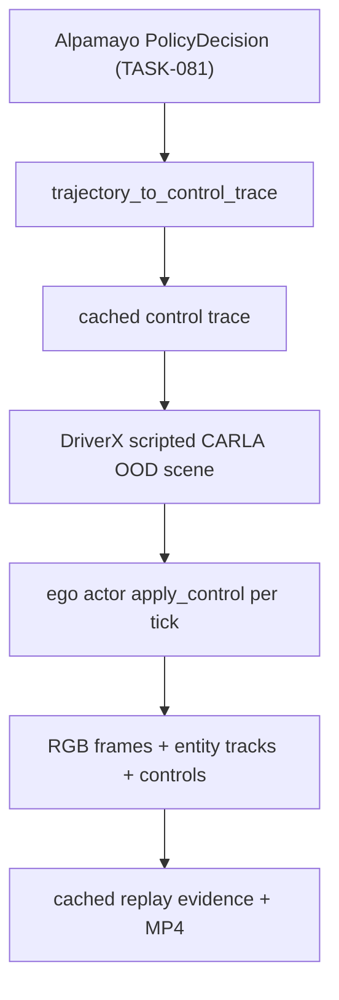

# TASK-083: Cached Alpamayo Trajectory CARLA Replay Pilot

## Status
- state: done
- owner: Codex
- assignee: generalPurpose
- dependencies: TASK-078, TASK-081, TASK-062
- location: `src/driverx/simulators`, `src/driverx/policies`, `src/driverx/pipeline`, tests, `tickets/TASK-083/artifacts`
- enter when: TASK-081 has a same-scene Alpamayo decision and local CARLA can run the scripted OOD scene
- leave when: a cached Alpamayo trajectory can drive a CARLA ego actor through the scripted OOD scene, with RGB frames, entity tracks, controls, and claim boundaries
- blockers: none
- spawned follow-ups: TASK-084, TASK-088
- complexity: L

### Summary

Turn the current open-loop Alpamayo trajectory into a visible CARLA behavior
artifact without pretending it is real-time VLA control. The pilot replays a
cached baseline or memory-augmented Alpamayo `PolicyDecision` as conservative
controls inside the same scripted OOD scene used for TASK-078.

### Scope

- In scope: cached trajectory replay against a live/fake CARLA ego actor,
  bounded controls, per-tick actor tracks, control trace logs, RGB capture,
  safety clamp reporting, and a replay evidence bundle.
- Out of scope: real-time Alpamayo inference in the control loop, stock
  Fail2Drive scoring, route-following leaderboard claims, and SimLingo policy
  execution.

### Plan

#### Change

Add a cached-policy replay mode for the DriverX scripted CARLA OOD demo. It
loads `alpamayo_policy_decision.json`, converts trajectory intent to bounded
controls via the existing `trajectory_to_control_trace`, applies controls to
the ego actor during a CARLA tick loop, captures RGB/tracks, and writes one
auditable replay report.

#### Why

The submission needs to show how the car reacts, not only how Alpamayo reasons
over still frames. Cached replay is the honest bridge: it demonstrates the
control seam and the visual reaction while keeping latency and open-loop limits
explicit.

#### Before -> After

- Before: Alpamayo output is a trajectory intent artifact and a comparison
  report; the CARLA video is driven by DriverX scripted ego motion.
- After: a saved Alpamayo decision can produce a CARLA ego control trace and a
  replay video/evidence bundle labeled `closed_loop_control=cached_replay`.

#### Touch

- `src/driverx/simulators/carla_policy_replay.py`: extend from dry-run actor
  command application to ticked live/fake CARLA replay.
- `src/driverx/simulators/carla_cached_ood_replay.py`: new orchestration seam
  combining OOD scene setup, cached controls, camera capture, and tracks.
- `src/driverx/simulators/carla_cached_ood_replay_cli.py`: `run-cached-ood-replay`.
- `src/driverx/simulators/carla_ood_demo.py`: extract reusable actor/camera
  setup helpers only if needed.
- `src/driverx/pipeline/ood_video_evidence.py`: reuse for replay video
  assembly; add source label only if current enum is too narrow.
- `src/driverx/cli.py`, `src/driverx/simulators/__init__.py`.
- `configs/carla_cached_ood_replay.local.sample.yaml`.
- `tests/test_carla_cached_ood_replay.py`, `tests/test_carla_policy_replay.py`,
  `tests/test_trajectory_control.py`.
- `README.md`, `docs/progress.md`, `blockers.md`.

#### Inspect

- `src/driverx/simulators/carla_ood_demo.py`
- `src/driverx/simulators/carla_policy_replay.py`
- `src/driverx/policies/trajectory_control.py`
- `tickets/TASK-081/artifacts/task81-live-same-scene-memory-summary/alpamayo_policy_decision.json`
- `tickets/TASK-078/artifacts/task78-live-ood-capture-v3/entity_tracks.json`

#### Signature Delta

```python
src/driverx/simulators/carla_cached_ood_replay.py / run_cached_ood_replay(config: CachedOodReplayConfig, run_dir: Path, *, carla_module: object | None = None) -> CachedOodReplayResult
src/driverx/simulators/carla_cached_ood_replay.py / write_cached_ood_replay(run_dir: Path, result: CachedOodReplayResult) -> dict[str, Any]
src/driverx/simulators/carla_policy_replay.py / apply_control_trace(actor: object, trace: ControlTrace, *, world: object | None = None, tick_timeout_s: float = 2.0) -> AppliedControlReplay
```

#### Type Sketch

```python
CachedOodReplayConfig = {
  "decision_path": Path,
  "carla_ood_config_path": Path,
  "behavior_id": "motorcycle_filtering",
  "control": TrajectoryControlConfig,
  "tick_count": 120,
  "fps": 5,
  "capture_rgb": True,
  "claim_label": "cached_alpamayo_replay",
}

CachedOodReplayResult = {
  "status": "passed" | "partial" | "blocked",
  "decision_path": str,
  "source_policy_id": "alpamayo-live",
  "closed_loop_control": "cached_replay",
  "applied_count": int,
  "command_count": int,
  "frame_count": int,
  "tracks_path": str | None,
  "rgb_folder": str | None,
  "control_trace_path": str,
  "safety_clamps": list[str],
  "claim_boundaries": list[str],
}
```

#### Typed Flow Example

`task81-live-same-scene-memory-summary/alpamayo_policy_decision.json`
-> `load_policy_decision_trajectory`
-> `trajectory_to_control_trace(..., trajectory_frame="ego")`
-> `run_cached_ood_replay`
-> `cached_ood_replay.json + rgb/ + entity_tracks.json`
-> `assemble-ood-video --source-kind cached_replay`

#### Execution Steps

1. Add fake-CARLA tests for applying a `ControlTrace` across ticks and logging
   the applied commands.
2. Extract only the minimal reusable CARLA actor/camera helpers needed from the
   scripted OOD runner.
3. Implement `run_cached_ood_replay` with conservative defaults and strict
   claim boundaries.
4. Add CLI/config and report writer.
5. Run fake-CARLA tests and dry-run replay against TASK-081 decisions.
6. If local CARLA is up, run one live cached replay and assemble the replay MP4.
7. If live CARLA stalls, write a precise blocker and keep the fake-CARLA proof.

#### Recommendation

Build cached replay before trying live real-time VLA control. It gives the
submission a visible "policy reaction" artifact now while making the latency
truth obvious.

#### Options Considered

- Real-time Alpamayo in the control loop: more impressive, but current eager
  inference is tens of seconds to minutes and unsuitable for the local loop.
- Keep only open-loop reports: safe, but undersells the simulator and does not
  answer "how does the car react?"
- Cached replay pilot: best now; honest, testable, and directly demoable.

#### Blast Radius

- CARLA simulator helpers and policy replay commands.
- No model/runtime bootstrap changes.
- No official Fail2Drive route score claims.

#### Risks

- CARLA may stall or not tick; fake-CARLA tests and partial reports contain
  this.
- Alpamayo trajectory frame may not align with CARLA world coordinates; v1 uses
  ego-frame replay and logs safety clamps.
- The video could be mistaken for real-time VLA driving; every artifact must
  label `cached_replay`.

### Diagram



### Acceptance Criteria

- [x] AC-1: `run-cached-ood-replay` accepts a TASK-081 policy decision and writes replay JSON/Markdown.
- [x] AC-2: Fake-CARLA tests prove controls are applied, ticks are counted, and cleanup/reporting works.
- [x] AC-3: Live CARLA proof records frames/tracks and an 8.0s MP4 evidence video.
- [x] AC-4: All evidence labels the result as cached trajectory replay, not real-time closed-loop VLA.

### Verification

- `PYTHONPATH=src python3 -m unittest tests.test_carla_cached_ood_replay tests.test_carla_policy_replay tests.test_trajectory_control`
- If CARLA is up:
  `bash scripts/run_carla_client_docker.sh python -m driverx run-cached-ood-replay --config configs/carla_cached_ood_replay.local.sample.yaml --decision tickets/TASK-081/artifacts/task81-live-same-scene-memory-summary/alpamayo_policy_decision.json --run-id task83-live-cached-replay`
- `bash scripts/pre_push_check.sh`

### Autonomy Readiness

- Can proceed locally with fake-CARLA tests.
- Live proof needs local CARLA open and Docker reachable.
- No GPU is required unless a fresh Alpamayo decision is requested.

### Evidence

- Planned 2026-05-06 after TASK-078 through TASK-082 produced live scripted
  CARLA and same-scene Alpamayo evidence.
- Plan review: `docs/reviews/TASK-083-088-impl-plan-review.md`.
- Implementation review: `docs/reviews/TASK-083-088-implementation-review.md`.
- QA report: `tickets/TASK-087/artifacts/qa/TASK-083-088-qa-report.md`.
- Implemented 2026-05-06. Local proof:
  `tickets/TASK-083/artifacts/task83-cached-replay/cached_ood_replay.md`.
- Live CARLA proof passed through Docker against local CARLA 0.9.16:
  `tickets/TASK-083/artifacts/task83-live-cached-replay/cached_ood_replay.md`
  with 40 RGB frames, 8.0s duration, and no blockers.
- Video evidence assembled at
  `tickets/TASK-083/artifacts/task83-live-cached-replay-video/ood_video_evidence.md`.

### Blockers

- None. The result remains a cached replay, not real-time VLA control.
