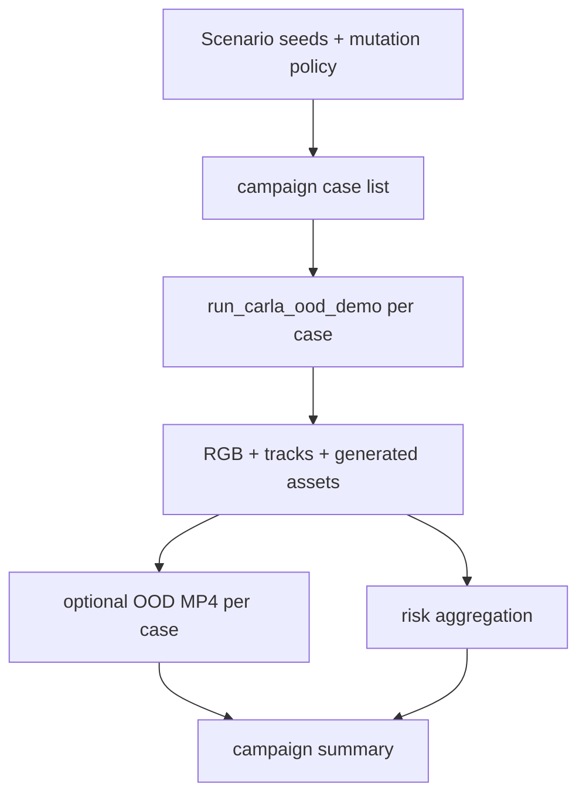

# TASK-085: Scripted OOD Scenario Campaign Runner

## Status
- state: done
- owner: Codex
- assignee: generalPurpose
- dependencies: TASK-078, TASK-079, TASK-066, TASK-076
- location: `src/driverx/pipeline`, `src/driverx/simulators`, `src/driverx/scenarios`, tests, `tickets/TASK-085/artifacts`
- enter when: one scripted CARLA OOD case works and the submission needs broader randomized scenario coverage
- leave when: a small campaign can run or plan multiple generated OOD cases, aggregate risk/video evidence, and identify the best/worst case
- blockers: none
- spawned follow-ups: TASK-086, TASK-088
- complexity: L

### Summary

Scale from one live scripted CARLA scenario to a small campaign of generated
edge cases. The campaign runner should make randomized scenario generation
visible: multiple recipes, behaviors, stock proxy assets, risk summaries, and
selected evidence videos.

### Scope

- In scope: campaign config, deterministic scenario/behavior selection,
  per-case live/fake run planning, risk aggregation from entity tracks,
  optional video assembly, and a suite report.
- Out of scope: full Fail2Drive scoring, Meshy asset import, real-time VLA
  control, or dozens of long CARLA runs in one ticket.

### Gap Analysis

- Current state: TASK-078 proves one live generated OOD scene.
- Production expectation: the simulator should generate varied OOD cases, not
  a single hand-picked scene.
- Missing gaps: a campaign-level runner, case selection, aggregate evidence,
  best/worst case ranking, and resumability so failed live runs do not waste
  prior results.
- Recommendation: implement a `limit=3` campaign first, with fake/dry-run tests
  and optional live CARLA proof.

### Plan

#### Change

Add `run-scripted-ood-campaign` that generates or loads recipes, selects
regional behaviors, executes `run_carla_ood_demo` per case when live mode is
enabled, optionally assembles per-case videos, and writes `campaign_summary`.

#### Why

The SoTA prompt explicitly rewards randomized scenario generation. A campaign
report is a stronger proof than a single video.

#### Before -> After

- Before: one generated OOD scene is runnable and visible.
- After: the repo can produce a small suite with multiple OOD behaviors,
  artifacts, risk rankings, and selected video proof.

#### Touch

- `src/driverx/pipeline/scripted_ood_campaign.py`: new campaign orchestrator.
- `src/driverx/pipeline/scripted_ood_campaign_cli.py`: CLI registration.
- `src/driverx/scenarios`: reuse recipe generation; add selection helper only
  if current APIs cannot express it.
- `src/driverx/simulators/carla_ood_demo.py`: reuse runner.
- `src/driverx/pipeline/ood_video_evidence.py`: optional per-case video.
- `src/driverx/cli.py`.
- `configs/scripted_ood_campaign.local.sample.yaml`.
- `tests/test_scripted_ood_campaign.py`.
- `README.md`, `docs/progress.md`, `blockers.md`.

#### Inspect

- `src/driverx/pipeline/generated_ood_suite.py`
- `src/driverx/behaviors/library.py`
- `src/driverx/assets/pipeline.py`
- `tickets/TASK-078/artifacts/task78-live-ood-capture-v3/carla_ood_demo.json`

#### Signature Delta

```python
src/driverx/pipeline/scripted_ood_campaign.py / run_scripted_ood_campaign(config: ScriptedOodCampaignConfig) -> dict[str, Any]
src/driverx/pipeline/scripted_ood_campaign.py / summarize_campaign_case(case_dir: Path, result: dict[str, Any], video: dict[str, Any] | None) -> CampaignCaseRecord
```

#### Type Sketch

```python
ScriptedOodCampaignConfig = {
  "scenario_config_path": Path,
  "carla_ood_config_path": Path,
  "behavior_ids": ["motorcycle_filtering", "sudden_brake", "unsignaled_u_turn"],
  "count": 3,
  "seed": 7,
  "live": bool,
  "assemble_video": bool,
  "resume": bool,
}

CampaignSummary = {
  "status": "passed" | "partial" | "blocked",
  "case_count": int,
  "live_case_count": int,
  "best_case": CampaignCaseRecord | None,
  "worst_case": CampaignCaseRecord | None,
  "mean_min_distance_m": float | None,
  "cases": list[CampaignCaseRecord],
}
```

#### Typed Flow Example

`scenario_forge.sample.yaml + behavior_ids=[motorcycle_filtering, sudden_brake, unsignaled_u_turn]`
-> 3 `ScenarioRecipe`s
-> per-case `run_carla_ood_demo`
-> per-case `ood_video_evidence`
-> `scripted_ood_campaign_summary.json`
-> V5 pack selects worst/highest-demo-value case.

#### Execution Steps

1. Implement fake-run campaign mode that uses fixture-like case results and
   proves aggregation without CARLA.
2. Add live mode that invokes `run_carla_ood_demo` serially with `limit`.
3. Add resume behavior: skip a case when final JSON already exists.
4. Add risk aggregation from `entity_tracks.json` and video evidence.
5. Add CLI/config and focused tests.
6. Run one fake campaign and, if CARLA is reachable, a `limit=2` live campaign.

#### Recommendation

Keep the first campaign small. A reliable 3-case suite beats an ambitious
10-case suite that stalls overnight.

#### Options Considered

- Use stock Fail2Drive for campaign: more benchmark-pure, but currently blocked
  by local runtime speed.
- Make only more fixture videos: easy, but weaker as simulator proof.
- DriverX scripted campaign: best current path; it extends the working live
  CARLA surface.

#### Blast Radius

- Pipeline-level orchestration and docs.
- Reuses existing simulator APIs; no model runtime changes.

#### Risks

- CARLA can leak actors between failed cases; each case must enforce cleanup and
  record spawned/destroyed ids.
- Long live campaigns may stall; default `count` and `tick_count` must stay
  conservative.

### Diagram



### Acceptance Criteria

- [x] AC-1: Campaign command produces deterministic case records from seed/config.
- [x] AC-2: Fake/dry-run campaign tests cover aggregation and best/worst ranking without CARLA.
- [x] AC-3: Live mode ran two CARLA cases and recorded RGB/tracks/video evidence.
- [x] AC-4: Campaign report distinguishes scripted CARLA evidence from stock Fail2Drive scores.

### Verification

- `PYTHONPATH=src python3 -m unittest tests.test_scripted_ood_campaign tests.test_carla_ood_demo tests.test_ood_video_evidence`
- Optional live:
  `bash scripts/run_carla_client_docker.sh python -m driverx run-scripted-ood-campaign --config configs/scripted_ood_campaign.local.sample.yaml --limit 2 --run-id task85-live-campaign`
- `bash scripts/pre_push_check.sh`

### Autonomy Readiness

- Fake/dry-run proof can proceed immediately.
- Live proof needs local CARLA and Docker.
- No GPU required.

### Evidence

- Planned 2026-05-06 after the first 24s live scripted OOD video landed.
- Plan review: `docs/reviews/TASK-083-088-impl-plan-review.md`.
- Implementation review: `docs/reviews/TASK-083-088-implementation-review.md`.
- QA report: `tickets/TASK-087/artifacts/qa/TASK-083-088-qa-report.md`.
- Implemented 2026-05-06. Fake campaign evidence:
  `tickets/TASK-085/artifacts/task85-fake-campaign/scripted_ood_campaign_summary.md`.
- Live campaign evidence:
  `tickets/TASK-085/artifacts/task85-live-campaign-2b/scripted_ood_campaign_summary.md`.
  The live campaign ran two cases, captured 120 RGB frames per case, and
  assembled local MP4 evidence for both cases. The campaign runner now has
  resume-aware case/video evidence reuse, so the promoted `local-video` records
  are reproducible from source.

### Blockers

- None. Stock Fail2Drive full-route scoring remains TASK-088/TASK-060 scope.
