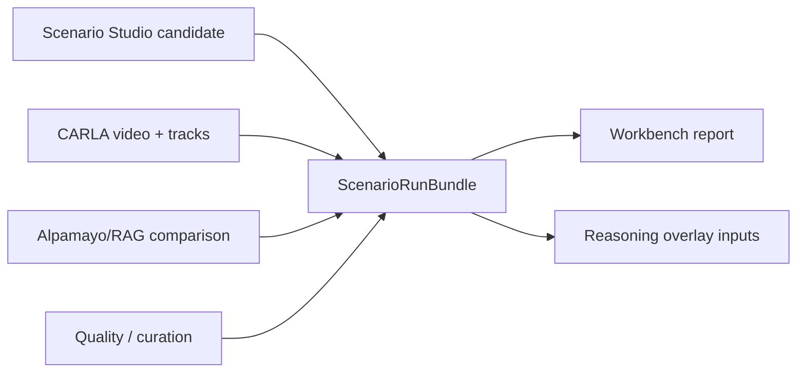

# TASK-108: Scenario Workbench Evidence Bundle

## Status
- state: done
- owner: Codex
- assignee: generalPurpose
- dependencies: TASK-101, TASK-102, TASK-103, TASK-104, TASK-107
- location: `src/driverx/workbench`, `src/driverx/pipeline`, `tickets/TASK-108/artifacts`
- enter when: the project needs one coherent product/research loop rather than separate Studio, CARLA, RAG, Alpamayo, and video artifacts
- leave when: one `ScenarioRunBundle` can load/link current evidence and explain the end-to-end loop in JSON/Markdown/HTML
- blockers: none; uses existing local artifacts and fixture fallback
- spawned follow-ups: TASK-109, TASK-110, TASK-111, TASK-112, TASK-113
- complexity: M

### Summary

Create the main call/evidence object for the rest of the final sprint. The
current code has all the ingredients, but the demo feels illegible because
Scenario Studio, CARLA, risk, memory, Alpamayo, and video live as separate
artifact islands. TASK-108 introduces a `ScenarioRunBundle` surface that ties
one generated case to its simulator run, risk timeline, retrieved memory,
reasoning events, curation status, and demo assets.

### Scope

- In scope: bundle types, artifact linker, Markdown/HTML bundle report,
  compatibility with existing TASK-102/TASK-104/TASK-106 evidence, fixture
  tests, and README/module docs for the workbench seam.
- Out of scope: new live CARLA runs, new Alpamayo inference, new video rendering.

### Plan

#### Change

Add a feature-first `driverx.workbench` module that owns `ScenarioRunBundle`
and bundle reports.

#### Why

The next demo needs to show a product loop: generate scenario -> run CARLA ->
detect risk -> retrieve memory -> show VLA reasoning -> curate dataset. A
unified bundle gives every later ticket a stable input and prevents another
round of one-off script glue.

#### Before -> After

- Before: final video builder points at an MP4 and title cards; reasoning and
  memory evidence are buried elsewhere.
- After: final demo builders consume one bundle per scenario and can show
  scenario intent, simulator evidence, risk events, memory events, reasoning
  events, and curation lineage together.

#### Touch

- Add `src/driverx/workbench/types.py`
- Add `src/driverx/workbench/bundle.py`
- Add `src/driverx/workbench/report.py`
- Add `src/driverx/workbench/README.md`
- Add `src/driverx/workbench/AGENTS.md`
- Add CLI glue in `src/driverx/workbench/cli.py` and register in `src/driverx/cli_extensions.py`
- Add tests under `tests/test_scenario_workbench_bundle.py`

#### Inspect

- `src/driverx/scenarios/studio.py`
- `src/driverx/pipeline/scripted_ood_campaign.py`
- `src/driverx/pipeline/alpamayo_ood_evaluation.py`
- `src/driverx/pipeline/reasoning_video_pack.py`
- `src/driverx/pipeline/final_submission_pack.py`
- `tickets/TASK-102/artifacts/task102-high-fidelity-hero-v6/ood_video_evidence.json`
- `tickets/TASK-104/artifacts/alpamayo-rag-batch-v1/alpamayo_ood_batch_summary.json`

#### Signature Delta

```python
src/driverx/workbench/types.py / ScenarioRunBundle.to_jsonable() -> dict[str, Any]
src/driverx/workbench/bundle.py / build_scenario_run_bundle(inputs: ScenarioRunBundleInputs) -> ScenarioRunBundle
src/driverx/workbench/report.py / write_scenario_run_bundle(run_dir: Path, bundle: ScenarioRunBundle) -> dict[str, Any]
src/driverx/workbench/cli.py / register_scenario_workbench_parser(subparsers) -> None
```

#### Type Sketch

```python
ScenarioRunBundle = {
  "bundle_id": str,
  "brief": ScenarioBrief | None,
  "candidate": ScenarioStudioCandidate | None,
  "carla_case": CampaignCaseRecord | None,
  "video": {"path": str | None, "duration_s": float | None, "export_status": str},
  "risk_timeline_path": str | None,
  "memory_events_path": str | None,
  "reasoning_events_path": str | None,
  "curation": DatasetCurationRecord | None,
  "claim_boundaries": list[str],
}
```

#### Typed Flow Example

`TASK-102 ood_video_evidence + TASK-103 studio batch + TASK-104 Alpamayo batch`
-> `build_scenario_run_bundle(...)`
-> `ScenarioRunBundle(bundle_id="generated-base-animals-0076...")`
-> `scenario_run_bundle.json`, `scenario_run_bundle.md`, `scenario_run_bundle.html`.

#### Execution Steps

1. Define bundle dataclasses with minimal optional fields so partial evidence
   remains representable.
2. Add loaders for Studio batch, campaign summary, video evidence, Alpamayo
   comparison, and final-pack paths.
3. Implement deterministic matching by `scenario_id`, `case_id`, and fallback
   artifact path.
4. Write JSON/Markdown/HTML reports with the exact product loop.
5. Add CLI command `build-scenario-workbench-bundle`.
6. Add tests for full, partial, and mismatch cases.

#### Recommendation

Implement this first. It is the foundation that lets the rest of the sprint
produce a demo that reads like a paper contribution rather than a raw video.

#### Options Considered

- Keep wiring artifacts directly in the final video script: fastest but repeats
  the current legibility failure.
- Build a full web app: too much UI for the remaining time.
- Recommended: headless bundle plus HTML report; enough product surface without
  building a frontend.

#### Blast Radius

Low to medium. New module and CLI are additive. Existing final pack should not
change until TASK-113 consumes the bundle.

#### Risks

- Artifact id mismatches could create false same-scene claims. Mitigation:
  record `linkage_warnings` and keep mismatched inputs as linked evidence, not
  same-capture proof.

### Gap Analysis

Production-grade autonomy data tools expose lineage: why a case exists, how it
was generated, what ran, what the model observed, and what entered the dataset.
0xDriver has the data, but not one lineage object. This ticket fills that gap.

### Diagram



### Acceptance Criteria

- [x] AC-1: A bundle can be built from current TASK-102/TASK-103/TASK-104 artifacts.
- [x] AC-2: Bundle report shows the full generate-run-reason-curate loop.
- [x] AC-3: Linkage warnings are emitted when scenario ids do not match exactly.
- [x] AC-4: Heavy MP4s are referenced, not copied into tracked artifacts.

### Verification

- `PYTHONPATH=src python3 -m unittest tests.test_scenario_workbench_bundle`
- `PYTHONPATH=src python3 -m driverx build-scenario-workbench-bundle ...`
- `python3 -m json.tool tickets/TASK-108/artifacts/*/scenario_run_bundle.json`
- `bash scripts/pre_push_check.sh`

### Autonomy Readiness

- Inputs: all local tracked evidence exists.
- Compute: local only.
- Human gates: none.
- QA risk: id mismatches; handle with explicit warnings.

### Evidence

- Built: `tickets/TASK-108/artifacts/workbench-bundle-v1/scenario_run_bundle.json`
- Built with risk: `tickets/TASK-108/artifacts/workbench-bundle-v1-with-risk/scenario_run_bundle.json`
- Built with risk HTML: `tickets/TASK-108/artifacts/workbench-bundle-v1-with-risk/scenario_run_bundle.html`
- Plan review: `tickets/TASK-108/artifacts/review/task108-113-plan-review.md`

### Blockers

- None.
