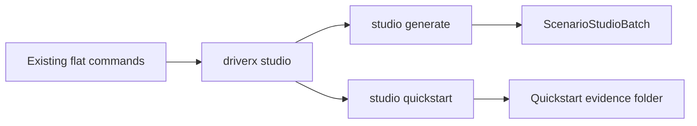

# TASK-114: Scenario Studio CLI Product Surface

## Status
- state: review
- owner: Codex
- assignee: generalPurpose
- dependencies: docs/prd.md, docs/specs/scenario-generator-cli-v1.md, TASK-103, TASK-108
- location: `src/driverx/cli_extensions.py`, `src/driverx/scenarios`, `src/driverx/workbench`, `configs`, `tests`
- enter when: Scenario Generator Studio is approved as CLI-first product harness
- leave when: `python -m driverx studio quickstart` proves generate -> queue stub -> mock manifest -> replay/export skeleton without CARLA
- blockers: none
- spawned follow-ups: TASK-115, TASK-116, TASK-117, TASK-118
- complexity: M

### Summary

Create a high-level `driverx studio` CLI group that wraps existing Scenario
Studio and Workbench primitives into a product-shaped operator flow. This ticket
ships the UX shell plus a dependency-light quickstart path so future tickets can
plug in queue, CARLA, Alpamayo, and export behavior without inventing command
shape again.

### Scope

- In scope: nested `studio` parser, `studio generate`, `studio quickstart`,
  compact stdout summaries, next-command hints, sample config/docs, and tests.
- Out of scope: real CARLA execution, Alpamayo closed-loop control, polished
  browser UI, and Codex skill packaging.

### Diagram Summary



### Plan

#### Change

Add a single product-facing `studio` command group while preserving every
existing flat CLI command.

#### Why

The project already has many useful primitives, but a judge/operator cannot
discover the product loop. A single CLI group makes the scenario generator feel
like a coherent tool and gives Codex a stable harness to call.

#### Before -> After

- Before: `generate-scenario-studio`, `build-scenario-workbench-bundle`, and
  related commands are scattered.
- After: `driverx studio generate` and `driverx studio quickstart` become the
  canonical front door, with old commands still available for debugging.

#### Touch

- `src/driverx/cli_extensions.py`: register the new command group.
- `src/driverx/scenarios/studio_product_cli.py`: new parser/command module.
- `src/driverx/scenarios/studio_product.py`: orchestration helpers.
- `configs/scenario_generator_cli.sample.json`: quickstart config.
- `tests/test_scenario_studio_product_cli.py`: parser and quickstart tests.
- `README.md` / `src/driverx/scenarios/README.md`: command examples.

#### Inspect

- `src/driverx/scenarios/studio.py`
- `src/driverx/scenarios/studio_cli.py`
- `src/driverx/workbench/cli.py`
- `src/driverx/cli_extensions.py`
- `tests/test_scenario_studio.py`
- `tests/test_scenario_workbench_bundle.py`

#### Signature Delta

```python
src/driverx/scenarios/studio_product.py / run_studio_generate(config: StudioGenerateRequest): StudioCommandResult
src/driverx/scenarios/studio_product.py / run_studio_quickstart(config: StudioQuickstartRequest): StudioCommandResult
src/driverx/scenarios/studio_product_cli.py / register_scenario_studio_product_parser(subparsers): None
```

#### Type Sketch

```python
StudioCommandResult = {
  "command": str,
  "run_id": str,
  "status": "passed" | "partial" | "blocked",
  "artifacts": dict[str, str],
  "next_commands": list[str],
  "claim_boundaries": list[str],
}
```

#### Typed Flow Example

Prompt `"Malaysian wet roadwork..."` -> `studio generate` -> existing
`generate_studio_batch` -> `scenario_studio_batch.json` -> compact result with
`next_commands=["python -m driverx studio queue --studio-batch ..."]`.

#### Execution Steps

1. Add `studio` nested parser and register it after existing dynamic parsers.
2. Implement `studio generate` by delegating to existing `generate_studio_batch`.
3. Implement `studio quickstart` as generate plus placeholder queue/run/replay
   skeleton using mock/no-CARLA claim boundaries.
4. Write deterministic tests for parser availability, command output shape, and
   quickstart artifacts.
5. Update docs with CLI UX and Codex-skill-later decision.

#### Recommendation

Build CLI first. Add a Codex skill only after the CLI is stable, using the CLI
as the source of truth.

#### Options Considered

- Browser app first: better product visuals, but slower to debug and harder on
  remote runtime.
- Codex skill first: conversationally elegant, but hides reproducibility.
- Recommended: CLI first, Codex skill wrapper later.

#### Blast Radius

Low-medium. CLI registration changes can conflict with existing commands, but
the implementation delegates to existing stable modules.

#### Risks

- Nested argparse can make help text clunky. Contain with focused tests over
  `driverx studio --help`, `studio generate --help`, and `studio quickstart`.

### Acceptance Criteria

- [ ] AC-1: `python -m driverx studio --help` lists `generate` and `quickstart`.
- [ ] AC-2: `studio generate` writes the same Scenario Studio artifacts as the
  current flat command and adds `next_commands`.
- [ ] AC-3: `studio quickstart` writes a single run folder with a batch summary
  and mock/no-CARLA claim boundaries.
- [ ] AC-4: Existing flat commands remain registered and compatible.

### Agent Contract
- Open: `PYTHONPATH=src python3 -m driverx studio --help`
- Test hook: `PYTHONPATH=src python3 -m driverx studio quickstart --prompt "night market scooter shoulder pass" --run-id studio-cli-smoke`
- Stabilize: use explicit `--seed`, `--run-id`, and temp output root in tests
- Inspect: stdout JSON plus generated run folder
- Key screens/states: CLI help, generate output, quickstart output
- QA cookbook: none yet
- Taste refs: CLI JSON must be compact; Markdown must be human-readable
- Expected artifacts: `scenario_studio_batch.json`, quickstart manifest, docs
- Delegate with: TASK-114 ticket file and generated artifact paths

### Evidence Checklist
- [ ] CLI help captured
- [ ] Quickstart JSON captured
- [ ] Unit tests linked
- [ ] QA report linked

### Verification

- `PYTHONPATH=src python3 -m unittest tests.test_scenario_studio_product_cli`
- `PYTHONPATH=src python3 -m driverx studio quickstart --prompt "night market scooter shoulder pass" --run-id studio-cli-smoke`
- `bash scripts/pre_push_check.sh`

### Autonomy Readiness

- Inputs: none beyond local repo.
- Credentials: none.
- Compute: local Python only.
- Human gates: none.

### Evidence

- Planned.

### Blockers

- None.
