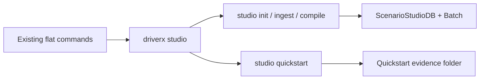

# TASK-114: Scenario Studio CLI Database Surface

## Status
- state: done
- owner: Codex
- assignee: generalPurpose
- dependencies: docs/prd.md, docs/specs/scenario-generator-cli-v1.md, TASK-103, TASK-108
- location: `src/driverx/cli_extensions.py`, `src/driverx/scenarios`, `src/driverx/workbench`, `configs`, `tests`
- enter when: Scenario Generator Studio is approved as CLI-backed data/control plane
- leave when: `python -m driverx studio quickstart` proves init -> ingest brief -> compile -> queue stub -> mock manifest -> replay/export skeleton without CARLA
- blockers: none
- spawned follow-ups: TASK-115, TASK-116, TASK-117, TASK-118, TASK-119
- complexity: M

### Summary

Create a high-level `driverx studio` CLI group that acts as the durable
scenario artifact database and control plane. This ticket ships the DB shell
plus a dependency-light quickstart path so Codex can be the AI generator while
the CLI persists, validates, and links the records.

### Scope

- In scope: nested `studio` parser, `studio init`, `studio ingest-brief`,
  `studio compile`, `studio quickstart`, compact stdout summaries,
  next-command hints, sample config/docs, and tests.
- Out of scope: real CARLA execution, Alpamayo closed-loop control, polished
  browser UI, and Codex skill packaging.

### Diagram Summary



### Plan

#### Change

Add a single product-facing `studio` command group and a JSON-backed scenario
database while preserving every existing flat CLI command.

#### Why

The project already has many useful primitives, but no durable studio database
that Codex can safely operate. A single CLI group makes the scenario generator
feel like a coherent tool while leaving AI creativity in Codex.

#### Before -> After

- Before: `generate-scenario-studio`, `build-scenario-workbench-bundle`, and
  related commands are scattered and artifact-specific.
- After: `driverx studio init/ingest-brief/compile/quickstart` become the
  canonical front door, with old commands still available for debugging.

#### Touch

- `src/driverx/cli_extensions.py`: register the new command group.
- `src/driverx/scenarios/studio_product_cli.py`: new parser/command module.
- `src/driverx/scenarios/studio_db.py`: DB dataclasses, loader, and writer.
- `src/driverx/scenarios/studio_product.py`: DB-backed orchestration helpers.
- `configs/scenario_generator_cli.sample.json`: quickstart config.
- `tests/test_scenario_studio_product_cli.py`: parser and quickstart tests.
- `README.md` / `src/driverx/scenarios/README.md`: command examples.

#### Inspect

- `src/driverx/scenarios/studio.py`
- `src/driverx/scenarios/studio_cli.py`
- `src/driverx/workbench/cli.py`
- `src/driverx/cli_extensions.py`
- `tests/test_scenario_studio.py`
- `tests/test_scenario_workbench_bundle.py`

#### Signature Delta

```python
src/driverx/scenarios/studio_db.py / load_studio_db(path: Path): ScenarioStudioDb
src/driverx/scenarios/studio_db.py / write_studio_db(path: Path, db: ScenarioStudioDb): dict[str, Any]
src/driverx/scenarios/studio_product.py / run_studio_compile(config: StudioCompileRequest): StudioCommandResult
src/driverx/scenarios/studio_product.py / run_studio_quickstart(config: StudioQuickstartRequest): StudioCommandResult
src/driverx/scenarios/studio_product_cli.py / register_scenario_studio_product_parser(subparsers): None
```

#### Type Sketch

```python
ScenarioStudioDb = {
  "schema_version": str,
  "run_id": str,
  "briefs": list[ScenarioBrief],
  "plans": list[ScenarioStudioPlan],
  "candidates": list[ScenarioStudioCandidate],
  "queue": list[dict],
  "runs": list[dict],
  "evaluations": list[dict],
  "claim_boundaries": list[str],
}

StudioCommandResult = {
  "command": str,
  "run_id": str,
  "status": "passed" | "partial" | "blocked",
  "artifacts": dict[str, str],
  "next_commands": list[str],
  "claim_boundaries": list[str],
}
```

#### Typed Flow Example

Codex proposes prompt `"Malaysian wet roadwork..."` -> `studio ingest-brief`
stores it -> `studio compile` delegates to existing `generate_studio_batch`
and records plans/candidates in `scenario_studio_db.json` -> compact result
with `next_commands=["python -m driverx studio queue --db ..."]`.

#### Execution Steps

1. Add `studio` nested parser and register it after existing dynamic parsers.
2. Implement `studio init` to create `scenario_studio_db.json`.
3. Implement `studio ingest-brief` to append human/Codex/provider briefs.
4. Implement `studio compile` by delegating to existing `generate_studio_batch`
   and storing the normalized outputs in the DB.
5. Implement `studio quickstart` as init + ingest + compile plus placeholder
   queue/run/replay skeleton using mock/no-CARLA claim boundaries.
6. Write deterministic tests for parser availability, command output shape, and
   quickstart artifacts.
7. Update docs with CLI UX and Codex-skill-later decision.

#### Recommendation

Build the CLI as database/control tooling first. Add a Codex skill after the DB
schema is stable, using the CLI as the source of truth.

#### Options Considered

- Browser app first: better product visuals, but slower to debug and harder on
  remote runtime.
- Codex skill first: conversationally elegant, but hides reproducibility and
  state.
- Recommended: CLI database first, Codex operator skill later.

#### Blast Radius

Low-medium. CLI registration changes can conflict with existing commands, but
the implementation delegates to existing stable modules.

#### Risks

- Nested argparse can make help text clunky. Contain with focused tests over
  `driverx studio --help`, `studio init --help`, `studio ingest-brief --help`,
  `studio compile --help`, and `studio quickstart`.

### Acceptance Criteria

- [x] AC-1: `python -m driverx studio --help` lists `init`,
  `ingest-brief`, `compile`, and `quickstart`.
- [x] AC-2: `studio compile` writes the same Scenario Studio artifacts as the
  current flat command, updates the DB, and adds `next_commands`.
- [x] AC-3: `studio quickstart` writes a single run folder with a batch summary
  and mock/no-CARLA claim boundaries.
- [x] AC-4: Existing flat commands remain registered and compatible.

### Agent Contract
- Open: `PYTHONPATH=src python3 -m driverx studio --help`
- Test hook: `PYTHONPATH=src python3 -m driverx studio quickstart --prompt "night market scooter shoulder pass" --run-id studio-cli-smoke`
- Stabilize: use explicit `--seed`, `--run-id`, and temp output root in tests
- Inspect: stdout JSON plus generated run folder
- Key screens/states: CLI help, DB init, brief ingest, compile output, quickstart output
- QA cookbook: none yet
- Taste refs: CLI JSON must be compact; Markdown must be human-readable
- Expected artifacts: `scenario_studio_db.json`, `scenario_studio_batch.json`, quickstart manifest, docs
- Delegate with: TASK-114 ticket file and generated artifact paths

### Evidence Checklist
- [ ] CLI help captured
- [ ] Studio DB JSON captured
- [ ] Quickstart JSON captured
- [ ] Unit tests linked
- [ ] QA report linked

### Verification

- `PYTHONPATH=src python3 -m unittest tests.test_scenario_studio_product_cli`
- `PYTHONPATH=src python3 -m driverx studio quickstart --prompt "night market scooter shoulder pass" --run-id studio-cli-smoke`
- `bash scripts/pre_push_check.sh`

### Autonomy Readiness

- Inputs: none beyond local repo.
- Credentials: none.
- Compute: local Python only.
- Human gates: none.

### Evidence

- Implemented product name: `OODriver`.
- Canonical command: `PYTHONPATH=src python3 -m driverx oodriver ...`.
- Compatibility alias: `PYTHONPATH=src python3 -m driverx studio ...`.
- Smoke DB: `artifacts/runs/oodriver-cli-smoke/scenario_studio_db.json`.
- Quickstart export:
  `artifacts/runs/oodriver-cli-smoke/exports/oodriver-cli-smoke-export/scenario_generator_cli_pack.html`.
- QA report: `tickets/TASK-119/artifacts/qa/oodriver-cli-qa.md`.
- Review: `docs/reviews/TASK-114-119-oodriver-cli-review.md`.
- Tests:
  `PYTHONPATH=src python3 -m unittest tests.test_oodriver_cli tests.test_scenario_studio tests.test_scenario_workbench_bundle`.

### Blockers

- None.
