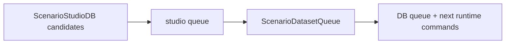

# TASK-115: Scenario Dataset Queue CLI

## Status
- state: review
- owner: Codex
- assignee: generalPurpose
- dependencies: TASK-114, TASK-103
- location: `src/driverx/scenarios`, `tests`, `configs`
- enter when: `driverx studio init/ingest-brief/compile` exists or can be planned against existing Scenario Studio batch artifacts converted into a DB
- leave when: generated candidates can be curated into a reusable dataset queue with next runtime commands
- blockers: none
- spawned follow-ups: TASK-116
- complexity: M

### Summary

Add `driverx studio queue` so compiled scenario candidates in the studio DB
become an explicit dataset/run queue. The queue is the database view that shows
which cases are accepted, rejected, waiting for runtime, or ready for
submission.

### Scope

- In scope: queue data model, DB update, queue writer, accept/reject selectors,
  Markdown report, next command hints, tests.
- Out of scope: executing CARLA runs or Alpamayo evaluation.

### Diagram Summary



### Plan

#### Change

Create a queue layer that converts compiled DB candidates into
`scenario_dataset_queue.json` and writes the selected queue back to
`scenario_studio_db.json`.

#### Why

Scenario generation alone is not a product. A queue makes the DB behave like a
dataset flywheel and gives the next CARLA runner a precise input.

#### Before -> After

- Before: curation rows live inside the generation batch.
- After: queue records live in the studio DB and explicitly track runtime
  readiness, priority, policy targets, and next command.

#### Touch

- `src/driverx/scenarios/queue.py`: new queue data model and writer.
- `src/driverx/scenarios/studio_product_cli.py`: add `studio queue`.
- `src/driverx/scenarios/README.md`: queue example.
- `tests/test_scenario_dataset_queue.py`: queue creation and selector tests.

#### Inspect

- `src/driverx/scenarios/studio.py`
- `src/driverx/scenarios/catalog.py`
- `tests/test_scenario_studio.py`

#### Signature Delta

```python
src/driverx/scenarios/queue.py / build_scenario_dataset_queue(db: ScenarioStudioDb, options: QueueBuildOptions): ScenarioDatasetQueue
src/driverx/scenarios/queue.py / write_scenario_dataset_queue(run_dir: Path, queue: ScenarioDatasetQueue): dict[str, Any]
```

#### Type Sketch

```python
ScenarioQueueRecord = {
  "scenario_id": str,
  "candidate_id": str,
  "curation_status": str,
  "run_status": "needs_runtime" | "ready" | "blocked" | "complete",
  "priority": int,
  "policy_targets": list[str],
  "next_command": str,
}
```

#### Typed Flow Example

`scenario_studio_db.json` with 12 candidates -> `studio queue --accept top:3`
-> DB queue records for top 3 as `needs_runtime` with `carla-autopilot` and
`alpamayo-trajectory` policy targets.

#### Execution Steps

1. Implement queue dataclasses and JSON/Markdown rendering.
2. Support selectors: `top:N`, explicit candidate ids, and `all-accepted`.
3. Add `studio queue` CLI args for `--accept`, `--policy-target`, and
   `--run-id`, using `--db` as the primary input.
4. Write tests for deterministic priority, selected candidates, rejected rows,
   and next command strings.
5. Update quickstart to call queue once TASK-114 exists.

#### Recommendation

Keep queue logic artifact-backed and deterministic. Use the studio JSON DB; do
not introduce SQLite/Postgres in this sprint.

#### Options Considered

- Store queue in SQLite: unnecessary for the submission sprint.
- Use only existing curation rows: too hidden for the product story.
- Recommended: explicit JSON DB plus queue artifact.

#### Blast Radius

Low. New module and new CLI subcommand.

#### Risks

- Too much curation ceremony can slow the demo. Keep V1 selectors simple.

### Acceptance Criteria

- [ ] AC-1: `studio queue` reads a Scenario Studio DB and writes
  `scenario_dataset_queue.json`, `.md`, and an updated DB.
- [ ] AC-2: Queue records include curation status, runtime status, priority,
  policy targets, lineage, and next command.
- [ ] AC-3: `--accept top:N` deterministically selects the highest-scoring
  candidates.
- [ ] AC-4: No heavy artifacts are copied into the queue.

### Agent Contract
- Open: `PYTHONPATH=src python3 -m driverx studio queue --help`
- Test hook: create/compile a fixture DB, then queue it with `--accept top:2`
- Stabilize: use fixed generation seed and temp output root
- Inspect: `scenario_studio_db.json`, `scenario_dataset_queue.json`, `scenario_dataset_queue.md`
- Key screens/states: accepted row, rejected row, needs-runtime row
- QA cookbook: none yet
- Taste refs: Markdown table must be compact and command-copyable
- Expected artifacts: queue JSON/Markdown
- Delegate with: TASK-115 ticket and fixture batch path

### Evidence Checklist
- [ ] Queue JSON captured
- [ ] Queue Markdown captured
- [ ] Unit tests linked
- [ ] QA report linked

### Verification

- `PYTHONPATH=src python3 -m unittest tests.test_scenario_dataset_queue`
- `PYTHONPATH=src python3 -m driverx studio queue --studio-batch <fixture> --accept top:2`
- `bash scripts/pre_push_check.sh`

### Autonomy Readiness

- Inputs: Scenario Studio DB from TASK-114 or a converted TASK-103 batch.
- Credentials: none.
- Compute: local Python only.
- Human gates: none.

### Evidence

- Planned.

### Blockers

- None.
