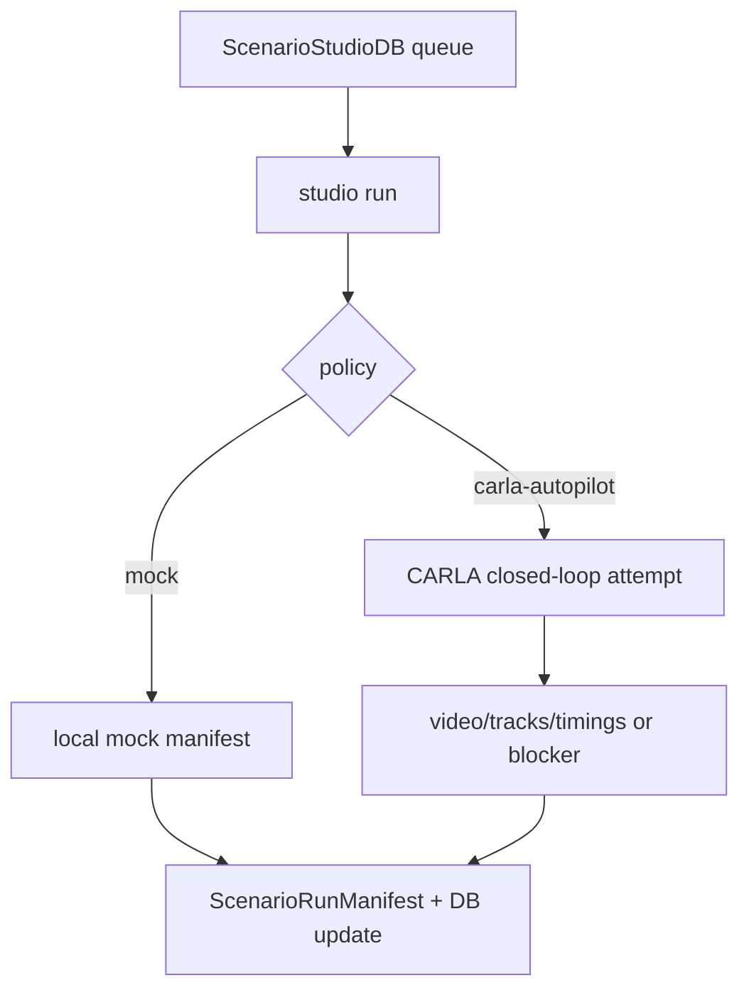

# TASK-116: Closed-Loop CARLA Runner CLI

## Status
- state: review
- owner: Codex
- assignee: generalPurpose
- dependencies: TASK-114, TASK-115, TASK-102
- location: `src/driverx/simulators`, `src/driverx/scenarios`, `src/driverx/remote`, `tests`
- enter when: a Scenario Studio DB contains a queued scenario candidate
- leave when: `driverx studio run` can produce a run manifest for `mock` and attempt `carla-autopilot` on the configured CARLA host
- blockers: requires live RunPod/CARLA only for the live proof; local dry-run and mock proof are unblocked
- spawned follow-ups: TASK-117
- complexity: L

### Summary

Add `driverx studio run` as the closed-loop runtime entrypoint. It should read
one queued candidate from the studio DB, run
mock locally, plan or execute CARLA autopilot when CARLA is reachable, and
always write a `ScenarioRunManifest` back into the DB with artifacts, timings,
claim boundaries, and blockers.

### Scope

- In scope: run manifest model, policy-mode selection, CARLA smoke/run
  planning, autopilot/fixture fallback, evidence pullback hooks, tests.
- Out of scope: Alpamayo trajectory control, model inference, and final export.

### Diagram Summary



### Plan

#### Change

Create a product-level run manifest and a CLI command that executes the safest
available policy path for one queued DB scenario.

#### Why

The submission needs actual closed-loop evidence, but the CLI must stay useful
even when CARLA is unavailable. A run manifest gives both success and blockers a
single evidence shape and keeps the DB as the durable source of truth.

#### Before -> After

- Before: CARLA runs exist as separate video/evidence commands.
- After: `studio run --db ...` owns one selected scenario and records what
  policy did or why live runtime could not proceed.

#### Touch

- `src/driverx/scenarios/run_manifest.py`: new manifest data model/writer.
- `src/driverx/scenarios/studio_db.py`: append run manifest references.
- `src/driverx/scenarios/studio_product_cli.py`: add `studio run`.
- `src/driverx/simulators/carla_studio_runner.py`: glue to existing CARLA
  OOD demo/cached replay primitives.
- `tests/test_scenario_studio_run_manifest.py`
- `tests/test_scenario_studio_run_cli.py`

#### Inspect

- `src/driverx/simulators/carla_ood_demo.py`
- `src/driverx/simulators/carla_cached_ood_replay.py`
- `src/driverx/simulators/carla_policy_replay.py`
- `src/driverx/remote/runpod.py`
- `configs/carla_ood_demo.runpod.high_fidelity.yaml`

#### Signature Delta

```python
src/driverx/scenarios/run_manifest.py / build_run_manifest(request: StudioRunRequest, result: StudioRunResult): ScenarioRunManifest
src/driverx/scenarios/studio_db.py / append_studio_run(db: ScenarioStudioDb, manifest: ScenarioRunManifest): ScenarioStudioDb
src/driverx/simulators/carla_studio_runner.py / run_carla_studio_scenario(request: CarlaStudioRunRequest): StudioRunResult
```

#### Type Sketch

```python
ScenarioRunManifest = {
  "run_id": str,
  "scenario_id": str,
  "candidate_id": str,
  "policy": "mock" | "carla-autopilot",
  "runtime": "local" | "runpod" | "dry_run",
  "artifacts": {"video": str | None, "tracks": str | None, "risk_timeline": str | None},
  "timings_ms": dict[str, float],
  "claim_boundaries": list[str],
  "blockers": list[str],
}
```

#### Typed Flow Example

DB queue record `wet-roadwork-v00` -> `studio run --db ... --policy carla-autopilot`
-> CARLA smoke passes -> high-fidelity OOD runner records video/tracks
-> manifest is appended to the DB and labels `closed_loop_carla_execution=true` and
`real_time_vla_control=false`.

#### Execution Steps

1. Implement manifest dataclasses and JSON/Markdown writer.
2. Implement mock policy runtime that writes a complete manifest without CARLA.
3. Implement CARLA autopilot path by calling existing CARLA runner primitives
   or planning a precise command when remote execution is unavailable.
4. Add blocker capture for unreachable CARLA, missing config, or missing video.
5. Append manifest summaries back into the studio DB.
6. Add tests for mock success, CARLA dry-run blocker, and manifest claim
   boundaries.

#### Recommendation

Make `carla-autopilot` the first live closed-loop target. It proves the
simulator/product loop before Alpamayo control complexity.

#### Options Considered

- Alpamayo first: highest prestige, but higher runtime/control risk.
- Mock only: easy but not enough for the challenge.
- Recommended: mock always works, autopilot first live proof, Alpamayo next.

#### Blast Radius

Medium. It touches simulator orchestration but should not change existing
runner internals.

#### Risks

- Live CARLA host may not be reachable. Contain by writing a blocker manifest
  and still passing local tests.

### Acceptance Criteria

- [ ] AC-1: `studio run --policy mock` writes a complete run manifest.
- [ ] AC-2: `studio run --policy carla-autopilot` attempts live CARLA when
  configured and otherwise writes a precise blocker manifest.
- [ ] AC-3: Manifest separates simulator timing, policy timing, artifact paths,
  claim boundaries, and blockers.
- [ ] AC-4: No command claims Alpamayo/VLA control in this ticket.

### Agent Contract
- Open: `PYTHONPATH=src python3 -m driverx studio run --help`
- Test hook: `studio run --db <fixture_db> --scenario-id <id> --policy mock`
- Stabilize: use temp output root and deterministic queue fixture
- Inspect: `scenario_studio_db.json`, `run_manifest.json`, `run_manifest.md`
- Key screens/states: mock complete, CARLA blocked, CARLA partial/success
- QA cookbook: none yet
- Taste refs: blocker text must be explicit and not defensive
- Expected artifacts: run manifest JSON/Markdown, optional video/tracks refs
- Delegate with: TASK-116 ticket and queue fixture

### Evidence Checklist
- [ ] Mock manifest captured
- [ ] CARLA blocker or success manifest captured
- [ ] Unit tests linked
- [ ] QA report linked

### Verification

- `PYTHONPATH=src python3 -m unittest tests.test_scenario_studio_run_manifest tests.test_scenario_studio_run_cli`
- `PYTHONPATH=src python3 -m driverx studio run --db <fixture_db> --policy mock`
- Optional live: `PYTHONPATH=src python3 -m driverx studio run --db <db> --policy carla-autopilot --config configs/carla_ood_demo.runpod.high_fidelity.yaml`
- `bash scripts/pre_push_check.sh`

### Autonomy Readiness

- Inputs: studio DB with queue records and optional CARLA config.
- Credentials: SSH only if remote pullback is implemented; no tokens.
- Compute: local for mock; RunPod graphics/CARLA host for live proof.
- Human gates: ask before creating new paid resources; use existing host if alive.
- Decision boundary: if live CARLA blocks, write manifest and continue.

### Evidence

- Planned.

### Blockers

- Live proof depends on a reachable CARLA host, but implementation and mock QA
  do not.
