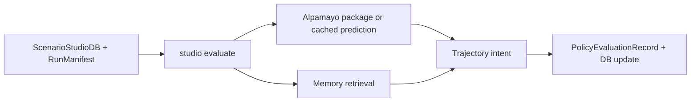

# TASK-117: Alpamayo Trajectory Evaluation In Studio CLI

## Status
- state: done
- owner: Codex
- assignee: generalPurpose
- dependencies: TASK-116, TASK-100, MEM-0028
- location: `src/driverx/policies`, `src/driverx/scenarios`, `src/driverx/simulators`, `tests`
- enter when: a Scenario Studio DB includes a ScenarioRunManifest for a generated scenario
- leave when: `driverx studio evaluate --policy alpamayo-trajectory` links Alpamayo reasoning/trajectory intent to the run and attempts bounded control conversion when possible
- blockers: live closed-loop Alpamayo requires reachable CUDA/Alpamayo runtime; offline evaluation is unblocked from existing artifacts
- spawned follow-ups: none
- complexity: L

### Summary

Add Alpamayo to the CLI product loop as a trajectory evaluator first and a
bounded control adapter second. The command reads and updates the studio DB and
must show reasoning, RAG memory,
latency, trajectory intent, and whether the output was open-loop, time-warped,
or actually applied to CARLA controls.

### Scope

- In scope: `studio evaluate`, Alpamayo record linking, memory/no-memory
  comparison, trajectory-to-control conversion summary, claim boundaries, tests.
- Out of scope: training, model serving optimization, and claiming real-time VLA
  control without live evidence.

### Diagram Summary



### Plan

#### Change

Add a studio-level evaluation command that attaches Alpamayo reasoning and
trajectory intent to a generated CARLA scenario run and records the result in
the studio DB.

#### Why

Alpamayo-in-CARLA is the novel prestige claim, but only if the evidence clearly
distinguishes open-loop reasoning, time-warped replay, and closed-loop control.

#### Before -> After

- Before: Alpamayo evidence exists in separate open-loop artifacts.
- After: one command links Alpamayo evidence to a scenario run and records
  memory comparison plus control feasibility in the studio DB.

#### Touch

- `src/driverx/scenarios/policy_evaluation.py`: new evaluation record writer.
- `src/driverx/scenarios/studio_db.py`: append evaluation records.
- `src/driverx/scenarios/studio_product_cli.py`: add `studio evaluate`.
- `src/driverx/policies/alpamayo_trajectory.py`: reuse/extend conversion seams
  if needed.
- `src/driverx/simulators/carla_policy_replay.py`: reuse dry-run control trace.
- `tests/test_studio_alpamayo_evaluation.py`

#### Inspect

- `src/driverx/pipeline/alpamayo_ood_batch.py`
- `src/driverx/pipeline/alpamayo_ood_evaluation.py`
- `src/driverx/policies/alpamayo_live.py`
- `src/driverx/policies/trajectory_control.py`
- `tickets/TASK-100/artifacts`

#### Signature Delta

```python
src/driverx/scenarios/policy_evaluation.py / build_policy_evaluation(request: StudioPolicyEvaluationRequest): PolicyEvaluationRecord
src/driverx/scenarios/policy_evaluation.py / write_policy_evaluation(run_dir: Path, record: PolicyEvaluationRecord): dict[str, Any]
src/driverx/scenarios/studio_db.py / append_policy_evaluation(db: ScenarioStudioDb, record: PolicyEvaluationRecord): ScenarioStudioDb
```

#### Type Sketch

```python
PolicyEvaluationRecord = {
  "scenario_id": str,
  "policy": "alpamayo-trajectory",
  "reasoning_mode": "cached_open_loop" | "live_open_loop" | "closed_loop_attempt",
  "memory_mode": "none" | "retrieved",
  "cot_summary": str | None,
  "trajectory_summary": dict[str, float | str | bool],
  "control_trace_path": str | None,
  "latency_ms": float | None,
  "claim_boundaries": list[str],
  "blockers": list[str],
}
```

#### Typed Flow Example

DB run manifest `wet-roadwork-autopilot-run` + cached Alpamayo prediction JSON
-> `studio evaluate --db ... --policy alpamayo-trajectory --memory auto`
-> output states `sampled_open_loop_reasoning=true`, links CoC snippet, writes
trajectory control dry-run, appends evaluation to DB, and lists closed-loop
blocker if not applied live.

#### Execution Steps

1. Define policy evaluation record shape with strict claim boundaries.
2. Load run manifest and optional Alpamayo artifacts.
3. Retrieve memory from existing memory bank or scenario tags when `--memory auto`.
4. Reuse trajectory-control conversion to create a bounded dry-run control
   trace where prediction data exists.
5. Write JSON/Markdown reports and tests for cached/open-loop and blocker paths.
6. Append the evaluation summary to the studio DB.

#### Recommendation

Do not block the whole product on live Alpamayo. Make cached/open-loop evidence
first-class and attempt control only when runtime is available.

#### Options Considered

- Force live model inference in this ticket: too brittle.
- Ignore Alpamayo until final packaging: loses the novel contribution.
- Recommended: Alpamayo evaluation record with honest mode labels.

#### Blast Radius

Medium. It touches policy evidence, but not core simulator runners.

#### Risks

- Cached artifacts may not match the scenario id. Emit linkage warnings instead
  of silently matching the wrong evidence.

### Acceptance Criteria

- [x] AC-1: `studio evaluate --policy alpamayo-trajectory` writes
  `policy_evaluation.json` and `.md`.
- [x] AC-2: Evaluation records show CoC/reasoning snippet, trajectory summary,
  latency/VRAM when available, memory ids, and claim boundaries.
- [x] AC-3: Missing live Alpamayo runtime produces a precise blocker while
  preserving cached/open-loop evaluation.
- [x] AC-4: Control conversion is dry-run unless live application is explicitly
  proven.

### Agent Contract
- Open: `PYTHONPATH=src python3 -m driverx studio evaluate --help`
- Test hook: use fixture run manifest plus cached fake Alpamayo prediction
- Stabilize: temp output root, deterministic fake prediction
- Inspect: `policy_evaluation.json`, control trace, Markdown report
- Key screens/states: cached open-loop, memory augmented, runtime blocked
- QA cookbook: none yet
- Taste refs: claim labels must be impossible to misread
- Expected artifacts: evaluation JSON/Markdown, optional control trace
- Delegate with: TASK-117 ticket and fixture manifest/prediction paths

### Evidence Checklist
- [ ] Evaluation JSON captured
- [ ] Markdown report captured
- [ ] Unit tests linked
- [ ] QA report linked

### Verification

- `PYTHONPATH=src python3 -m unittest tests.test_studio_alpamayo_evaluation`
- `PYTHONPATH=src python3 -m driverx studio evaluate --db <fixture_db> --run <fixture_manifest> --policy alpamayo-trajectory --memory auto`
- `bash scripts/pre_push_check.sh`

### Autonomy Readiness

- Inputs: studio DB, run manifest, optional cached Alpamayo package/prediction.
- Credentials: HF token only for live model path; cached path requires none.
- Compute: local for cached/dry-run; CUDA host for live inference.
- Human gates: none unless new paid runtime is needed.
- Decision boundary: do not stall if live model blocks; write blocker and proceed.

### Evidence

- Evaluation module: `src/driverx/scenarios/policy_evaluation.py`.
- CLI command:
  `PYTHONPATH=src python3 -m driverx oodriver evaluate --db <db> --policy alpamayo-trajectory`.
- Smoke evaluation:
  `artifacts/runs/oodriver-cli-smoke/evaluations/studio-0023-malaysian-wet-roadwork-motorbike-filters-between-v00-alpamayo-trajectory-eval/policy_evaluation.json`.
- Cached-prediction test: `tests/test_oodriver_cli.py`.
- QA report: `tickets/TASK-119/artifacts/qa/oodriver-cli-qa.md`.

### Blockers

- No implementation blocker. Live closed-loop Alpamayo still requires remote
  runtime evidence; cached/open-loop evaluation is implemented.
