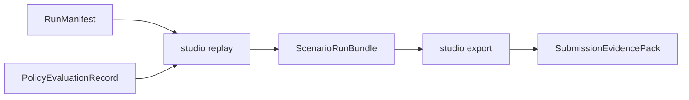

# TASK-118: CLI Replay And Submission Export Pack

## Status
- state: review
- owner: Codex
- assignee: generalPurpose
- dependencies: TASK-114, TASK-115, TASK-116, TASK-117, TASK-113
- location: `src/driverx/workbench`, `src/driverx/pipeline`, `src/driverx/scenarios`, `tests`
- enter when: CLI generation, queue, run manifest, and policy evaluation artifacts exist or have fixture equivalents
- leave when: `driverx studio replay` and `driverx studio export` produce a judge-facing CLI product demo packet
- blockers: final video polish depends on available video artifacts; HTML/Markdown export does not
- spawned follow-ups: future browser app or Codex skill wrapper
- complexity: M

### Summary

Add the final CLI product commands: replay links one scenario's video, risk,
RAG, reasoning, and action artifacts; export builds the judge-facing packet with
command provenance and claim boundaries.

### Scope

- In scope: `studio replay`, `studio export`, bundle linking from run manifest
  and policy evaluation, HTML/Markdown reports, final CLI transcript, tests.
- Out of scope: new simulator runs, new model inference, browser app, and
  public upload.

### Diagram Summary



### Plan

#### Change

Create replay/export commands that make the CLI workflow judge-visible.

#### Why

The CLI product still needs a presentation layer. Export should show what was
generated, what ran, what Alpamayo reasoned, where RAG appeared, and what claims
are proved versus partial.

#### Before -> After

- Before: final pack exists but is detached from a coherent CLI workflow.
- After: one export packet contains scenario generation, queue, run, evaluation,
  replay, and exact command provenance.

#### Touch

- `src/driverx/scenarios/studio_product_cli.py`: add `studio replay/export`.
- `src/driverx/workbench/cli_export.py` or extend existing workbench report.
- `src/driverx/pipeline/scenario_generator_cli_pack.py`: pack builder.
- `tests/test_scenario_generator_cli_pack.py`
- `README.md`: CLI demo command sequence.

#### Inspect

- `src/driverx/workbench/bundle.py`
- `src/driverx/workbench/report.py`
- `src/driverx/pipeline/final_submission_pack_v8.py`
- `src/driverx/pipeline/submission_scenario_browser.py`
- `tests/test_scenario_workbench_bundle.py`

#### Signature Delta

```python
src/driverx/pipeline/scenario_generator_cli_pack.py / build_scenario_generator_cli_pack(inputs: ScenarioGeneratorCliPackInputs): dict[str, Any]
src/driverx/pipeline/scenario_generator_cli_pack.py / write_scenario_generator_cli_pack(run_dir: Path, payload: dict[str, Any]): dict[str, Any]
```

#### Type Sketch

```python
ScenarioGeneratorCliPack = {
  "pack_id": str,
  "command_transcript": list[str],
  "scenario_count": int,
  "closed_loop_count": int,
  "alpamayo_eval_count": int,
  "evidence_rows": list[dict[str, str]],
  "claim_boundaries": list[str],
  "next_work": list[str],
}
```

#### Typed Flow Example

Quickstart artifacts + one live/autopilot manifest + one Alpamayo evaluation
-> `studio replay` -> `scenario_run_bundle.html`
-> `studio export` -> `scenario_generator_cli_browser.html` and demo script.

#### Execution Steps

1. Implement replay command that delegates to existing Workbench bundler with
   run/evaluation inputs.
2. Implement export pack builder that consumes one or more replay bundles.
3. Add command transcript and claim-boundary summary.
4. Add tests for missing optional artifacts, local video references, and pack
   counts.
5. Update README with the final CLI demo sequence.

#### Recommendation

Make export HTML/Markdown the primary proof. Video remains a linked artifact,
not a required committed asset.

#### Options Considered

- Continue only with V8 final pack: useful, but not CLI-product-specific.
- Build browser UI now: stronger visuals, but too costly before CLI works.
- Recommended: CLI replay/export now, browser later.

#### Blast Radius

Medium. It touches final evidence packaging but should reuse existing pack code
instead of replacing it.

#### Risks

- Export can overclaim if linked evidence is partial. Enforce claim boundaries
  from every source artifact.

### Acceptance Criteria

- [ ] AC-1: `studio replay` writes `scenario_run_bundle.json`, `.md`, and `.html`.
- [ ] AC-2: `studio export` writes a CLI-specific evidence pack with command
  transcript, scenario rows, model reasoning rows, claim boundaries, and next
  work.
- [ ] AC-3: Missing optional video/model artifacts produce partial rows, not
  false failures or overclaims.
- [ ] AC-4: README shows the full CLI demo sequence.

### Agent Contract
- Open: `PYTHONPATH=src python3 -m driverx studio replay --help`
- Test hook: quickstart artifacts -> replay -> export under temp output root
- Stabilize: fixture manifests, deterministic output paths
- Inspect: replay HTML/Markdown and export pack JSON/HTML
- Key screens/states: complete row, partial row, claim boundary row
- QA cookbook: none yet
- Taste refs: HTML should be scannable, not decorative
- Expected artifacts: replay bundle and CLI export pack
- Delegate with: TASK-118 ticket and quickstart artifact folder

### Evidence Checklist
- [ ] Replay HTML captured
- [ ] Export pack captured
- [ ] Unit tests linked
- [ ] QA report linked

### Verification

- `PYTHONPATH=src python3 -m unittest tests.test_scenario_generator_cli_pack`
- `PYTHONPATH=src python3 -m driverx studio replay --run <fixture_manifest>`
- `PYTHONPATH=src python3 -m driverx studio export --runs <bundle>`
- `bash scripts/pre_push_check.sh`

### Autonomy Readiness

- Inputs: quickstart or live run artifacts.
- Credentials: none.
- Compute: local Python only.
- Human gates: ask before public upload only.

### Evidence

- Planned.

### Blockers

- None for CLI export. Final demo video polish depends on source media quality.
