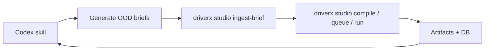

# TASK-119: Codex Scenario Operator Skill

## Status
- state: done
- owner: Codex
- assignee: generalPurpose
- dependencies: TASK-114, TASK-115, docs/specs/scenario-generator-cli-v1.md
- location: `skills` or `.codex/skills`, `docs`, `tickets/TASK-119/artifacts`
- enter when: the CLI database can initialize, ingest briefs, compile candidates, and queue scenarios
- leave when: a Codex skill guides an agent through generating OOD scenario ideas, recording them through the CLI DB, selecting experiments, and preserving claim boundaries
- blockers: should not be built before TASK-114/TASK-115 establish the DB contract
- spawned follow-ups: none
- complexity: M

### Summary

Create the AI operator layer as a Codex skill after the CLI database is stable.
The skill should make Codex the generator/orchestrator while the CLI remains the
durable database and execution control surface.

### Scope

- In scope: skill instructions, workflow prompts, command recipes, artifact
  expectations, blocker handling, and a dry-run proof transcript.
- Out of scope: a second database, hidden state, live paid-provider calls by
  default, and simulator/model implementation.

### Diagram Summary



### Plan

#### Change

Add a Codex skill wrapper that tells an agent how to use the `driverx studio`
database commands to generate, record, run, evaluate, and export scenarios.

#### Why

The AI generator should live where the model and tool orchestration already
live: Codex. The CLI should remain deterministic and auditable.

#### Before -> After

- Before: the CLI plan risks making `generate` sound like the AI brain.
- After: Codex generates and decides; CLI stores and proves.

#### Touch

- Skill folder chosen during implementation, likely
  `/Users/kenjipcx/coding-harness/Codexter/skills/driverx-scenario-operator/`
  or a project-local skill draft if the repo chooses not to mutate global
  skills.
- `docs/specs/scenario-generator-cli-v1.md`
- README command examples.
- `tickets/TASK-119/artifacts/skill-dry-run-transcript.md`

#### Inspect

- `docs/specs/scenario-generator-cli-v1.md`
- `src/driverx/scenarios/studio_product_cli.py` after TASK-114
- Available Codexter skill conventions

#### Signature Delta

```text
driverx-scenario-operator/SKILL.md:
  - generate candidate scenario briefs
  - call driverx studio ingest-brief / compile / queue
  - choose next experiment
  - log blockers and claim boundaries
```

#### Type Sketch

```python
SkillRunContract = {
  "inputs": ["theme", "target_policy", "budget", "runtime_mode"],
  "writes": ["ScenarioBrief", "ScenarioStudioDB", "ScenarioDatasetQueue"],
  "calls": ["driverx studio ..."],
  "must_not": ["store hidden state", "claim live control without manifest"],
}
```

#### Typed Flow Example

User asks for Malaysian road chaos -> skill writes 10 candidate briefs ->
`studio ingest-brief` stores them -> `studio compile` expands them -> skill
reviews queue and selects the next CARLA run.

#### Execution Steps

1. Wait for TASK-114/TASK-115 to stabilize the DB command contract.
2. Draft skill instructions around scenario ideation, CLI command use, and
   artifact proof.
3. Add a dry-run transcript proving the skill can operate without live CARLA.
4. Add claim-boundary and blocker rules so the skill does not overclaim runtime
   evidence.

#### Recommendation

Build this after the CLI DB exists. Do not create the skill first.

#### Options Considered

- Global skill now: fast, but it would rely on unimplemented commands.
- Project docs only: safe, but less useful to Codex.
- Recommended: plan now, implement after TASK-114/TASK-115.

#### Blast Radius

Low if implemented as a wrapper. Medium if global skills are mutated; use a
project-local draft unless the user wants global install.

#### Risks

- Skill could hide state or make non-reproducible decisions. Mitigate by
  requiring every action to write through the CLI DB.

### Acceptance Criteria

- [x] AC-1: Skill instructions use the CLI DB as the only durable state surface.
- [x] AC-2: Skill includes scenario-generation heuristics for OOD driving cases.
- [x] AC-3: Skill includes exact `driverx oodriver` commands and artifact checks.
- [x] AC-4: Dry-run transcript proves it can generate and queue scenarios
  without CARLA/GPU.

### Agent Contract
- Open: read `driverx-scenario-operator/SKILL.md`
- Test hook: run the skill dry-run transcript against TASK-114/TASK-115 commands
- Stabilize: fixed prompts, seeds, output root
- Inspect: skill text and dry-run transcript
- Key screens/states: none
- QA cookbook: none yet
- Taste refs: skill must be concise and command-oriented
- Expected artifacts: skill file, dry-run transcript, review
- Delegate with: TASK-119 ticket and CLI DB spec

### Evidence Checklist
- [ ] Skill file captured
- [ ] Dry-run transcript captured
- [ ] Review linked

### Verification

- Manual dry-run transcript once CLI commands exist.
- `bash scripts/pre_push_check.sh` if repo files are changed.

### Autonomy Readiness

- Inputs: stable CLI DB commands.
- Credentials: none by default.
- Compute: local Python only.
- Human gates: ask before installing a global skill outside the repo.

### Evidence

- Skill draft: `skills/oodriver-scenario-operator/SKILL.md`.
- Skill index: `skills/README.md`.
- Dry-run proof: `artifacts/runs/oodriver-cli-smoke/scenario_studio_db.json`
  and `tickets/TASK-119/artifacts/qa/oodriver-cli-qa.md`.
- Review: `docs/reviews/TASK-114-119-oodriver-cli-review.md`.
- Tests: `PYTHONPATH=src python3 -m unittest tests.test_oodriver_cli`.

### Blockers

- None. TASK-114/TASK-115 are implemented.
