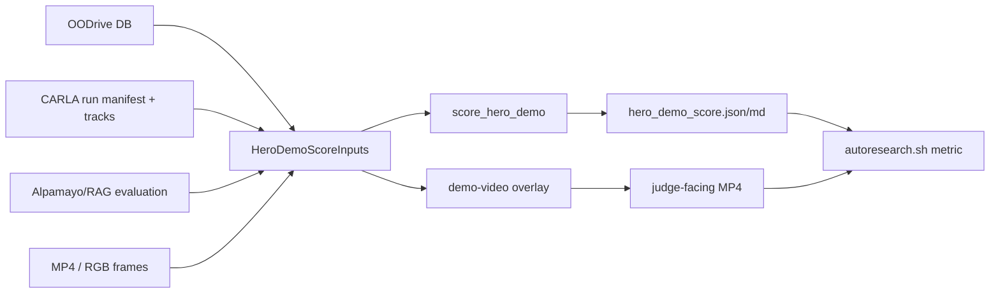

# TASK-130: Hero Demo Score And Reasoning Video Contract

## Status
- state: building
- owner: Codex
- assignee: generalPurpose
- dependencies: TASK-128, TASK-129 optional
- location: `src/driverx/evaluation`, `src/driverx/simulators`, `src/driverx/pipeline`, `src/driverx/scenarios`, `src/oodrive`, `qa/fixtures/hero_demo_score`, `tests`
- enter when: TASK-128 proves the live OODrive loop but the exported video is too slow and does not visibly show reasoning/RAG/frame evidence
- leave when: `oodrive score-demo` and `oodrive demo-video` can produce and score a judge-facing hero demo with frame/time, reasoning, RAG, risk, OOD objects, speed/duration, and claim-boundary evidence
- blockers: none for local fixture implementation; live CARLA/Alpamayo reruns need the Kasm pod only for fresh source evidence
- spawned follow-ups: none
- complexity: M

### Summary

The current video technically proves a live generated CARLA run plus fresh
Alpamayo reasoning, but it is not persuasive as a submission demo. This ticket
adds the mechanical demo-quality contract and the video surfaces required to
make a reviewer understand the OODrive contribution without squinting at raw
simulator footage.

### Scope

- In scope: hero demo scoring, score fixtures, `oodrive score-demo`, visible
  frame/time overlay, reasoning/RAG/risk overlay inputs, demo-video report,
  tests, and autoresearch handoff.
- Out of scope: real-time closed-loop VLA control, training/fine-tuning,
  Meshy/custom GLB assets, public video hosting, and rewriting the entire
  CARLA runner.

### Plan

#### Change

Add a first-class demo QA layer:

```bash
PYTHONPATH=src python3 -m oodrive score-demo \
  --db artifacts/runs/task128-oodrive-live-product/scenario_studio_db.json \
  --run artifacts/runs/task128-oodrive-live-product/runs/task128-oodrive-live-place/run_manifest.json \
  --evaluation artifacts/runs/task128-oodrive-live-product/reasoning/evaluations/task128-oodrive-live-alpamayo-fresh-evaluation/policy_evaluation.json \
  --video artifacts/exported/task128_oodrive_live_product.mp4 \
  --run-id task130-score
```

Add a demo-video command that builds a better presentation artifact:

```bash
PYTHONPATH=src python3 -m oodrive demo-video \
  --db ... \
  --run ... \
  --evaluation ... \
  --input-video ... \
  --speed-factor 4 \
  --show-frame-time \
  --show-reasoning \
  --show-rag \
  --run-id task130-hero-demo
```

#### Why

The submission needs to show the product and reasoning loop in-frame. A stronger
GPU will not fix a demo that lacks visible reasoning, visible memory retrieval,
or a mechanical definition of "good enough."

#### Before -> After

- Before: a video can be assembled even when it is slow, visually unclear, and
  missing VLA/RAG callouts.
- After: bad hero videos fail a numeric score and the renderer has explicit
  panels for frame/time, scenario prompt, generated objects, risk, RAG memory,
  Alpamayo reasoning, and action intent.

#### Touch

- `src/driverx/evaluation/hero_demo_score.py`
- `src/driverx/evaluation/hero_demo_score_cli.py`
- `src/driverx/simulators/reasoning_timeline_overlay.py`
- `src/driverx/pipeline/reasoning_overlay_video.py`
- `src/driverx/scenarios/studio_product_cli.py`
- `src/oodrive/cli.py`
- `qa/fixtures/hero_demo_score/*`
- `tests/test_hero_demo_score.py`
- `tests/test_reasoning_overlay_video.py`
- `tests/test_oodrive_cli.py`
- `README.md`, `docs/HISTORY.md`, `docs/MEMORY.md`

#### Inspect

- `src/driverx/simulators/ood_video_overlay.py`
- `src/driverx/simulators/video_timewarp.py`
- `src/driverx/scenarios/quality.py`
- `src/driverx/scenarios/studio_product_runtime.py`
- `src/driverx/policies/alpamayo_carla_adapter.py`
- `tickets/TASK-128/artifacts/qa/live-product-loop-qa.md`
- `autoresearch.md`

#### Signature delta

```python
# evaluation
load_demo_score_inputs(
    db_path: Path | None,
    run_manifest_path: Path | None,
    evaluation_path: Path | None,
    video_path: Path | None,
) -> HeroDemoScoreInputs

score_hero_demo(inputs: HeroDemoScoreInputs, thresholds: HeroDemoThresholds) -> HeroDemoScoreReport

write_hero_demo_score(run_dir: Path, report: HeroDemoScoreReport) -> dict[str, Any]

# simulator overlay
render_reasoning_timeline_overlay(config: ReasoningOverlayConfig) -> ReasoningOverlayResult
# extend config/events to include frame/time visibility and repeated reasoning/RAG panels

# product CLI
run_studio_score_demo(...) -> StudioCommandResult
run_studio_demo_video(...) -> StudioCommandResult
```

#### Type Sketch

```python
HeroDemoScoreInputs = {
  "candidate_id": str,
  "video_path": str | None,
  "source_duration_s": float,
  "output_duration_s": float,
  "frame_count": int,
  "fps": int,
  "has_mp4": bool,
  "road_alignment_pass": bool,
  "frame_time_overlay_coverage": float,
  "mean_ego_speed_mps": float | None,
  "visible_generated_object_count": int,
  "risk_event_count": int,
  "reasoning_event_count": int,
  "rag_event_count": int,
  "alpamayo_prediction_count": int,
  "min_distance_m": float | None,
  "offroad_actor_count": int,
  "claim_boundaries": list[str],
}

HeroDemoScoreReport = {
  "status": "passed" | "blocked",
  "hero_demo_score": float,
  "threshold": float,
  "metrics": dict[str, float | int | bool | str | None],
  "blockers": list[str],
  "warnings": list[str],
  "json_path": str,
  "report_path": str,
}

ReasoningDisplayEvent = {
  "frame_index": int,
  "source_time_s": float,
  "risk": str,
  "memory_id": str | None,
  "memory_principle": str | None,
  "vla_reasoning": str | None,
  "action_intent": str,
}
```

#### Typed flow example

`scenario_studio_db.json + run_manifest.json + policy_evaluation.json + task128 MP4`
-> `load_demo_score_inputs(...)` extracts `frame_count=450`,
`output_duration_s=30`, `reasoning_event_count=1`, `rag_event_count=1`,
`frame_time_overlay_coverage=0`
-> `score_hero_demo(...)` emits `hero_demo_score < pass threshold` with blockers
for missing visible reasoning/RAG/frame evidence
-> `oodrive demo-video` rebuilds an overlay with frame/time and repeated
reasoning events
-> `oodrive score-demo` passes only when the report shows enough source
duration, motion, visible OOD objects, risk events, reasoning panels, RAG
panels, and honest claim boundaries.

#### Execution steps

1. Promote the fixture scorer formula into `src/driverx/evaluation/hero_demo_score.py`.
2. Add fixture tests proving weak baseline fails and target contract passes.
3. Add `oodrive score-demo` and DriverX compatibility registration.
4. Extend reasoning overlay events to include frame index, source timestamp,
   scenario prompt, generated object labels, and explicit RAG/CoC panels.
5. Add `oodrive demo-video` as the product command that wraps the existing
   reasoning overlay pipeline with the new display contract.
6. Add tests for CLI help, report writing, missing evidence blockers, and
   frame/time coverage scoring.
7. Run `./autoresearch.sh`, focused tests, then `bash scripts/pre_push_check.sh`.
8. Update docs/history/memory and attach review/QA evidence to this ticket.

#### Recommendation

Build TASK-130 before spending more GPU time. This makes every future CARLA or
Alpamayo run self-qualifying and prevents another bad video from becoming the
hero artifact.

#### Options considered

- Polish the MP4 manually: fastest, but it does not create a reusable simulator
  product loop or prevent future bad clips.
- Add closed-loop Alpamayo first: higher prestige, but the current evidence
  surface is too weak to communicate success even if inference works.
- Add scoring plus reasoning video contract first: best fit because it turns
  the subjective demo complaint into mechanical gates and directly improves the
  judge-facing artifact.

#### Blast radius

- CLI surface grows by two product commands.
- Video overlay tests may need fixture images/videos rather than real CARLA.
- Submission pack builders should read the score report before promoting hero
  media.
- Existing `assemble-ood-video` and `timewarp-video` remain valid low-level
  primitives.

#### Risks

- Metric gaming: contained by requiring traceable DB/run/evaluation inputs and
  preserving claim boundaries.
- Over-scoring fake data: contained by labeling fixture mode and requiring live
  run paths for submission promotion.
- Video renderer complexity: contained by extending the existing overlay module
  instead of building a new renderer from scratch.

### Gap Analysis

Current repo has scenario quality gates and video assembly, but no demo-quality
gate that specifically tests whether a human can see the OODrive product loop.
The missing production-grade capability is a scorer that rejects clips without
visible reasoning, visible memory retrieval, frame/time context, or enough
motion and OOD interaction density.

### Diagram



### Acceptance Criteria

- [ ] AC-1: `oodrive score-demo --help` and `oodrive demo-video --help` exist.
- [ ] AC-2: Weak fixture scores below the pass threshold with specific blockers.
- [ ] AC-3: Target fixture scores above the pass threshold.
- [ ] AC-4: Score report includes duration, motion, visible OOD count, risk
  events, reasoning events, RAG events, Alpamayo evidence, frame/time coverage,
  penalties, and claim boundaries.
- [ ] AC-5: Demo-video overlay can render frame number/source timestamp plus
  VLA/RAG/risk/action panels without requiring CARLA.
- [ ] AC-6: `./autoresearch.sh` emits one primary
  `METRIC hero_demo_score=<number>` line plus optional secondary metric lines.
- [ ] AC-7: Submission promotion docs point to the score report instead of raw
  video presence.

### Verification

- `./autoresearch.sh`
- `./autoresearch.checks.sh`
- `PYTHONPATH=src python3 -m unittest tests.test_hero_demo_score tests.test_reasoning_overlay_video tests.test_oodrive_cli`
- `bash scripts/pre_push_check.sh`
- Manual artifact review: generated score JSON/Markdown and one sample overlay
  frame show frame/time, reasoning, RAG, risk, and action intent.

### Autonomy Readiness

- Inputs available: local fixtures, TASK-128 downloaded video path, existing
  OODrive DB/run/evaluation artifact shapes, existing video overlay modules.
- Compute needed: local CPU for implementation and tests; no stronger GPU
  required until we regenerate live source footage.
- Human gates: none for TASK-130. Fresh live CARLA/Alpamayo reruns remain
  optional after the score contract lands.
- QA risks: avoid promoting fixture-only reports as live evidence; keep
  `fixture_mode=true` or equivalent in fixture artifacts.

### Evidence

- Autoresearch session: `autoresearch.md`
- Fixture scorer: `qa/fixtures/hero_demo_score/score_fixture.py`
- Plan review: `docs/reviews/TASK-130-hero-demo-score-plan-review.md`
- Review JSON: `tickets/TASK-130/artifacts/review/task130-plan-review.json`
- Implementation QA: pending
- Implementation review: pending

### Blockers

- None for local planning and implementation.
