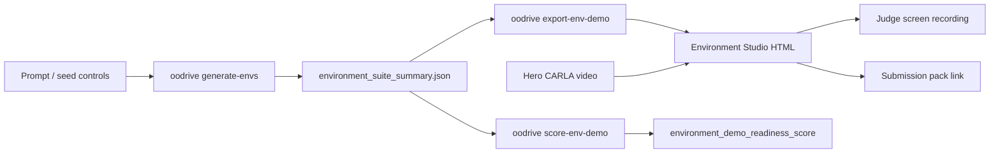

# TASK-135: Judge-Visible Environment Studio Demo

## Status
- state: done
- owner: Codex
- assignee: generalPurpose
- dependencies: TASK-103, TASK-131, TASK-133
- location: `src/driverx/environments`, `src/driverx/pipeline`, `src/driverx/scenarios`, `src/driverx/evaluation`, `src/oodrive`, `tests`, `tickets/TASK-135`
- enter when: OODrive can generate deterministic CARLA environment packs, but judges still cannot easily see or demo that capability as a product-facing app/workflow
- leave when: OODrive has a product-facing environment demo surface, a recordable local HTML app, a mechanical `environment_demo_readiness_score >= 90`, and the final submission pack can point judges to the environment-generation proof
- blockers: none for local artifact/demo work; fresh live CARLA rendering remains optional and should not block this ticket
- spawned follow-ups: optional live CARLA multi-environment reel only after this local demo surface passes
- complexity: M

### Summary

Make OODrive's environment generation judge-visible. The feature already
generates six deterministic CARLA-ready environment families, stock proxy asset
requests, road-local placement hints, weather, traffic pressure, and policy
stress descriptions. The missing product layer is a demoable OODrive command
and app-like HTML surface that shows prompt -> generated environment variants
-> CARLA weather/assets/placement -> scenario/run evidence -> submission story.

### Scope

- In scope: product-facing environment-generation CLI commands, a local static
  Environment Studio demo pack, an environment-demo readiness scorer, tests,
  README/submission-pack references, and a video-ready storyboard/shot list.
- Out of scope: a new full web server, public hosting, fresh GPU setup, new
  model inference, custom GLB asset generation, and closed-loop VLA claims.

### Plan

#### Change

Add a recordable environment-generation product surface:

```bash
PYTHONPATH=src python3 -m oodrive generate-envs \
  --template-id construction_lane_closure \
  --template-id roadside_market_occlusion \
  --template-id flooded_road \
  --template-id night_rain_fog \
  --template-id dense_regional_traffic \
  --template-id school_zone_unstructured_crossing \
  --severity 4 \
  --count 6 \
  --seed 31 \
  --run-id task135-env-demo-v1

PYTHONPATH=src python3 -m oodrive export-env-demo \
  --environment-summary artifacts/runs/task135-env-demo-v1/environment_suite_summary.json \
  --submission-pack artifacts/runs/task128-oodrive-live-product/submission-packs/task133-submission-pack-v1/submission_manifest.json \
  --hero-video artifacts/runs/task128-oodrive-live-product/demo-videos/task131-score-gated-hero-v2/oodrive_hero_demo.mp4 \
  --run-id task135-env-demo-v1

PYTHONPATH=src python3 -m oodrive score-env-demo \
  --environment-summary artifacts/runs/task135-env-demo-v1/environment_suite_summary.json \
  --demo-manifest artifacts/runs/task135-env-demo-v1/environment-demo-packs/task135-env-demo-v1/environment_demo_manifest.json \
  --metric-only
```

The generated `index.html` should be usable as the first screen for a judge
demo video: six environment cards, CARLA weather/traffic controls, generated
asset proxies with road-local placements, expected policy pressure, claim
boundaries, and links into the hero video/submission pack.

#### Why

The SoTA prompt asks for a simulation environment and extra credit for
randomized scenario generation. OODrive has the substance, but the current demo
emphasizes the hero video and reasoning overlays more than the environment
generator. This ticket turns the feature into a product surface a judge can
understand in the first 20 seconds of a screen recording.

#### Before -> After

- Before: environment generation exists as `driverx forge-environments` and
  integrated scenario recipes, but it is not product-facing through `oodrive`
  and not showcased as an app-like demo.
- After: `oodrive generate-envs` and `oodrive export-env-demo` produce a
  recordable Environment Studio pack, and `oodrive score-env-demo` mechanically
  gates whether the feature is demo-ready.

#### Touch

- `src/driverx/environments/generator.py`
- `src/driverx/environments/types.py`
- `src/driverx/scenarios/studio_product_cli.py`
- `src/driverx/scenarios/studio_product_environment_runtime.py` (new focused runtime module)
- `src/driverx/pipeline/environment_demo_pack.py` (new)
- `src/driverx/evaluation/environment_demo_score.py` (new)
- `src/oodrive/cli.py`
- `tests/test_environment_generator.py`
- `tests/test_environment_demo_pack.py` (new)
- `tests/test_environment_demo_score.py` (new)
- `tests/test_oodrive_cli.py`
- `README.md`
- `docs/HISTORY.md`
- `tickets/TASK-135/autoresearch/*`

#### Inspect

- `src/driverx/environments/generator.py`
- `src/driverx/environments/library.py`
- `src/driverx/scenarios/studio.py`
- `src/driverx/scenarios/studio_product_cli.py`
- `src/driverx/pipeline/submission_story_pack.py`
- `src/driverx/evaluation/submission_readiness_score.py`
- `tests/test_environment_generator.py`
- `tests/test_submission_story_pack.py`
- `docs/specs/scenario-studio-data-engine.md`
- `docs/specs/scenario-workbench-v2-plan.md`
- `docs/MEMORY.md`
- `docs/TROUBLES.md`

#### Signature Delta

```python
run_studio_generate_envs(
    *,
    template_ids: tuple[str, ...],
    severity: int,
    count: int,
    random_seed: int,
    output_root: Path,
    run_id: str,
) -> StudioCommandResult

build_environment_demo_pack(
    *,
    environment_summary_path: Path,
    output_root: Path,
    run_id: str,
    submission_pack_path: Path | None = None,
    hero_video_path: Path | None = None,
) -> dict[str, Any]

score_environment_demo_readiness(
    inputs: EnvironmentDemoReadinessInputs,
) -> EnvironmentDemoReadinessReport

load_environment_demo_readiness_inputs(
    *,
    environment_summary_path: Path | None,
    demo_manifest_path: Path | None,
    score_input_path: Path | None = None,
) -> EnvironmentDemoReadinessInputs
```

#### Type Sketch

```python
EnvironmentDemoPack = {
  "pack_id": str,
  "product_name": "OODrive",
  "environment_families": list[str],
  "recipes": list[{
    "recipe_id": str,
    "template_id": str,
    "family": str,
    "severity": int,
    "weather": dict[str, float | str],
    "traffic": dict[str, float | str],
    "assets": list[{
      "asset_id": str,
      "role": str,
      "blueprint_hint": str,
      "base_placement": dict[str, float | str],
      "collision_proxy": dict[str, float | str],
    }],
    "expected_policy_pressure": str,
  }],
  "hero_video": {"path": str, "status": "local_file" | "missing"},
  "claim_boundaries": list[str],
  "video_storyboard_path": str,
}

EnvironmentDemoReadinessReport = {
  "environment_demo_readiness_score": float,
  "status": "passed" | "blocked",
  "components": {
    "generation_substance": float,
    "product_surface": float,
    "judge_app_legibility": float,
    "video_readiness": float,
    "reproducibility": float,
  },
  "blockers": list[str],
  "recommendations": list[str],
}
```

#### Typed Flow Example

`oodrive generate-envs --severity 4 --count 6`
-> `EnvironmentSuiteConfig`
-> `environment_suite_summary.json` with six families, eleven asset requests,
weather, traffic, collision proxies, and road-local placements
-> `oodrive export-env-demo`
-> `environment_demo_manifest.json`, `index.html`, `video_storyboard.md`,
`commands.sh`
-> `oodrive score-env-demo`
-> `environment_demo_readiness_score`
-> submission pack links the Environment Studio page as proof of randomized
environment generation.

#### Execution Steps

1. Add product-facing `oodrive generate-envs` as a thin wrapper over
   `run_environment_forge`, preserving the existing internal
   `driverx forge-environments` command.
2. Add `studio_product_environment_runtime.py` so environment demo behavior does
   not grow the already large product runtime modules.
3. Build `environment_demo_pack.py` to render a static, local HTML app with
   environment cards, family filters, weather/traffic panels, asset placement
   tables, claim labels, and links to the hero video/submission pack.
4. Add `oodrive export-env-demo` and `oodrive score-env-demo`.
5. Implement `environment_demo_score.py` with a non-saturated local metric:
   generation substance, product CLI surface, judge legibility, video readiness,
   and reproducibility.
6. Add fixtures/tests for weak, current, and target environment-demo states.
7. Update the TASK-133 submission pack builder to include an Environment Studio
   section/link when a demo manifest is provided.
8. Generate `task135-env-demo-v1` locally and run the nested autoresearch
   metric until `environment_demo_readiness_score >= 90`.
9. Record a `video_storyboard.md` with a 1-5 minute app-demo sequence:
   generate envs, inspect the app cards, open CARLA/hero proof, show claims and
   score.
10. Run focused tests, visual QA on the HTML output, `./autoresearch.checks.sh`,
    `bash scripts/pre_push_check.sh`, review, and history writeback.

#### Recommendation

Build the static Environment Studio demo surface now. It is higher ROI than
fresh CARLA runtime because it turns an already-working differentiator into a
judge-understandable product story, while keeping generated videos and GPU work
off the critical path.

#### Options Considered

- Only mention environment packs in the README: too weak for a video demo and
  does not prove product usability.
- Build a full live web app: attractive but too large for the deadline and not
  necessary to satisfy the challenge.
- Add product CLI plus static app-like HTML pack: selected because it is
  recordable, testable, local, and directly supports the submission video.

#### Blast Radius

- CLI surface gains three additive product commands.
- Existing environment generator APIs remain source-compatible.
- Generated HTML/MP4 artifacts stay ignored under `artifacts/`.
- Submission-readiness scoring remains honest; no claim-boundary upgrades.

#### Risks

- A static HTML surface can feel decorative if it is not backed by real
  environment summary JSON. The pack must load from generated artifacts, not
  hard-coded marketing copy.
- The score can become gameable if it rewards text alone. Require real recipe
  counts, asset requests, CARLA weather/traffic fields, and command help
  registration.
- Visual polish could sprawl. Keep the UI focused on the demo video path:
  first-screen cards, generated assets, CARLA placement, proof links, and score.

### Gap Analysis

Current state:

- `driverx forge-environments` generates six deterministic environment families.
- `oodrive generate` already attaches environment recipes to scenario
  candidates.
- Tests prove deterministic generation, CARLA-ready weather/assets, and
  scenario attachment.
- The submission pack mentions randomized generation but does not show the
  environment generator as a product surface.

Production-grade expectation for this deadline:

- A judge can see the operator type one OODrive command and get varied
  environment families.
- The resulting app view shows what CARLA will receive: weather, traffic,
  static assets, proxy blueprints, collision boxes, placements, and policy
  stress.
- The video story connects the generated environments to the hero CARLA run and
  the honest open-loop Alpamayo evidence.

Missing gaps:

- No product-facing `oodrive generate-envs` command.
- No Environment Studio page suitable for screen recording.
- No environment-demo metric separate from the already-saturated submission
  readiness score.
- No storyboard that tells the operator exactly how to demo this feature to
  judges.

### Diagram



### Acceptance Criteria

- [x] AC-1: `oodrive generate-envs --help`, `oodrive export-env-demo --help`,
  and `oodrive score-env-demo --help` exist.
- [x] AC-2: `oodrive generate-envs` writes an environment suite summary with at
  least six families, CARLA weather/traffic fields, asset requests, collision
  proxies, and road-local placement hints.
- [x] AC-3: `oodrive export-env-demo` writes `index.html`,
  `environment_demo_manifest.json`, `commands.sh`, and `video_storyboard.md`.
- [x] AC-4: The HTML first screen makes the environment generator clear without
  reading source code: families, severity/seed/count, assets, weather, traffic,
  expected policy pressure, and claim boundaries are visible.
- [x] AC-5: `oodrive score-env-demo --metric-only` reports
  `environment_demo_readiness_score >= 90`.
- [x] AC-6: The final submission pack can link to or embed the Environment
  Studio demo manifest.
- [x] AC-7: Claim boundaries stay honest:
  `closed_loop_vla_control=false`, `real_time_vla_control=false`,
  `sampled_open_loop_reasoning=true`, `time_warped_offline_demo=true`.

### Verification

- PASS: `tickets/TASK-135/autoresearch/autoresearch.sh` emitted
  `METRIC environment_demo_readiness_score=100.0000`.
- PASS: `tickets/TASK-135/autoresearch/autoresearch.checks.sh` ran `23`
  tests, all passing.
- PASS: `PYTHONPATH=src python3 -m unittest tests.test_environment_generator tests.test_environment_demo_pack tests.test_environment_demo_score tests.test_oodrive_cli tests.test_submission_story_pack`
  ran `23` tests, all passing.
- PASS: `./autoresearch.sh` emitted `METRIC submission_readiness_score=96.3500`.
- PASS: `./autoresearch.checks.sh` ran `22` tests, all passing.
- PASS: `bash scripts/pre_push_check.sh` ran `415` tests with `4` skipped and
  passed.
- PASS: Visual QA opened the generated `index.html` through Quick Look and
  captured a screenshot
  proving the first screen is readable and recordable.

### Autonomy Readiness

- Human inputs/assets needed: none for local demo pack; optional user review of
  final screen recording before public submission.
- Credentials/external services: none for the core ticket.
- Compute/runtime needs: local Python only; no fresh RunPod/CARLA run required.
- Hard-to-QA surfaces: static HTML legibility and whether the demo feels like
  an app rather than a report; use visual QA screenshot and storyboard proof.
- Human gates: ask before public upload or new paid GPU work only.
- Agent decision boundary: if live CARLA multi-environment footage is not
  available, ship the local Environment Studio demo and link existing hero
  CARLA proof.

### Refs

- `docs/prd.md`
- `docs/specs/scenario-studio-data-engine.md`
- `docs/specs/scenario-workbench-v2-plan.md`
- `docs/MEMORY.md` MEM-0035, MEM-0037, MEM-0039, MEM-0040
- `docs/TROUBLES.md` 2026-05-07 product-story correction
- `src/driverx/environments/README.md`
- `tests/test_environment_generator.py`

### Evidence

- Planning smoke: `PYTHONPATH=src python3 -m driverx forge-environments --config configs/environment_forge.sample.yaml --output-root artifacts/runs --run-id task135-env-plan-smoke`
- Planning smoke result: `6` recipes, `11` asset requests, families
  `construction`, `pedestrian_occlusion`, `regional_market`,
  `regional_traffic`, `visibility`, `weather_surface`.
- Autoresearch plan: `tickets/TASK-135/autoresearch/autoresearch.md`
- Baseline verify: `tickets/TASK-135/autoresearch/autoresearch.sh` emitted
  `METRIC environment_demo_readiness_score=57.0000`.
- Baseline components: `generation_substance=30.0000`,
  `product_surface=5.0000`, `judge_app_legibility=3.0000`,
  `video_readiness=15.0000`, `reproducibility=4.0000`.
- Baseline guard: `tickets/TASK-135/autoresearch/autoresearch.checks.sh` ran
  `18` tests, all passing.
- Planning review:
  `tickets/TASK-135/artifacts/review/task135-planning-review.json`
- Environment Studio HTML:
  `artifacts/runs/task135-env-demo-v1/environment-demo-packs/task135-env-demo-v1/index.html`
- Environment demo manifest:
  `artifacts/runs/task135-env-demo-v1/environment-demo-packs/task135-env-demo-v1/environment_demo_manifest.json`
- Environment score report:
  `artifacts/runs/task135-env-demo-v1/environment-demo-packs/task135-env-demo-v1/environment-demo-scores/task135-env-demo-v1-score-report/environment_demo_score.md`
- Environment score JSON:
  `artifacts/runs/task135-env-demo-v1/environment-demo-packs/task135-env-demo-v1/environment-demo-scores/task135-env-demo-v1-score-report/environment_demo_score.json`
- Visual QA screenshot:
  `tickets/TASK-135/artifacts/visual/index.html.png`
- Submission pack with environment demo link:
  `artifacts/runs/task128-oodrive-live-product/submission-packs/task135-submission-pack-with-env-demo/index.html`
- QA:
  `tickets/TASK-135/artifacts/qa/environment_studio_qa.md`
- Implementation review:
  `tickets/TASK-135/artifacts/review/task135-implementation-review.json`

### Blockers

- None.
