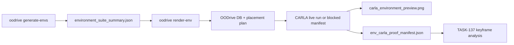

# TASK-136: Same-Run Environment To CARLA Visual Proof

## Status
- state: building
- owner: Codex
- assignee: generalPurpose
- dependencies: TASK-135
- location: `src/driverx/environments`, `src/driverx/scenarios`, `src/driverx/simulators`, `src/oodrive`, `tests`, `tickets/TASK-136`
- enter when: OODrive can generate deterministic environment recipes, but a judge cannot yet run one product command and see a CARLA image from that exact generated environment
- leave when: `oodrive render-env` or the selected equivalent command turns a generated environment recipe into a same-lineage CARLA run manifest, preview PNG, visual proof manifest, and clear blocked artifact when CARLA is unavailable
- blockers: live CARLA preview image still requires the Kasm/RunPod graphics host; local dry-run and blocked-artifact behavior are implemented
- spawned follow-ups: TASK-137, TASK-138, TASK-141
- complexity: M

### Summary

Create the missing visual bridge between Environment Studio and CARLA. The judge-facing flow should be:

```bash
oodrive generate-envs -> oodrive render-env -> carla_environment_preview.png
```

The preview must not be a generic screenshot or old hero frame. It must trace to the selected `environment_recipe_id`, seed, template, placement plan, CARLA config, run manifest, and RGB frame folder from the same execution attempt.

### Scope

- In scope: product CLI command, environment recipe selection, same-run DB/placement/run manifest linkage, preview image extraction, visual proof manifest, dry-run and blocked CARLA behavior, tests, ticket evidence, and metric integration for the nested autoresearch loop.
- Out of scope: new custom assets, fresh Alpamayo inference, final video assembly, public hosting, and closed-loop VLA control claims.

### Plan

#### Change

Add a product command that renders one generated environment into CARLA evidence:

```bash
PYTHONPATH=src python3 -m oodrive render-env \
  --environment-summary artifacts/runs/task135-env-demo-v1/environment_suite_summary.json \
  --recipe-id env-roadside-market-occlusion-s4-0032 \
  --prompt "wet Malaysian roadside market occlusion with scooter filtering" \
  --config configs/carla_ood_demo.runpod.high_fidelity.yaml \
  --run-id task136-env-c3-proof-v1 \
  --live
```

Recommended command name: `render-env`. It is more judge-intuitive than `prove-env` and narrower than `place`: the user expects an image of the environment, not only a placement manifest.

#### Why

TASK-135 proves randomized environment generation as an app-like pack, but the challenge asks for a simulation environment for a vehicle/model to navigate. A strong submission needs same-lineage proof that the generated environment can appear in CARLA, not just a static HTML card.

#### Before -> After

- Before: judges can inspect environment recipes and a separate hero CARLA video, but they must trust that those surfaces connect.
- After: one command writes a preview PNG and manifest proving that a selected generated recipe was converted into a CARLA visual run attempt with exact lineage.

#### Touch

- `src/driverx/scenarios/studio_product_cli.py`
- `src/driverx/scenarios/studio_product_environment_runtime.py`
- `src/driverx/environments/generator.py`
- `src/driverx/environments/types.py`
- `src/driverx/scenarios/studio_runtime.py` or the existing focused runtime package
- `src/driverx/simulators/carla_ood_demo.py`
- `src/driverx/simulators/video_timewarp.py` only if frame extraction utility reuse is needed
- `src/oodrive/__main__.py`
- `tests/test_environment_generator.py`
- `tests/test_environment_to_carla_visual_proof.py` (new)
- `tests/test_oodrive_cli.py`
- `README.md`
- `docs/HISTORY.md`
- `tickets/TASK-136/autoresearch/*`

#### Inspect

- `src/driverx/scenarios/studio_product_runtime.py`
- `src/driverx/scenarios/studio_product_environment_runtime.py`
- `src/driverx/environments/generator.py`
- `src/driverx/environments/library.py`
- `src/driverx/assets/types.py`
- `src/driverx/simulators/carla_ood_demo.py`
- `src/driverx/scenarios/run_manifest.py`
- `configs/carla_ood_demo.runpod.high_fidelity.yaml`
- `configs/carla_ood_demo.local.sample.yaml`
- `tickets/TASK-135/ticket.md`
- `docs/MEMORY.md`
- `docs/TROUBLES.md`

#### Signature Delta

```python
select_environment_recipe(
    environment_summary_path: Path,
    *,
    recipe_id: str | None = None,
    template_id: str | None = None,
    family: str | None = None,
) -> EnvironmentRecipe

build_environment_visual_candidate(
    *,
    environment: EnvironmentRecipe,
    prompt: str,
    output_root: Path,
    run_id: str,
    severity: int,
    seed: int,
) -> EnvironmentVisualCandidate

run_studio_render_env(
    *,
    environment_summary_path: Path,
    recipe_id: str | None,
    template_id: str | None,
    family: str | None,
    prompt: str,
    config_path: Path,
    output_root: Path | None,
    run_id: str,
    live: bool,
) -> StudioCommandResult

write_environment_carla_visual_proof(
    *,
    run_dir: Path,
    environment: EnvironmentRecipe,
    db_path: Path,
    placement_plan_path: Path,
    run_manifest_path: Path,
    carla_report_path: Path | None,
    preview_frame_path: Path | None,
    status: str,
    blockers: list[str],
) -> dict[str, Any]
```

#### Type Sketch

```python
EnvironmentVisualCandidate = {
  "environment_recipe_id": str,
  "template_id": str,
  "family": str,
  "random_seed": int,
  "prompt": str,
  "db_path": str,
  "scenario_id": str,
  "placement_plan_path": str,
  "asset_count": int,
}

EnvironmentCarlaVisualProof = {
  "status": "passed" | "planned" | "blocked" | "failed",
  "same_lineage": true,
  "environment_recipe_id": str,
  "scenario_id": str,
  "run_id": str,
  "carla_config_path": str,
  "run_manifest_path": str,
  "carla_report_path": str | None,
  "rgb_folder": str | None,
  "preview_image_path": str | None,
  "preview_source_frame": str | None,
  "claim_boundaries": [
    "environment_generation=true",
    "carla_visual_evidence=true|false",
    "closed_loop_vla_control=false",
    "real_time_vla_control=false"
  ],
  "blockers": list[str],
  "next_commands": list[str],
}
```

#### Typed Flow Example

`environment_suite_summary.json`
-> select `roadside_market_occlusion`
-> create one OODrive DB candidate with `environment_recipe_id`
-> build placement plan with stock proxy assets (`foodcart`, `dirtdebris01`, cones)
-> `run_carla_ood_demo` if `--live`
-> copy representative RGB frame to `carla_environment_preview.png`
-> write `env_carla_proof_manifest.json`
-> print next command for TASK-137 keyframe analysis.

#### Execution Steps

1. Add recipe-selection helpers that load `EnvironmentRecipe` objects from the environment summary without duplicating template parsing.
2. Add a focused visual-proof runtime function instead of growing unrelated product runtime code.
3. Create a one-scenario DB/placement artifact from the selected environment recipe and prompt, preserving `environment_recipe_id` in every artifact.
4. Reuse `run_studio_place` or the lower-level CARLA runner for `--live`, but keep dry-run output useful when CARLA is absent.
5. Extract a representative preview image from the live RGB folder, preferring the frame closest to the first high-risk or OOD-asset event when tracks exist, otherwise the midpoint frame.
6. Write `env_carla_proof_manifest.json`, `env_carla_visual_report.md`, and `commands.sh`.
7. Add CLI help, tests for dry-run/blocked/live-manifest shape, and fixture tests for preview extraction.
8. Run the nested TASK-136 autoresearch metric and record the baseline/new score.

#### Recommendation

Build this first. It is the highest-risk link in the user's desired story because it requires same-run provenance between generated environment recipes and CARLA visuals.

#### Options Considered

- Extend `oodrive place`: rejected as the primary UX because `place` is already scenario-centric and does not promise a visual preview.
- Build a new full studio app screen: rejected for this ticket because TASK-135 already did the static app; this ticket needs simulator proof.
- Add `oodrive render-env`: selected because the command directly answers "show me what this generated environment looks like in CARLA."

#### Blast Radius

- Adds one product CLI command and supporting runtime helpers.
- Does not change existing `generate-envs`, `place`, or hero-video scoring behavior.
- Generated CARLA images/videos remain ignored under `artifacts/`.
- Live CARLA behavior remains optional and honestly blocked on non-CARLA hosts.

#### Risks

- CARLA unavailable locally: write a blocked proof manifest with the exact Kasm command rather than failing with a stack trace.
- Generated environment assets may not be visually obvious with stock proxies: choose a recipe with strong proxy visibility and record actual blueprint IDs.
- Same-run provenance can be accidentally broken by reusing old videos: hard-code the visual proof manifest to fail `same_lineage=false` unless recipe/run paths agree.

### Gap Analysis

- Current proof shows environment cards and a hero video, but it does not show a generated environment becoming a CARLA image in one traceable run.
- A production-grade simulation environment harness should make generated environment parameters inspectable, renderable, and traceable to visual evidence.
- The right now boundary is a single preview PNG plus run manifest, not a full closed-loop driving benchmark.

### Diagram



### Acceptance Criteria

- [x] AC-1: `oodrive render-env --help` exists with options for environment summary, recipe/template/family selection, prompt, config, run id, output root, and `--live`.
- [x] AC-2: Dry-run mode writes a DB path, placement plan, run manifest, visual proof manifest, and next command without requiring CARLA.
- [ ] AC-3: Live mode writes `carla_environment_preview.png` from the same run's RGB frames when CARLA is available.
- [x] AC-4: The proof manifest records `same_lineage=true` only when environment recipe id, scenario id, placement plan, run manifest, and preview source frame all match.
- [x] AC-5: CARLA-unavailable paths produce `status=blocked`, concrete setup blockers, and Kasm/RunPod next commands without opaque tracebacks.
- [x] AC-6: Claim boundaries remain honest: no closed-loop or real-time VLA claim.

### Verification

- PASS: `PYTHONPATH=src python3 -m oodrive render-env --help`
- PASS: `PYTHONPATH=src python3 -m oodrive render-env --environment-summary artifacts/runs/task135-env-demo-v1/environment_suite_summary.json --template-id roadside_market_occlusion --prompt "wet Malaysian roadside market occlusion with scooter filtering" --run-id task136-env-c3-proof-v1`
- PASS: `PYTHONPATH=src python3 -m oodrive render-env --environment-summary artifacts/runs/task135-env-demo-v1/environment_suite_summary.json --template-id roadside_market_occlusion --prompt "wet Malaysian roadside market occlusion with scooter filtering" --run-id task136-env-c3-proof-live-blocked-v2 --live`
- Optional Kasm live command with `--live` and `configs/carla_ood_demo.runpod.high_fidelity.yaml`
- PASS: `PYTHONPATH=src python3 -m unittest tests.test_environment_to_carla_visual_proof tests.test_oodrive_cli` ran 12 tests.
- PASS: `tickets/TASK-136/autoresearch/autoresearch.sh` emitted latest `METRIC environment_to_reasoned_carla_score=45.0000`.
- PASS: `tickets/TASK-136/autoresearch/autoresearch.checks.sh` ran 33 tests.
- PASS: `bash scripts/pre_push_check.sh` ran 425 tests OK, 5 skipped.
- Review artifact linked from this ticket before completion claim.

### Autonomy Readiness

- Required compute: local Mac for dry-run/tests, Kasm RunPod only for live CARLA preview.
- Secrets: none. Do not send HF tokens or secrets through Kasm proxy SSH.
- Human gate: none for local implementation. Stop only before external spend, publish, destructive cleanup, or manual token entry.
- Safe fallback: blocked manifest plus exact Kasm command is acceptable local evidence until live host is available.

### Evidence

- Plan review: `tickets/TASK-136/artifacts/review/task136-138-planning-review.json`
- Build QA: `tickets/TASK-136/artifacts/qa/task136-138-build-qa.md`
- Implementation review: `tickets/TASK-136/artifacts/review/task136-138-implementation-review.json`
- Autoresearch plan: `tickets/TASK-136/autoresearch/autoresearch.md`
- Baseline metric script: `tickets/TASK-136/autoresearch/autoresearch.sh`
- Dry-run visual proof:
  `artifacts/runs/task136-env-c3-proof-v1/env_carla_proof_manifest.json`
- Dry-run placement plan:
  `artifacts/runs/task136-env-c3-proof-v1/placements/task136-env-c3-proof-v1-placement/carla_placement_plan.json`
- Dry-run manifest:
  `artifacts/runs/task136-env-c3-proof-v1/runs/task136-env-c3-proof-v1/run_manifest.json`
- Live blocked proof with Kasm guidance:
  `artifacts/runs/task136-env-c3-proof-live-blocked-v2/env_carla_proof_manifest.json`

### Blockers

- Live CARLA preview requires the configured Kasm/RunPod graphics path. Local dry-run and blocked artifacts are implemented; the score remains below target until preview RGB frames exist or TASK-137/TASK-138 add downstream evidence.
