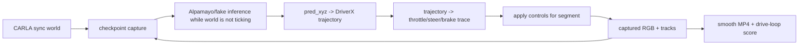

# TASK-139: Time-Warped Closed-Loop Alpamayo CARLA Driver

## Status
- state: review
- owner: Codex
- assignee: generalPurpose
- dependencies: TASK-128, TASK-134, TASK-141
- location: `src/driverx/policies`, `src/driverx/simulators`, `src/driverx/scenarios`, `src/driverx/pipeline`, `src/driverx/evaluation`, `src/oodrive`, `tests`, `tickets/TASK-139`
- enter when: Alpamayo can reason over fresh CARLA frames and DriverX can replay cached trajectory controls, but the model is not yet driving CARLA through repeated current-state decisions
- leave when: `oodrive drive-loop` runs a stop-the-world Alpamayo checkpoint loop that captures fresh CARLA state, waits for slow inference, applies the resulting bounded controls for a short simulated segment, repeats, and renders a smooth video with honest claim labels
- blockers: real Alpamayo execution requires TASK-134 or an equivalent local/GPU backend; the preferred generated scenario source requires TASK-141; local fake-backend and blocked-artifact proof can still use fixture/TASK-128 artifacts
- spawned follow-ups: optional final submission pack refresh after a scored live artifact exists
- complexity: L

### Summary

Build the user's requested stop-the-world VLA driving proof: CARLA advances a
few simulated seconds, freezes while Alpamayo slowly infers on the latest
frames/history, then resumes using the new Alpamayo trajectory converted into
bounded throttle/steer/brake controls. The final MP4 should look smooth because
wall-clock inference pauses are excluded from simulator time, while artifacts
make the claim boundary explicit:
`closed_loop_vla_control=time_warped` and `real_time_vla_control=false`.

### Scope

- In scope: product command, synchronous CARLA segment loop, checkpoint capture,
  Alpamayo/fake/blocked backend seam, trajectory-to-control application,
  per-segment manifests, smooth video assembly, score command, tests, review,
  and metric plan.
- Out of scope: real-time VLA serving, model acceleration, HF token handling,
  public video hosting, official Fail2Drive scoring, and pretending fake backend
  output is real Alpamayo evidence.

### Plan

#### Change

Add a product-facing loop:

```bash
PYTHONPATH=src python3 -m oodrive drive-loop \
  --db artifacts/runs/task128-oodrive-live-product/scenario_studio_db.json \
  --run artifacts/runs/task128-oodrive-live-product/runs/task128-oodrive-live-place/run_manifest.json \
  --config configs/carla_ood_demo.runpod.high_fidelity.yaml \
  --policy alpamayo-stop-world \
  --backend fake \
  --segment-seconds 3 \
  --max-segments 8 \
  --run-id task139-timewarped-vla-drive
```

Then score and render:

```bash
PYTHONPATH=src python3 -m oodrive score-vla-drive \
  --drive-loop artifacts/runs/task139-timewarped-vla-drive/vla_drive_loop.json \
  --video artifacts/runs/task139-timewarped-vla-drive/timewarped_vla_drive.mp4 \
  --metric-only
```

The real Alpamayo mode uses the TASK-134 local inference seam when available.
The fake mode produces deterministic trajectory changes for local proof. The
blocked mode records exact missing GPU/model/runtime setup without a stack
trace.

#### Why

Open-loop Alpamayo reasoning is useful, but the PRD now asks for one
closed-loop CARLA proof. Real-time VLA control is not necessary for the video:
we can pause simulator ticking, let slow inference finish, apply a short control
segment, and stitch the captured frames into a smooth run. This is an honest
offline model-predictive-control demo and a credible bridge to future real-time
serving.

#### Before -> After

- Before: Alpamayo reasons over captured CARLA frames and can produce a
  trajectory; separate code can replay a cached policy decision into controls.
- After: Alpamayo or a labeled fake backend repeatedly sees the current CARLA
  state at checkpoints, generates the next trajectory, and DriverX applies
  bounded controls to the ego vehicle for each following segment.

#### Touch

- `src/driverx/simulators/carla_timewarped_vla_drive.py` (new focused loop)
- `src/driverx/simulators/carla_ood_demo.py`
- `src/driverx/simulators/carla_policy_replay.py`
- `src/driverx/policies/alpamayo_trajectory.py`
- `src/driverx/policies/trajectory_control.py`
- `src/driverx/policies/alpamayo_local_inference.py` from TASK-134 when present
- `src/driverx/scenarios/studio_product_cli.py`
- `src/driverx/scenarios/studio_product_runtime.py` or a focused runtime module
- `src/driverx/pipeline/timewarped_vla_drive_video.py` (new)
- `src/driverx/evaluation/timewarped_vla_drive_score.py` (new)
- `src/oodrive/cli.py`
- `tests/test_timewarped_vla_drive.py` (new)
- `tests/test_timewarped_vla_drive_score.py` (new)
- `tests/test_oodrive_cli.py`
- `README.md`
- `docs/HISTORY.md`

#### Inspect

- `tickets/TASK-128/ticket.md`
- `tickets/TASK-134/ticket.md`
- `tickets/TASK-136/ticket.md`
- `tickets/TASK-137/ticket.md`
- `tickets/TASK-138/ticket.md`
- `tickets/TASK-141/ticket.md`
- `src/driverx/simulators/carla_ood_demo.py`
- `src/driverx/simulators/carla_cached_ood_replay.py`
- `src/driverx/simulators/carla_policy_replay.py`
- `src/driverx/policies/alpamayo_live.py`
- `src/driverx/policies/alpamayo_ood_package.py`
- `src/driverx/policies/trajectory_control.py`
- `src/driverx/scenarios/studio_product_runtime.py`
- `src/driverx/simulators/reasoning_timeline_overlay.py`
- `src/driverx/evaluation/hero_demo_score.py`
- `src/driverx/evaluation/submission_readiness_score.py`
- `scripts/run_remote_alpamayo_carla_inference.sh`
- `docs/prd.md`
- `docs/specs/scenario-workbench-v2-plan.md`
- `docs/MEMORY.md`
- `docs/TROUBLES.md`

#### Signature Delta

```python
TimewarpedVlaDriveConfig = {
    "config_path": Path,
    "db_path": Path,
    "run_manifest_path": Path,
    "policy": Literal["alpamayo-stop-world"],
    "backend": Literal["fake", "blocked", "alpamayo-local"],
    "segment_seconds": float,
    "max_segments": int,
    "control_config": TrajectoryControlConfig,
}

run_timewarped_vla_drive(
    config: TimewarpedVlaDriveConfig,
    output_root: Path,
    *,
    run_id: str,
    carla_module: object | None = None,
    inference_backend: AlpamayoInferenceBackend | None = None,
) -> TimewarpedVlaDriveResult

capture_drive_checkpoint(
    *,
    world: object,
    ego: object,
    camera_queue: object,
    tracks: list[dict[str, Any]],
    segment_index: int,
    run_dir: Path,
) -> DriveCheckpoint

infer_checkpoint_trajectory(
    checkpoint: DriveCheckpoint,
    *,
    backend: AlpamayoInferenceBackend,
    output_root: Path,
) -> DriveInferenceResult

apply_control_segment(
    *,
    ego: object,
    world: object,
    trace: ControlTrace,
    segment_ticks: int,
    carla_module: object,
) -> AppliedDriveSegment

build_timewarped_vla_drive_video(
    *,
    drive_loop_path: Path,
    output_root: Path,
    run_id: str,
) -> TimewarpedVlaDriveVideo

score_timewarped_vla_drive(
    inputs: TimewarpedVlaDriveScoreInputs,
) -> TimewarpedVlaDriveScoreReport

run_studio_drive_loop(...) -> StudioCommandResult
run_studio_score_vla_drive(...) -> StudioCommandResult
```

#### Type Sketch

```python
DriveCheckpoint = {
  "checkpoint_id": str,
  "segment_index": int,
  "sim_time_s": float,
  "ego_pose": {"x": float, "y": float, "z": float, "yaw_deg": float},
  "ego_history_xyz": list[list[float]],
  "frame_paths": list[str],
  "tracks_path": str,
  "package_path": str,
}

DriveInferenceResult = {
  "status": "passed" | "blocked" | "failed",
  "backend": "fake" | "blocked" | "alpamayo-local",
  "prediction_path": str | None,
  "trajectory": {"points_xy": list[tuple[float, float]], "source": str},
  "reasoning": str | None,
  "latency_ms": float | None,
  "vram_peak_mb": float | None,
  "blockers": list[str],
}

AppliedDriveSegment = {
  "segment_index": int,
  "command_count": int,
  "applied_count": int,
  "sim_start_s": float,
  "sim_end_s": float,
  "control_trace_path": str,
  "safety_clamps": list[str],
}

TimewarpedVlaDriveResult = {
  "status": "passed" | "partial" | "blocked" | "failed",
  "closed_loop_vla_control": "time_warped",
  "real_time_vla_control": false,
  "segments": list[{
    "checkpoint": DriveCheckpoint,
    "inference": DriveInferenceResult,
    "application": AppliedDriveSegment,
  }],
  "rgb_folder": str,
  "tracks_path": str,
  "video_path": str | None,
  "claim_boundaries": [
    "closed_loop_vla_control=time_warped",
    "real_time_vla_control=false",
    "sim_time_excludes_inference_wait=true"
  ],
}
```

#### Typed Flow Example

Segment `0` starts from live CARLA state at sim time `0.0s`. The runner captures
four ego RGB frames and 16 ego-history poses, then stops ticking CARLA while
`alpamayo-local` or `fake` produces `pred_xyz`. DriverX converts the selected
trajectory to 12 seconds of bounded control commands, applies the first `3s`
worth of controls, captures resulting frames/tracks, and repeats at sim time
`3.0s`. The final `vla_drive_loop.json` shows at least two distinct checkpoint
predictions and matching applied control traces; the MP4 is assembled from
captured frames only, so inference wait does not create visual stutter.

#### Execution Steps

1. Add a focused simulator module for time-warped driving rather than growing
   `carla_ood_demo.py` into a policy loop.
2. Extract or wrap only the CARLA setup helpers needed for ego/camera/spawn
   reuse; avoid broad CARLA runner refactors until the loop works locally with
   fakes.
3. Implement the fake inference backend first: each checkpoint produces a
   deterministic but state-dependent trajectory so tests can prove segment
   switching and control application.
4. Implement blocked backend behavior that writes setup blockers for missing
   TASK-134 real inference dependencies.
5. Integrate the real `alpamayo-local` backend through TASK-134's package and
   inference seam when it exists; do not duplicate HF token or SSH handling.
6. Run CARLA in synchronous mode for the loop and restore prior settings on
   cleanup. Treat "not ticking the world" as the pause; record wall-clock
   latency separately from simulator time.
7. Convert each checkpoint trajectory through `trajectory_to_control_trace` and
   apply only the next segment window to the ego actor.
8. Persist per-segment checkpoint package, prediction, selected trajectory,
   control trace, applied controls, frames, tracks, and blockers.
9. Build a smooth video from captured frames and overlay checkpoint reasoning,
   action intent, segment numbers, and claim labels.
10. Add `score-vla-drive` before polishing the live video so quality stays
    mechanical.
11. Wire `oodrive drive-loop`, `oodrive drive-loop-video`, and
    `oodrive score-vla-drive` into the CLI help and tests.
12. Run focused tests, the ticket metric, root guards, pre-push, and review
    before any completion claim.

#### Recommendation

Build the stop-the-world loop now. It is the best balance of novelty, honest
claim boundaries, and video quality: stronger than cached replay, much more
feasible than real-time VLA control, and directly aligned with the user's
desired smooth final video.

#### Options Considered

- Cached Alpamayo replay: useful fallback, but it does not prove repeated
  current-state VLA decisions.
- Stop-the-world time-warped control: selected because it gives real
  closed-loop dependency between future observations and model outputs without
  requiring real-time inference.
- True real-time Alpamayo control: rejected for this ticket because observed
  Alpamayo latency is tens of seconds and would make the first proof fragile.

#### Blast Radius

- Adds new product commands and focused runtime modules.
- Reuses existing Alpamayo trajectory conversion and control clamps.
- Does not change existing `oodrive generate/place/reason/demo-video` behavior.
- Submission readiness and story-pack references should only change after a
  scored artifact exists.
- Live CARLA work stays under ignored `artifacts/`; model weights and videos
  remain out of git.

#### Risks

- Real Alpamayo remains slow or unavailable: keep fake and blocked paths useful,
  and label real-model evidence separately.
- CARLA control can look jerky if segment commands are discontinuous: clamp
  steering/throttle, prefer short segments, and score smoothness mechanically.
- The video can overclaim: burn visible labels into the report/video and keep
  `real_time_vla_control=false`.
- Synchronous mode cleanup can leave CARLA in a bad state: always restore
  settings and destroy spawned actors in `finally`.

### Gap Analysis

Current state:

- TASK-128 proves live CARLA placement and fresh Alpamayo reasoning over
  captured frames.
- `alpamayo_prediction_to_trajectory` converts `pred_xyz` into DriverX
  trajectory chunks.
- `trajectory_to_control_trace` converts trajectories into bounded
  throttle/steer/brake commands.
- `run_carla_ood_demo` can accept an `ego_control_trace`, but the normal live
  path is scripted unless a trace is injected.

Production-grade expectation for this deadline:

- The model must see fresh simulator state at more than one checkpoint.
- At least one later CARLA segment must be driven by a trajectory produced from
  the prior checkpoint.
- The artifact must separate wall-clock inference delay from simulator time.
- The video must be smooth and the report must expose every checkpoint,
  prediction, control trace, frame range, and claim boundary.

Missing gaps:

- No product command owns repeated checkpoint inference and control.
- No schema records per-segment fresh observation -> model output -> control
  application.
- No score rewards smooth time-warped closed-loop proof while penalizing stale
  open-loop or fake-only evidence.

### Diagram



### Acceptance Criteria

- [ ] AC-1: `oodrive drive-loop --help` and `oodrive score-vla-drive --help`
  exist and document backend modes, segment length, max segments, claim labels,
  and output paths.
- [ ] AC-2: Fake backend run writes `vla_drive_loop.json` with at least three
  segments, each containing checkpoint state, prediction/trajectory, control
  trace, applied-control summary, and frame/tracks references.
- [ ] AC-3: Blocked real-backend run writes concrete missing-dependency
  blockers and next setup commands without stack traces.
- [ ] AC-4: Live CARLA mode uses synchronous ticking, excludes inference wait
  from simulator time, restores CARLA settings, and records cleanup evidence.
- [ ] AC-5: Real or fake closed-loop proof shows later segment controls derived
  from the current checkpoint, not a single reused initial trajectory.
- [ ] AC-6: `drive-loop-video` or the selected video builder emits a smooth MP4
  plus overlay/report with segment ids, reasoning/action snippets, frame/time,
  and claim boundaries.
- [ ] AC-7: `score-vla-drive --metric-only` emits
  `METRIC timewarped_vla_drive_score=<number>` and the target fixture/live
  artifact reaches `>=90` before promotion.

### Verification

- `PYTHONPATH=src python3 -m oodrive drive-loop --help`
- `PYTHONPATH=src python3 -m oodrive score-vla-drive --help`
- `PYTHONPATH=src python3 -m oodrive drive-loop --db <db> --run <run_manifest> --config configs/carla_ood_demo.local.sample.yaml --backend fake --segment-seconds 3 --max-segments 3 --run-id task139-fake-smoke`
- `PYTHONPATH=src python3 -m oodrive score-vla-drive --drive-loop artifacts/runs/task139-fake-smoke/vla_drive_loop.json --metric-only`
- `PYTHONPATH=src python3 -m unittest tests.test_timewarped_vla_drive tests.test_timewarped_vla_drive_score tests.test_carla_policy_replay tests.test_alpamayo_trajectory tests.test_oodrive_cli`
- Optional Kasm live run with `configs/carla_ood_demo.runpod.high_fidelity.yaml`
- Optional real Alpamayo run after TASK-134 is implemented on the GPU host
- `bash scripts/pre_push_check.sh` before completion claim
- Review artifact linked from this ticket before completion claim

### Autoresearch Readiness

Autoresearch is useful here, but the session should not overwrite the existing
root `submission_readiness_score` session. Initialize a ticket-scoped session
under `tickets/TASK-139/autoresearch/` after `score-vla-drive` exists and dry
runs.

Planned primitives:

- Goal: maximize the judge-visible quality of the time-warped closed-loop VLA
  proof.
- Scope: `src/driverx/simulators/carla_timewarped_vla_drive.py`,
  `src/driverx/pipeline/timewarped_vla_drive_video.py`,
  `src/driverx/evaluation/timewarped_vla_drive_score.py`,
  `src/driverx/scenarios/studio_product_cli.py`, `tests/`, and
  `tickets/TASK-139/`.
- Metric: `timewarped_vla_drive_score` points, higher is better, target `>=90`.
- Verify command:
  `PYTHONPATH=src python3 -m oodrive score-vla-drive --drive-loop <artifact> --video <artifact> --metric-only`.
- Guard command:
  `PYTHONPATH=src python3 -m unittest tests.test_timewarped_vla_drive tests.test_timewarped_vla_drive_score tests.test_oodrive_cli`.
- Noise policy: fixture score is deterministic; live Kasm score must be rerun
  when a change improves the metric by more than 8 points.

Metric components:

- fresh checkpoint count and same-run frame lineage
- model-driven or fake-labeled segment switching
- applied-control completeness
- smoothness and duration of the rendered MP4
- visible reasoning/action/claim overlays
- honesty penalties for fake-only, blocked, stale, or real-time overclaims

### Autonomy Readiness

- Required compute: local Mac for fake/blocked tests and scoring; Kasm/RunPod
  CARLA for live video; GPU/model environment for real Alpamayo.
- Secrets: do not transmit HF tokens through Kasm proxy SSH heredocs or base64
  streams.
- Human gates: token installation, RunPod spend, public upload, or submission
  publishing.
- Safe fallback: fake backend can prove product loop and video shape, but real
  Alpamayo evidence must be separately labeled before claiming model control.
- Stop condition: do not promote artifact if `same_run_lineage=false`, video
  missing, fewer than two checkpoint-derived control segments, or claim labels
  omit `real_time_vla_control=false`.

### Evidence

- Plan review: `tickets/TASK-139/artifacts/review/task139-impl-plan-review.json`
- Future QA: `tickets/TASK-139/artifacts/qa/timewarped-vla-drive-qa.md`
- Future autoresearch: `tickets/TASK-139/autoresearch/autoresearch.md`

### Blockers

- Real Alpamayo backend depends on TASK-134 or equivalent local/GPU inference
  support. Fake and blocked-backend planning/proof are unblocked.
