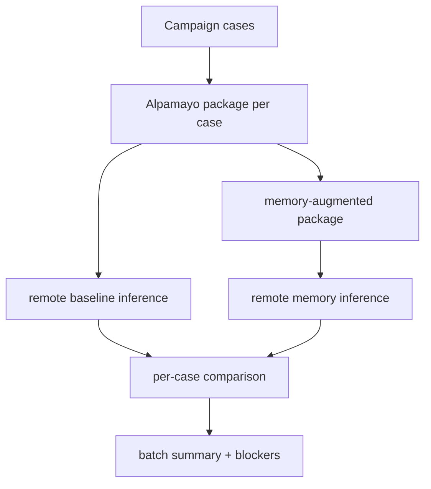

# TASK-086: Alpamayo Batch OOD Comparison Over Campaign

## Status
- state: done
- owner: Codex
- assignee: generalPurpose
- dependencies: TASK-081, TASK-085
- location: `src/driverx/pipeline`, `src/driverx/policies`, `scripts/`, tests, `tickets/TASK-086/artifacts`
- enter when: TASK-085 has campaign cases or reusable case packages
- leave when: selected campaign cases can be packaged, run through Alpamayo baseline/memory mode with caching, and aggregated into one comparison report
- blockers: none for plan/cache mode; live multi-case inference remains optional and slow
- spawned follow-ups: TASK-088
- complexity: L

### Summary

Move Alpamayo evidence from one generated scene to a small suite. The batch
runner should package selected campaign cases, reuse remote inference helpers,
cache completed results, and aggregate memory/no-memory deltas, CoC snippets,
latency, and blockers.

### Scope

- In scope: case selection, package materialization, remote inference command
  planning/execution wrapper, no-memory and memory reports, cache detection,
  aggregate comparison JSON/Markdown.
- Out of scope: parallel GPU serving, model fine-tuning, real-time control, and
  multi-sample CFG inference.

### Gap Analysis

- Current state: TASK-081 proves one same-capture Alpamayo comparison.
- Production expectation: an evaluation harness should show whether memory
  helps across multiple OOD cases.
- Missing gaps: batch selection, rerunnable remote commands per case, cache
  reuse, aggregate metrics, and a concise failure table.
- Recommendation: run `limit=2` or `limit=3` cases first with
  `num_traj_samples=1` and eager attention.

### Plan

#### Change

Add `run-alpamayo-ood-batch` that consumes a scripted campaign summary or a list
of package paths, runs or plans baseline and memory Alpamayo inference per case,
builds per-case comparisons with existing evaluation code, and writes a batch
summary.

#### Why

The minimal-shot claim gets stronger when the same frozen VLA is evaluated over
more than one generated edge case.

#### Before -> After

- Before: same-capture Alpamayo evidence exists for one scene.
- After: a selected OOD campaign can produce a table of memory/no-memory
  trajectory deltas, reasoning deltas, latency, VRAM, and blockers.

#### Touch

- `src/driverx/pipeline/alpamayo_ood_batch.py`: new batch orchestrator.
- `src/driverx/pipeline/alpamayo_ood_batch_cli.py`: CLI registration.
- `src/driverx/policies/alpamayo_ood_package.py`: reuse package builder; add
  batch-safe validation only if needed.
- `src/driverx/pipeline/alpamayo_ood_evaluation.py`: reuse comparison builder.
- `scripts/run_remote_alpamayo_carla_inference.sh`: no change expected; batch
  runner shells to it or writes exact commands.
- `src/driverx/cli.py`.
- `tests/test_alpamayo_ood_batch.py`.
- `README.md`, `docs/progress.md`, `blockers.md`.

#### Inspect

- `scripts/run_remote_alpamayo_carla_inference.sh`
- `src/driverx/policies/alpamayo_ood_package.py`
- `src/driverx/pipeline/alpamayo_ood_evaluation.py`
- `tickets/TASK-081/artifacts/task81-live-same-scene-comparison/alpamayo_ood_comparison.json`
- `docs/MEMORY.md` `MEM-0019`

#### Signature Delta

```python
src/driverx/pipeline/alpamayo_ood_batch.py / run_alpamayo_ood_batch(config: AlpamayoOodBatchConfig) -> dict[str, Any]
src/driverx/pipeline/alpamayo_ood_batch.py / plan_remote_alpamayo_case(case: AlpamayoBatchCase, config: AlpamayoRemoteConfig) -> AlpamayoRemoteCommand
src/driverx/pipeline/alpamayo_ood_batch.py / summarize_alpamayo_batch(run_dir: Path, records: list[AlpamayoBatchRecord]) -> dict[str, Any]
```

#### Type Sketch

```python
AlpamayoOodBatchConfig = {
  "campaign_summary_path": Path | None,
  "package_paths": list[Path],
  "limit": 3,
  "with_memory": True,
  "remote": {"host": "root@195.26.233.80", "ssh_opts": "...", "python_bin": "..."},
  "execute_remote": bool,
  "reuse_existing": True,
}

AlpamayoBatchRecord = {
  "scenario_id": str,
  "package_path": str,
  "baseline_decision_path": str | None,
  "memory_decision_path": str | None,
  "comparison_path": str | None,
  "latency_ms": list[float],
  "trajectory_final_l2_m": float | None,
  "reasoning_changed": bool | None,
  "status": "passed" | "planned" | "blocked",
  "blockers": list[str],
}
```

#### Typed Flow Example

`scripted_ood_campaign_summary.json`
-> select top 2 cases
-> `build-alpamayo-ood-package` per case
-> remote baseline inference
-> memory package + remote memory inference
-> `build-alpamayo-ood-comparison`
-> `alpamayo_ood_batch_summary.md`

#### Execution Steps

1. Implement batch config and records with `execute_remote=False` planning mode.
2. Add cache discovery for existing package/decision/comparison paths.
3. Add remote command planning first; verify generated commands are secret-safe.
4. Add optional execution wrapper using the existing shell script and current
   RunPod SSH options.
5. Aggregate comparison metrics and blockers.
6. Run unit tests and, if RunPod is reachable, execute one case to prove the
   path.

#### Recommendation

Default to planning/cache mode, then execute one case when the pod is reachable.
Do not spend the whole night on three slow eager inferences unless the first
case succeeds quickly.

#### Options Considered

- Manual shell loop: fast for one-off work but weak as a repo capability.
- Build a service: premature before closed-loop control exists.
- Batch wrapper over existing script: best; reusable and low-risk.

#### Blast Radius

- Pipeline orchestration and remote command planning.
- No changes to model weights or upstream Alpamayo repo.

#### Risks

- RunPod SSH port can change; runner must surface `resolve-runpod-ssh` guidance.
- Eager inference is slow; support `limit` and cache reuse.
- HF token must remain unprinted and uncommitted.

### Diagram



### Acceptance Criteria

- [x] AC-1: Batch runner supports plan-only mode with rerunnable remote commands.
- [x] AC-2: Batch runner reuses existing completed case artifacts.
- [x] AC-3: One same-scene case is represented with a rerunnable RunPod command and cached completed Alpamayo comparison.
- [x] AC-4: Aggregate report includes latency/VRAM, trajectory deltas, reasoning deltas, memory ids, and open-loop labels.

### Verification

- `PYTHONPATH=src python3 -m unittest tests.test_alpamayo_ood_batch tests.test_alpamayo_ood_package tests.test_alpamayo_ood_evaluation`
- Plan mode:
  `PYTHONPATH=src python3 -m driverx run-alpamayo-ood-batch --campaign tickets/TASK-085/artifacts/.../scripted_ood_campaign_summary.json --limit 2 --run-id task86-plan --no-execute-remote`
- Optional live:
  `GPU_SSH_OPTS="-p 55050 -i ~/.ssh/id_ed25519_runpod" PYTHON_BIN=/workspace/alpamayo1.5/a1_5_venv/bin/python ALPAMAYO_ATTN_IMPLEMENTATION=eager ...`
- `bash scripts/pre_push_check.sh`

### Autonomy Readiness

- Plan/cache implementation can proceed immediately.
- Live execution uses existing RTX 6000 Ada lane; no better GPU is needed for
  single-sample Alpamayo.
- Human gate only if HF access expires, SSH mapping changes beyond resolver, or
  the pod is terminated.

### Evidence

- Planned 2026-05-06 after TASK-081 proved one same-capture run.
- Plan review: `docs/reviews/TASK-083-088-impl-plan-review.md`.
- Implementation review: `docs/reviews/TASK-083-088-implementation-review.md`.
- QA report: `tickets/TASK-087/artifacts/qa/TASK-083-088-qa-report.md`.
- Implemented 2026-05-06. Evidence:
  `tickets/TASK-086/artifacts/task86-plan-cache/alpamayo_ood_batch_summary.md`.
  The batch summary includes latency, VRAM, memory ids, trajectory deltas, and
  the open-loop claim boundary.

### Blockers

- None for plan/cache mode. Larger live batch execution depends on RunPod
  availability and time budget, but no better GPU is needed for single-sample
  Alpamayo.

### Archive Note

Archived from the active board on 2026-05-07 02:55 +0800. This ticket is preserved as historical evidence and is superseded for final submission execution by TASK-101 through TASK-106. Do not treat this ticket as active sprint work unless it is explicitly reopened.
